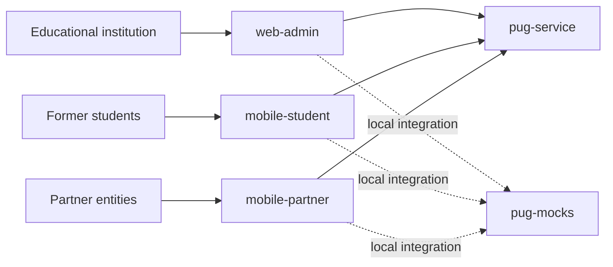

# PUG Platform Documentation

> 📚 Initial root overview

`pug-docs` is the documentation entry point for the PUG platform created for the **[Programa Universidade Gratuita](https://universidadegratuita.sc.gov.br/)**. At a high level, the platform supports the management of counterpart hours by connecting the educational institution, former students, partner entities, and the shared backend services behind the program workflows.

The official Universidade Gratuita program is a State of Santa Catarina initiative focused on access to higher education, with a counterpart model in which supported students give back through supervised hours in their area of study. This project documents the software ecosystem used to manage that operational flow.

## 🎯 What This Documentation Covers

This repository currently documents the parts of the platform that already have written technical material:

- `pug-service` as the shared backend service
- `pug-web-admin` as the institutional backoffice
- `pug-mocks` as the optional mock backend for local integration work

The mobile applications are already part of the overall platform context, but detailed documentation for them is still pending and will be added later:

- `mobile-student`
- `mobile-partner`

## 🏗️ High-Level Architecture

The platform is organized around a shared backend and multiple user-facing applications:

- the **educational institution** operates through the backoffice
- **former students** use the student mobile app to manage their own counterpart hours and enroll in projects
- **partner entities** use the partner mobile app to manage projects and the former students linked to those projects
- the **backend services** centralize business rules, records, authentication, and operational workflows
- the **mock backend** supports local development and integration work when the full backend is not needed



## 🔄 How The Repositories Connect

From the current documentation set, the system relationship is straightforward:

1. `pug-web-admin` provides the operational interface used by the educational institution.
2. `pug-service` exposes the shared business API and concentrates the main platform domains, including identity, academic records, partner management, projects, enrollments, attendances, and completed-hour tracking.
3. `pug-mocks` mirrors the backend contract for local integration scenarios.
4. The mobile applications fit into the same platform flow:
   - `mobile-student` is the former-student experience
   - `mobile-partner` is the partner-entity experience

The current repository documentation is strongest around the backend, the admin application, and the mock backend. Mobile documentation will be expanded as those materials are added.

## 📦 Repository Guide

### `pug-service`

The backend service for the platform. It centralizes authentication, academic data, partner entities, projects, enrollments, attendances, audit logging, and counterpart-hour tracking.

- Documentation: [pug-service docs](./pug-service/README.md)
- Repository README: [pug-service](https://github.com/Plataforma-Universidade-Gratuita/pug-service/blob/main/README.md)

### `pug-web-admin`

The backoffice used by the educational institution. It provides the operational web interface for the same major domains exposed by the backend service.

- Documentation: [pug-web-admin docs](./pug-web-admin/README.md)
- Repository README: [pug-web-admin](https://github.com/Plataforma-Universidade-Gratuita/pug-web-admin/blob/main/README.md)

### `pug-mocks`

An optional mock backend used for local development and integration work. It mirrors the main API contract with in-memory data and simplified auth behavior.

- Documentation: [pug-mocks docs](./pug-mocks/README.md)
- Repository README: [pug-mocks](https://github.com/Plataforma-Universidade-Gratuita/pug-mocks/blob/main/README.md)

### `mobile-student`

The mobile app for former students. Its role in the platform is to let former students manage their own counterpart hours and subscribe to projects.

- Detailed documentation in `pug-docs`: not available yet
- Repository: [pug-mobile-student](https://github.com/Plataforma-Universidade-Gratuita/pug-mobile-student)
- Repository README: not available in the current workspace

### `mobile-partner`

The mobile app for partner entities. Its role in the platform is to let partner organizations manage projects and the former students subscribed to them.

- Detailed documentation in `pug-docs`: not available yet
- Repository: [pug-mobile-partner](https://github.com/Plataforma-Universidade-Gratuita/pug-mobile-partner)
- Repository README: not available in the current workspace

## 🧭 Current Documentation Structure

```text
pug-docs/
├── README.md
├── pug-mocks/
│   └── README.md
├── pug-service/
│   ├── README.md
│   ├── DEVELOPMENT.md
│   ├── ARCHITECTURE.md
│   ├── TESTS.md
│   ├── CICD.md
│   ├── shared/
│   ├── geo/
│   ├── identity/
│   ├── partner/
│   ├── academic/
│   └── project/
└── pug-web-admin/
    ├── README.md
    ├── DEVELOPMENT.md
    ├── ARCHITECTURE.md
    └── CICD.md
```

## 🔗 Start Here

- [pug-service documentation](./pug-service/README.md)
- [pug-web-admin documentation](./pug-web-admin/README.md)
- [pug-mocks documentation](./pug-mocks/README.md)

## 📝 Note

This is an initial root overview for the platform documentation. It is meant to orient new readers across the main repositories and system roles before they dive into repository-specific material. More detailed documentation for the mobile applications will be added later.
