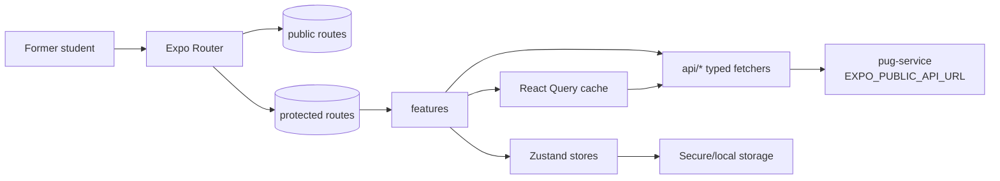
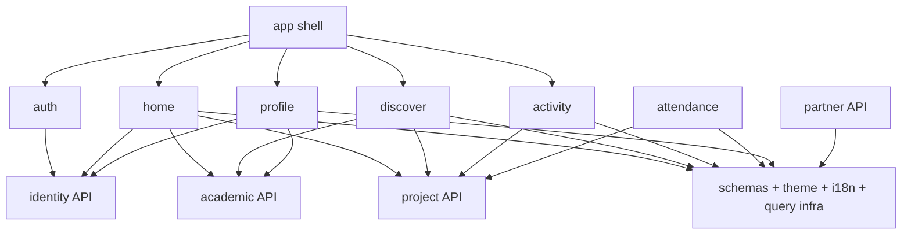
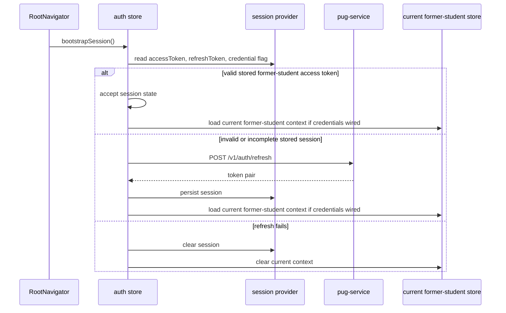
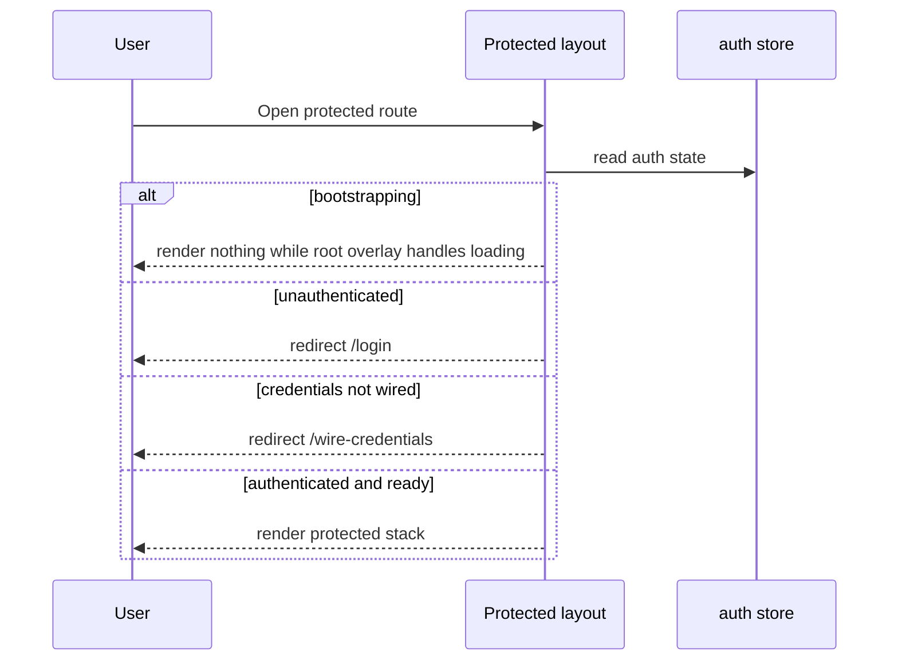
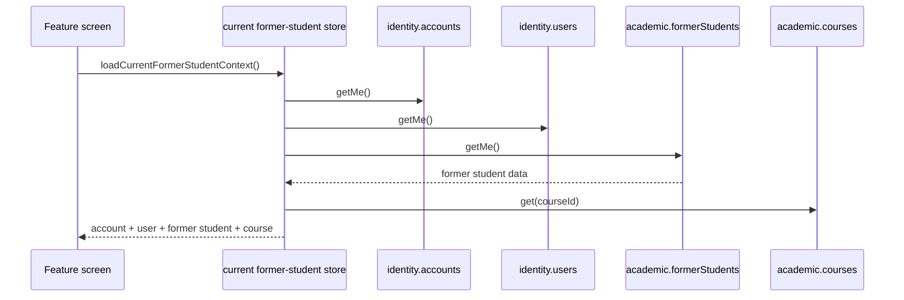
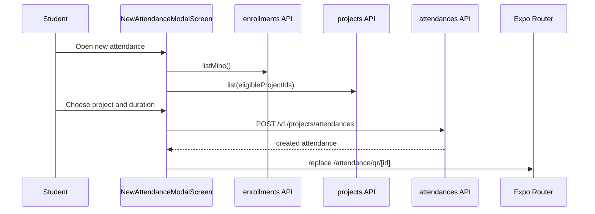

# PUG Mobile Student Architecture

Back to [README.md](https://github.com/Plataforma-Universidade-Gratuita/pug-docs/blob/main/pug-mobile-student/README.md).

## 🧭 Overall architecture

`pug-mobile-student` is a layered Expo Router application. It is not a general-purpose admin shell; it is the former-student mobile experience for the PUG platform.

The app calls the backend service configured by `EXPO_PUBLIC_API_URL` directly from the typed API layer. Unlike `pug-web-admin`, there is no local Next.js `/api/v1/*` proxy layer. Mobile session state is kept in local secure storage and synchronized into Zustand and React Query at runtime.

Core files:

- [app/(public)/_layout.tsx](https://github.com/Plataforma-Universidade-Gratuita/pug-mobile-student/blob/main/app/(public)/_layout.tsx)
- [app/(protected)/_layout.tsx](https://github.com/Plataforma-Universidade-Gratuita/pug-mobile-student/blob/main/app/(protected)/_layout.tsx)
- [app/(protected)/(tabs)/_layout.tsx](https://github.com/Plataforma-Universidade-Gratuita/pug-mobile-student/blob/main/app/(protected)/(tabs)/_layout.tsx)
- [root-layout/RootLayout.tsx](https://github.com/Plataforma-Universidade-Gratuita/pug-mobile-student/blob/main/root-layout/RootLayout.tsx)
- [root-layout/RootNavigator.tsx](https://github.com/Plataforma-Universidade-Gratuita/pug-mobile-student/blob/main/root-layout/RootNavigator.tsx)
- [api/utils.ts](https://github.com/Plataforma-Universidade-Gratuita/pug-mobile-student/blob/main/api/utils.ts)
- [stores/auth.ts](https://github.com/Plataforma-Universidade-Gratuita/pug-mobile-student/blob/main/stores/auth.ts)

## 🧱 Main layers and components

### 1. Root provider stack

The root application shell is composed in `root-layout/RootLayout.tsx`.

It wraps the navigator with:

1. `I18nextProvider`
2. `QueryClientProvider`
3. `AppProviders`
4. `RootNavigator`

This keeps cross-cutting concerns close to the application boundary instead of repeating setup in feature screens.

### 2. Bootstrap navigator

`RootNavigator` hydrates the three app-critical contexts:

- theme
- language
- auth session

It also syncs the current system theme, updates the native system UI background color, and displays a bootstrap overlay while hydration is incomplete.

### 3. Public and protected route groups

Expo Router route groups split the app into:

- `(public)` for login and public auth entry points
- `(protected)` for authenticated student flows

The protected layout checks:

- whether the session is still bootstrapping
- whether the user is authenticated
- whether credential setup is still required

If credentials are not wired, the user is forced to `/wire-credentials`. If credentials are already wired, `/wire-credentials` redirects back to the protected home route.

### 4. Protected tab shell

The protected tab layout exposes the main student workspace:

- `Home`
- `Discover`
- `Activity`
- `Profile`

The tab shell uses a custom authenticated tab bar and theme-derived screen options.

### 5. Feature layer

Feature screens live under [features/](https://github.com/Plataforma-Universidade-Gratuita/pug-mobile-student/tree/main/features), while route files in [app/](https://github.com/Plataforma-Universidade-Gratuita/pug-mobile-student/tree/main/app) stay thin.

Important feature families:

- `auth/login`
- `auth/wire-credentials`
- `home`
- `discover`
- `activity`
- `project-detail`
- `enrollment-detail`
- `attendance-detail`
- `attendance-qr`
- `new-attendance`
- `profile`

### 6. Typed API layer

The [api/](https://github.com/Plataforma-Universidade-Gratuita/pug-mobile-student/tree/main/api) directory mirrors backend domains:

- `academic`
- `geo`
- `identity`
- `partner`
- `project`

The API layer owns:

- endpoint functions
- React Query hooks
- mutation helpers
- query-key factories
- request normalization utilities
- response parsing through Zod schemas

The route base map is centralized in [api/constants.ts](https://github.com/Plataforma-Universidade-Gratuita/pug-mobile-student/blob/main/api/constants.ts).

### 7. Validation and type boundary

Zod schemas are used to validate request and response payloads. API functions parse outbound bodies before sending them and parse backend success envelopes before returning typed data to callers.

Relevant directories:

- [schemas/api/](https://github.com/Plataforma-Universidade-Gratuita/pug-mobile-student/tree/main/schemas/api)
- [schemas/client/](https://github.com/Plataforma-Universidade-Gratuita/pug-mobile-student/tree/main/schemas/client)
- [types/api/](https://github.com/Plataforma-Universidade-Gratuita/pug-mobile-student/tree/main/types/api)
- [types/client/](https://github.com/Plataforma-Universidade-Gratuita/pug-mobile-student/tree/main/types/client)

## 🔗 Module relationships

The app is centered on the former-student journey, but it consumes multiple backend domains to build that experience.

Concrete examples from code:

- the current former-student store loads account, user, former-student, and course data
- the home screen combines current student context, enrollments, attendances, and projects
- the discover screen uses the student's course area of expertise to search compatible projects
- the new-attendance modal filters approved enrollments before allowing attendance creation

## 🔄 Request and data flow

### Auth bootstrap flow

### Protected route flow

### Student context flow

### Attendance creation flow

## 🌐 External dependencies

- **PUG backend API** through `EXPO_PUBLIC_API_URL`
- **Secure/local storage** for access token, refresh token, credential setup flag, theme, and locale values
- **Translation bundles** in [locales/](https://github.com/Plataforma-Universidade-Gratuita/pug-mobile-student/tree/main/locales)
- **GitHub Actions** for CI
- **GHCR** for image publishing
- **Azure Container Apps** for deployed Expo web revisions

The repository does not include direct integrations with a database, queue, or message broker.

## 💾 Persistence and integration boundaries

This repo does **not** own business persistence.

What it stores or manages locally:

- access token
- refresh token
- credential setup flag
- theme mode
- language preference
- React Query in-memory cache
- current former-student context in Zustand memory

What stays outside this repo:

- academic, geo, identity, partner, and project persistence
- auth token issuance and revocation rules
- backend authorization rules
- attendance validation business rules
- enrollment lifecycle rules
- deployment environment orchestration

## 📌 Architectural decisions visible in code

### Direct backend calls are intentional

The app does not have a browser-facing local API proxy. It builds backend URLs from `EXPO_PUBLIC_API_URL` and calls `pug-service` directly from the typed API layer.

This keeps the native/mobile runtime simpler, but it means:

- the backend URL must be correct for the runtime environment
- token refresh and invalid-session behavior must be handled in the mobile API utilities
- public Expo variables are visible in web builds

### Former-student token validation is part of auth

The auth store validates that received tokens represent a former-student session before accepting them into app state.

This prevents admin or partner tokens from being used inside the student app, even if the backend login endpoint technically returns a valid token pair.

### Credential setup is an app state, not just a screen

`requiresCredentialSetup` is part of the authenticated session state. The protected route layout uses it to restrict navigation until the student wires credentials.

### Feature screens own composition; route files stay thin

Route files should normally import and render a feature entry. Feature screens own data loading, screen state, and component composition.

## 🧪 Observed boundaries and gaps

- Dedicated automated tests are not configured in the repository.
- The repository contains CI and container deployment flows for Expo web output, but native EAS build and app-store deployment flows are not part of the current workspace.
- The Android package is currently configured as `com.anonymous.pugmobilestudent` in `app.json`.
- The student app exposes only the former-student journey; admin and partner flows belong in other applications.
