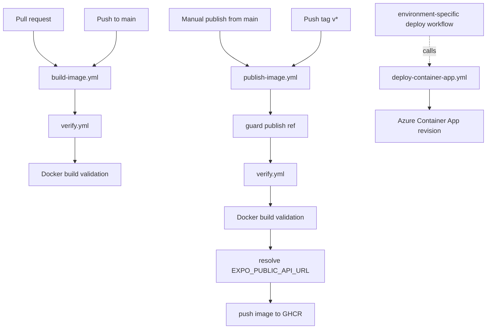
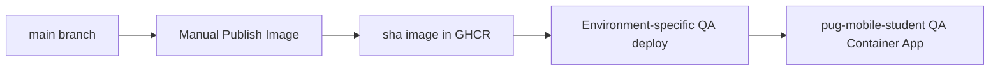
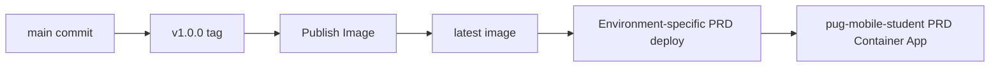

# PUG Mobile Student CI/CD

Back to [README.md](https://github.com/Plataforma-Universidade-Gratuita/pug-docs/blob/main/pug-mobile-student/README.md).

## 🚦 Pipeline overview

`pug-mobile-student` uses GitHub Actions to verify the application, validate container builds, publish images to GHCR, and provide a reusable Azure Container Apps deployment implementation for Expo web revisions.

Current workflow set:

| Workflow | File | Trigger | Purpose |
| --- | --- | --- | --- |
| Verify | [`verify.yml`](https://github.com/Plataforma-Universidade-Gratuita/pug-mobile-student/blob/main/.github/workflows/verify.yml) | reusable `workflow_call` | Run the repository quality gate |
| Build Image | [`build-image.yml`](https://github.com/Plataforma-Universidade-Gratuita/pug-mobile-student/blob/main/.github/workflows/build-image.yml) | pull request, push to `main` | Verify and validate that the Docker image builds |
| Publish Image | [`publish-image.yml`](https://github.com/Plataforma-Universidade-Gratuita/pug-mobile-student/blob/main/.github/workflows/publish-image.yml) | `workflow_dispatch`, tag push `v*` | Verify, build, and publish a container image to GHCR |
| Deploy Container App | [`deploy-container-app.yml`](https://github.com/Plataforma-Universidade-Gratuita/pug-mobile-student/blob/main/.github/workflows/deploy-container-app.yml) | reusable `workflow_call` | Shared Azure Container Apps deployment implementation |



## 🔔 Workflow triggers

### Verify

`verify.yml` is reusable and is called by other workflows.

It does not run directly from pull requests or pushes by itself. It is currently invoked by `build-image.yml` and `publish-image.yml`.

### Build Image

`build-image.yml` validates that the Docker image can be built.

It runs on:

- pull requests
- pushes to `main`

It first calls the reusable verify workflow, then builds the Docker image with `push: false`, so it does not publish an image.

### Publish Image

`publish-image.yml` runs on:

- manual `workflow_dispatch`
- pushed tags matching `v*`

Manual publish is only allowed from `main`.

Tag publish is only allowed when the tagged commit is contained in `main`.

Manual publish accepts:

```text
target_environment: dev | qa | prd
```

That target is used to choose the public backend API URL baked into the Expo web bundle.

### Deploy Container App

`deploy-container-app.yml` is reusable.

It is not an environment-specific workflow by itself. It expects another workflow to call it with the target environment name, Azure resource group, Azure Container App name, and full image reference.

## 🛠️ Verification

The reusable verify job:

1. checks out the repository
2. sets up Node.js `22`
3. restores npm cache through `actions/setup-node`
4. runs `npm ci`
5. runs `npm run verify`

`npm run verify` expands to:

```bash
npm run format:check && tsc --noEmit && npm run trans && npm run build:web
```

That means the current quality gate covers:

- Prettier formatting
- ESLint
- TypeScript type-checking
- translation ordering and consistency checks
- Expo web export success

Relevant files:

- [`package.json`](https://github.com/Plataforma-Universidade-Gratuita/pug-mobile-student/blob/main/package.json)
- [`scripts/reorderTranslations.js`](https://github.com/Plataforma-Universidade-Gratuita/pug-mobile-student/blob/main/scripts/reorderTranslations.js)
- [`scripts/checkMissingTranslations.js`](https://github.com/Plataforma-Universidade-Gratuita/pug-mobile-student/blob/main/scripts/checkMissingTranslations.js)
- [`scripts/checkUnusedTranslations.js`](https://github.com/Plataforma-Universidade-Gratuita/pug-mobile-student/blob/main/scripts/checkUnusedTranslations.js)

## 🐳 Build Image workflow

The image build workflow:

1. runs the reusable verify workflow
2. checks out the repository
3. sets up Docker Buildx
4. builds the image from [`Dockerfile`](https://github.com/Plataforma-Universidade-Gratuita/pug-mobile-student/blob/main/Dockerfile)
5. keeps `push: false`

This validates container buildability, but it does not publish an image.

## 📦 Publish Image workflow

The publish workflow is the main image release workflow.

It:

1. validates the ref
2. runs the reusable verify workflow
3. validates the Docker image build
4. resolves the public backend API URL for the selected target environment
5. computes image tags
6. logs in to GHCR
7. builds and pushes the image

### Ref guards

Manual publish is only allowed from:

```text
refs/heads/main
```

Tag publish is only allowed when:

```text
refs/tags/v*
```

and the tagged commit is contained in:

```text
origin/main
```

### Image name

The image name is fixed by the workflow:

```text
ghcr.io/plataforma-universidade-gratuita/pug-mobile-student
```

### Manual publish tags

Manual publish from `main` publishes:

```text
ghcr.io/plataforma-universidade-gratuita/pug-mobile-student:sha-<shortsha>
```

Example:

```text
ghcr.io/plataforma-universidade-gratuita/pug-mobile-student:sha-abc123def456
```

This is the expected image format for environment-specific deployments that want an immutable revision.

### Version tag publish tags

When a tag like this is pushed:

```text
v1.0.0
```

the workflow publishes:

```text
ghcr.io/plataforma-universidade-gratuita/pug-mobile-student:1.0.0
ghcr.io/plataforma-universidade-gratuita/pug-mobile-student:latest
```

### Provenance and SBOM

The publish step disables Docker provenance and SBOM generation:

```yaml
provenance: false
sbom: false
```

This keeps GHCR package versions simpler and avoids extra untagged package entries.

## 🌐 Build-time API URL resolution

`EXPO_PUBLIC_API_URL` is a public frontend value.

Because this repository publishes an Expo web export, the value is baked into the generated web bundle during the Docker build. Changing it only at Azure Container App runtime does not reliably change already-exported static assets.

The publish workflow accepts:

```text
target_environment: dev | qa | prd
```

Then it resolves one of these repository variables:

| Target environment | Repository variable |
| --- | --- |
| `dev` | `EXPO_PUBLIC_API_URL_DEV` |
| `qa` | `EXPO_PUBLIC_API_URL_QA` |
| `prd` | `EXPO_PUBLIC_API_URL_PRD` |

The resolved value is passed into Docker as:

```text
EXPO_PUBLIC_API_URL=<resolved API URL>
```

### Important note for tag publishes

Tag publishes are normally production releases. If the workflow runs from a tag and no `target_environment` input exists, the workflow should treat the target environment as `prd`.

Recommended behavior:

```yaml
TARGET_ENVIRONMENT: ${{ inputs.target_environment || 'prd' }}
```

## ☁️ Deploy Container App workflow

`deploy-container-app.yml` is a reusable workflow intended for environment-specific deploy workflows.

It receives:

| Input | Purpose |
| --- | --- |
| `environment_name` | GitHub Environment name, such as `qa` or `prd` |
| `azure_resource_group` | Azure resource group containing the Container App |
| `azure_container_app` | Azure Container App name |
| `image` | Full container image reference to deploy |

It performs these steps:

1. logs in to Azure using `AZURE_CREDENTIALS`
2. ensures the Azure Container Apps extension exists
3. configures GHCR as the Container App registry
4. updates the Container App image
5. sets runtime environment variables
6. prints the deployed URL

Runtime environment values set by the workflow:

```text
NODE_ENV=production
EXPO_NO_TELEMETRY=1
EXPO_PUBLIC_API_URL=<environment variable value>
```

The runtime `EXPO_PUBLIC_API_URL` value is still useful for consistency and diagnostics, but the web bundle must be built with the correct value as well.

## 🚚 Typical QA deployment

No dedicated `deploy-qa.yml` file was found in the current mobile repository, but the reusable deploy workflow can support QA when called by an environment-specific workflow.

Expected image format:

```text
ghcr.io/plataforma-universidade-gratuita/pug-mobile-student:sha-abc123def456
```

Typical QA flow:



## 🚀 Typical PRD deployment

No dedicated `deploy-prd.yml` file was found in the current mobile repository, but the publish workflow already supports version tag image publishing.

Expected production image after tag publish:

```text
ghcr.io/plataforma-universidade-gratuita/pug-mobile-student:latest
```

Typical PRD flow:



## 🔐 Required secrets and variables

### GitHub secrets

| Secret | Used by | Purpose |
| --- | --- | --- |
| `GITHUB_TOKEN` | `publish-image.yml` | automatic GitHub token used to push to GHCR |
| `AZURE_CREDENTIALS` | `deploy-container-app.yml` | Azure service principal JSON |
| `GHCR_USERNAME` | `deploy-container-app.yml` | username used by Azure to pull from GHCR |
| `GHCR_TOKEN` | `deploy-container-app.yml` | token used by Azure to pull from GHCR |

`GITHUB_TOKEN` is provided automatically by GitHub Actions.

`GHCR_TOKEN` should have permission to read packages.

### Repository variables

| Variable | Purpose |
| --- | --- |
| `EXPO_PUBLIC_API_URL_DEV` | backend API URL baked into dev-target images |
| `EXPO_PUBLIC_API_URL_QA` | backend API URL baked into QA-target images |
| `EXPO_PUBLIC_API_URL_PRD` | backend API URL baked into PRD-target images |

These values are public by design because `EXPO_PUBLIC_*` values are visible in the generated client bundle.

### Environment variables

Each GitHub deployment environment should define:

| Environment | Variable |
| --- | --- |
| `qa` | `EXPO_PUBLIC_API_URL` |
| `prd` | `EXPO_PUBLIC_API_URL` |

The deploy workflow sets this runtime value on the Azure Container App revision.

## 🧪 Tests, lint, and coverage status

What the pipeline enforces today:

- formatting
- linting
- type-checking
- translation checks
- Expo web export success
- Docker image build success
- image publishing
- reusable Azure Container Apps deployment implementation

Repository scope currently excludes:

- a dedicated automated test script in [`package.json`](https://github.com/Plataforma-Universidade-Gratuita/pug-mobile-student/blob/main/package.json)
- coverage reporting
- a coverage threshold gate
- native Android or iOS build publishing
- EAS/TestFlight/App Store deployment workflows
- preview environment provisioning
- post-deploy smoke tests

This repository treats `npm run verify` as its quality gate instead of a dedicated test suite.

## Common pitfalls

- `EXPO_PUBLIC_API_URL` must be correct at image build time, not only at deployment runtime.
- Manual publish is only allowed from `main`.
- Manual environment deploys should use full image tags, usually `sha-<shortsha>`.
- A tag publish creates `latest`; make sure that is the image intended for production deployment.
- The current container image serves the Expo web export, not a native mobile binary.
- A green Docker build only proves the web container builds; it does not prove native Android or iOS builds are healthy.

## Links

- [Back to README](https://github.com/Plataforma-Universidade-Gratuita/pug-docs/blob/main/pug-mobile-student/README.md)
- [`pug-mobile-student` repository](https://github.com/Plataforma-Universidade-Gratuita/pug-mobile-student)
- [`pug-mobile-student` workflows](https://github.com/Plataforma-Universidade-Gratuita/pug-mobile-student/tree/main/.github/workflows)
