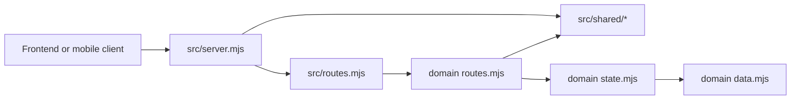
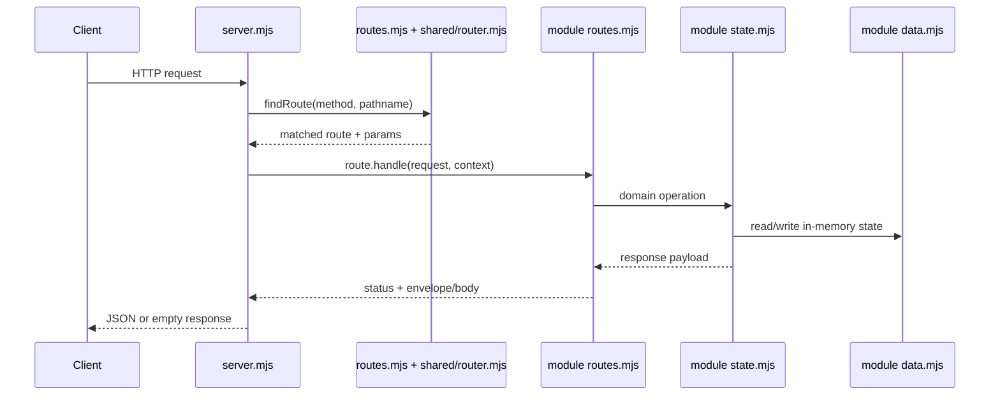
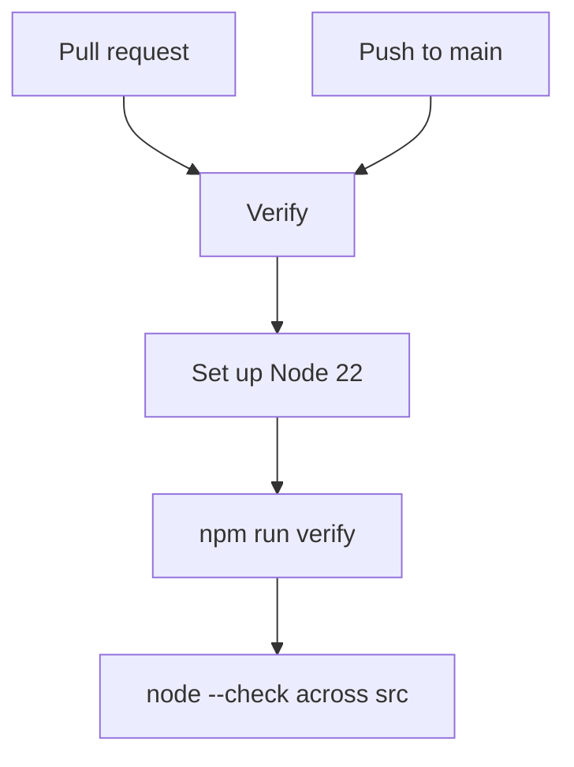

# PUG Mocks

`pug-mocks` is the shared mock backend for the PUG applications. It is a small Node.js ESM HTTP server built directly on the standard library and exists so clients can run against a backend-shaped API without needing the full `pug-service` stack.

This README intentionally includes the repo’s **architecture**, **development guidance**, and **CI/CD notes** in one place because `pug-mocks` is a small optional utility repository rather than a primary deployable application.

## 🎯 Purpose

This repository provides:

- a lightweight mock HTTP server for PUG clients
- route families that mirror the real backend contract under `/v1/*`
- in-memory seeded state for academic, geo, identity, partner, and project flows
- mock auth/session behavior so frontend and mobile flows can exercise login, refresh, logout, and credential wiring

Representative files:

- [src/server.mjs](https://github.com/Plataforma-Universidade-Gratuita/pug-mocks/blob/main/src/server.mjs)
- [src/routes.mjs](https://github.com/Plataforma-Universidade-Gratuita/pug-mocks/blob/main/src/routes.mjs)
- [src/shared/http.mjs](https://github.com/Plataforma-Universidade-Gratuita/pug-mocks/blob/main/src/shared/http.mjs)
- [src/identity/auth/session.mjs](https://github.com/Plataforma-Universidade-Gratuita/pug-mocks/blob/main/src/identity/auth/session.mjs)

## ✨ High-level feature summary

- `GET /health`
- `/v1/auth/*`
- `/v1/identity/*`
- `/v1/geo/*`
- `/v1/academic/*`
- `/v1/partners/*`
- `/v1/projects/*`

The mocked domains currently present in `src/` are:

- `academic`
- `geo`
- `identity`
- `partner`
- `project`
- `shared`

## 🧰 Tech and runtime

- **Runtime:** Node.js
- **Module format:** native ESM
- **HTTP layer:** Node standard library `http`
- **Persistence:** in-memory only
- **Package manager:** npm
- **External runtime dependencies:** None

Key files:

- [package.json](https://github.com/Plataforma-Universidade-Gratuita/pug-mocks/blob/main/package.json)
- [src/server.mjs](https://github.com/Plataforma-Universidade-Gratuita/pug-mocks/blob/main/src/server.mjs)

## 🗂️ Repository overview

| Path | Role |
| --- | --- |
| [src/server.mjs](https://github.com/Plataforma-Universidade-Gratuita/pug-mocks/blob/main/src/server.mjs) | server bootstrap, config, CORS, request dispatch, response writing |
| [src/routes.mjs](https://github.com/Plataforma-Universidade-Gratuita/pug-mocks/blob/main/src/routes.mjs) | top-level route aggregation including `/health` |
| [src/shared/](https://github.com/Plataforma-Universidade-Gratuita/pug-mocks/tree/main/src/shared) | HTTP envelopes, route matching, ids, formatting, paging/filter helpers |
| [src/identity/auth/](https://github.com/Plataforma-Universidade-Gratuita/pug-mocks/tree/main/src/identity/auth) | auth routes, credential wiring, mock sessions, guards |
| [src/academic/](https://github.com/Plataforma-Universidade-Gratuita/pug-mocks/tree/main/src/academic) | academic mock modules |
| [src/geo/](https://github.com/Plataforma-Universidade-Gratuita/pug-mocks/tree/main/src/geo) | geo mock modules |
| [src/identity/](https://github.com/Plataforma-Universidade-Gratuita/pug-mocks/tree/main/src/identity) | identity mock modules |
| [src/partner/](https://github.com/Plataforma-Universidade-Gratuita/pug-mocks/tree/main/src/partner) | partner mock modules |
| [src/project/](https://github.com/Plataforma-Universidade-Gratuita/pug-mocks/tree/main/src/project) | project mock modules |

Leaf modules follow a stable pattern:

- `data.mjs` for seeded mutable data
- `state.mjs` for reads, writes, and domain behavior
- `routes.mjs` for HTTP route definitions

## ▶️ How to run locally

Start the mock server:

```bash
npm run mock:dev
```

or:

```bash
npm run start
```

Default runtime values from [src/server.mjs](https://github.com/Plataforma-Universidade-Gratuita/pug-mocks/blob/main/src/server.mjs):

- `MOCK_API_HOST=0.0.0.0`
- `MOCK_API_PORT=8090`
- `MOCK_API_VERBOSE=true`
- `MOCK_API_CORS_ORIGIN=*`

Typical local base URL:

```text
http://localhost:8090
```

## ✅ Verification

Primary verification command:

```bash
npm run verify
```

Current `verify` delegates to:

```bash
npm run check
```

What `check` does:

- runs `node --check` across every `*.mjs` file under `src`

## 🏗️ Architecture

At a high level, `pug-mocks` is a contract-shaped in-memory API server:



### Request flow



### Main architectural decisions

- route registration is centralized through `createRoute(...)` in [src/shared/router.mjs](https://github.com/Plataforma-Universidade-Gratuita/pug-mocks/blob/main/src/shared/router.mjs)
- all top-level route aggregation stays in [src/routes.mjs](https://github.com/Plataforma-Universidade-Gratuita/pug-mocks/blob/main/src/routes.mjs)
- success and error payloads use a shared API envelope from [src/shared/http.mjs](https://github.com/Plataforma-Universidade-Gratuita/pug-mocks/blob/main/src/shared/http.mjs)
- all domain state is process-local and mutable
- restarting the process clears all sessions and all in-memory mutations

### Persistence and integration boundaries

What this repo owns:

- seeded in-memory domain data
- mock refresh-token sessions in `refreshSessions`
- mock HTTP behavior, auth guards, and response envelopes

What it does not own:

- database persistence
- real JWT signing/verification
- background jobs
- external queues or brokers

## 🔐 Auth behavior

Auth is intentionally simplified for local integration work.

Observed behavior from [src/identity/auth/state.mjs](https://github.com/Plataforma-Universidade-Gratuita/pug-mocks/blob/main/src/identity/auth/state.mjs), [src/identity/auth/session.mjs](https://github.com/Plataforma-Universidade-Gratuita/pug-mocks/blob/main/src/identity/auth/session.mjs), and [src/identity/auth/routes.mjs](https://github.com/Plataforma-Universidade-Gratuita/pug-mocks/blob/main/src/identity/auth/routes.mjs):

- login checks email existence and active state
- the mock `authenticate(...)` flow does **not** validate the password value
- access tokens are unsigned JWT-shaped strings with a mock signature segment
- refresh tokens are stored in-memory in `refreshSessions`
- refresh rotates the session by deleting the previous refresh token and issuing a new pair
- `logout-all` clears all sessions for the authenticated account
- `wire-credentials` updates the current account email/password in memory

Important guard behavior:

- non-auth guarded routes reject authenticated accounts whose password is not yet wired
- admin-only routes use `requireAdmin`
- account-type-sensitive routes use `requireAccountType`

## 🧑‍💻 Development guidance

### Established coding pattern

Keep responsibilities split the same way the repo already does:

- server bootstrap in [src/server.mjs](https://github.com/Plataforma-Universidade-Gratuita/pug-mocks/blob/main/src/server.mjs)
- route aggregation in [src/routes.mjs](https://github.com/Plataforma-Universidade-Gratuita/pug-mocks/blob/main/src/routes.mjs)
- generic route helpers in [src/shared/router.mjs](https://github.com/Plataforma-Universidade-Gratuita/pug-mocks/blob/main/src/shared/router.mjs)
- envelope helpers in [src/shared/http.mjs](https://github.com/Plataforma-Universidade-Gratuita/pug-mocks/blob/main/src/shared/http.mjs)
- domain behavior in each module’s `state.mjs`
- seeded domain data in each module’s `data.mjs`

### Route conventions

- keep the canonical prefix as `/v1`
- keep search endpoints as `POST .../search`
- keep relationship routes nested where the current contract expects them
- keep specific routes before generic `/:id` routes inside the same module
- keep `/health` defined in [src/routes.mjs](https://github.com/Plataforma-Universidade-Gratuita/pug-mocks/blob/main/src/routes.mjs)

### State conventions

- all state is in memory and mutable
- seed data should stay with the owning module
- cross-domain references should stay explicit rather than hidden behind a global shared state owner
- when deleting a parent record, keep related cleanup coherent

Concrete example:

- [src/project/projects/state.mjs](https://github.com/Plataforma-Universidade-Gratuita/pug-mocks/blob/main/src/project/projects/state.mjs) removes linked project-area associations, enrollments, and attendances when a project is deleted

### Error and response conventions

- use the shared helpers instead of open-coded response shapes
- keep success payloads wrapped in the shared envelope
- keep `204` responses bodyless through `noContent()`
- keep route-not-found and internal-error behavior centralized

### What to run before finishing work

```bash
npm run check
```

Then verify:

- the new route is exported through its module `routes.mjs`
- the module routes are aggregated in [src/routes.mjs](https://github.com/Plataforma-Universidade-Gratuita/pug-mocks/blob/main/src/routes.mjs)
- route ordering still keeps specific paths ahead of generic parameter paths

The repository root [README.md](https://github.com/Plataforma-Universidade-Gratuita/pug-mocks/blob/main/README.md) is currently the stricter day-to-day development contract.

## 🚦 CI/CD

Current GitHub Actions workflows:

- [verify.yml](https://github.com/Plataforma-Universidade-Gratuita/pug-mocks/blob/main/.github/workflows/verify.yml)

### Verify workflow

- triggers on `pull_request`
- triggers on push to `main`
- uses `verify-${{ github.ref }}` concurrency with cancel-in-progress
- sets up Node `22`
- runs `npm run verify`



## 📌 Practical integration notes

- consumers should be able to switch between `pug-service` and `pug-mocks` by changing the base URL only
- clients should not need mock-specific route aliases
- CORS is controlled centrally in [src/server.mjs](https://github.com/Plataforma-Universidade-Gratuita/pug-mocks/blob/main/src/server.mjs)
- all in-memory changes disappear when the process restarts
