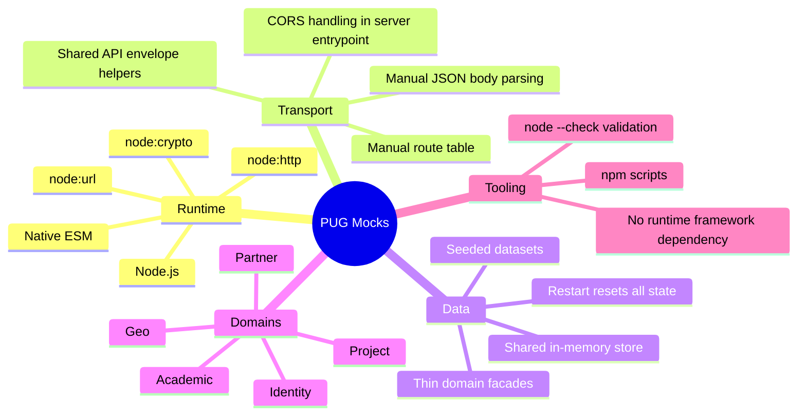
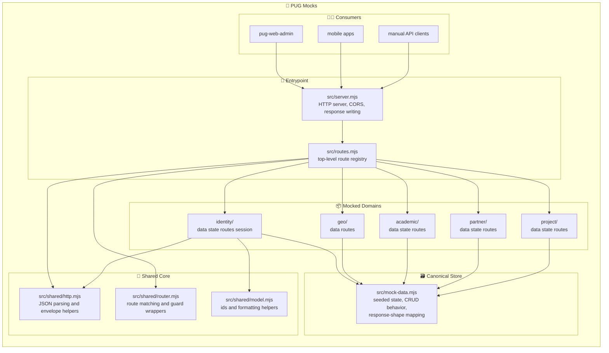
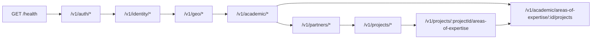
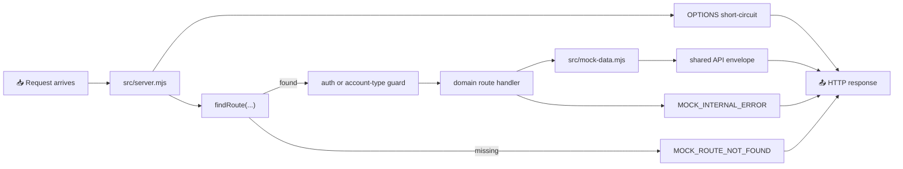
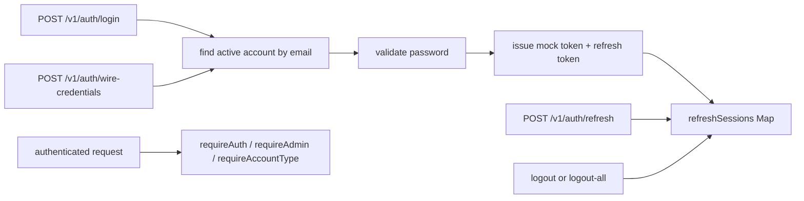
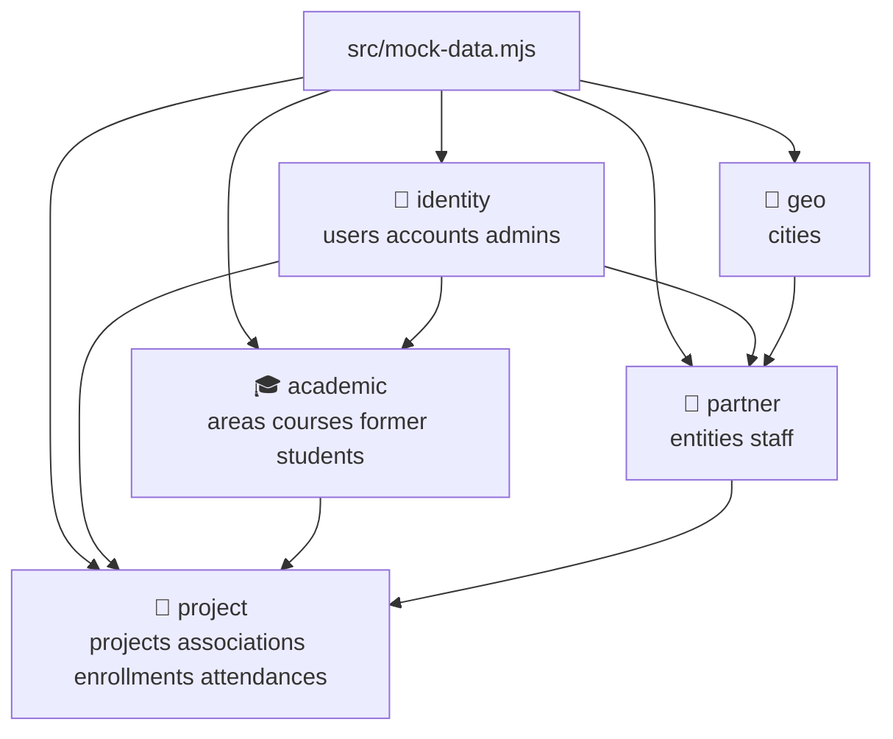
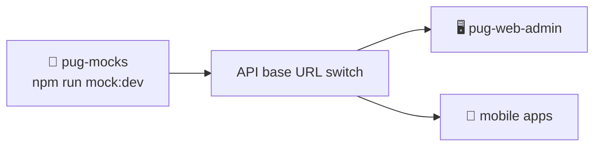

# PUG Mocks

> 🧪 PUG Mocks is the shared mock backend for the PUG platform. It is the lightweight HTTP server used to preserve the current backend contract for web and mobile clients when they need a shared in-memory API target.

## Project Overview

`pug-mocks` is a small Node.js ESM server built directly on the standard library. It keeps the mock backend behavior in one place so the client applications can stay API-contract driven and switch backend targets by base URL only.

The current mocked product surface covers:

- `academic`
- `geo`
- `identity`
- `partner`
- `project`

The application is organized around:

- a single HTTP entrypoint in `src/server.mjs`
- centralized route aggregation in `src/routes.mjs`
- shared HTTP, routing, and formatting helpers under `src/shared`
- one canonical in-memory store in `src/mock-data.mjs`
- thin domain `state/data/routes` modules under each mocked domain

## Tech Stack



## Application Architecture

The mock server uses a clear split between transport entrypoint, shared helpers, one canonical store, and domain-local route modules.



## Route Model



Current high-level route groups include:

- `GET /health`
- auth routes under `/v1/auth`
- identity account, admin, and user routes under `/v1/identity`
- geo city lookup routes under `/v1/geo`
- academic area-of-expertise, course, and former-student routes under `/v1/academic`
- partner entity and staff routes under `/v1/partners`
- project, project-area association, enrollment, and attendance routes under `/v1/projects`

## Request Flow



## Auth and Session Flow

Auth is mock-oriented but still contract-shaped. Login issues an unsigned JWT-shaped bearer token plus a refresh token stored in memory. The current contract also supports credential wiring for password-setup flows.



Important behavior:

- the access token is not cryptographically signed
- refresh sessions are stored in process memory only
- restarting the server clears sessions and all mocked state
- `logout-all` clears sessions for the current authenticated account
- `wire-credentials` is available for password wiring flows
- admin and account-type checks are enforced in the route layer

## State Model

The project now uses one shared in-memory store with explicit cross-domain links instead of separate domain-owned state graphs.



The main relationships are:

- identity is the shared base for users, accounts, and admins
- academic owns areas of expertise, courses, and former-student-specific profiles
- partner owns entities and staff profiles and depends on geo and identity data
- project owns project records plus area-of-expertise associations, enrollments, and attendances
- the seeded dataset stays intentionally light, but coherent enough to exercise cross-domain flows
- seeded values use realistic names, emails, CPF values, CNPJ values, and city data
- the seeded account set includes password-configured flows and at least one password-wiring flow

## High-Level Folder Layout

```text
pug-mocks/
|-- src/
|   |-- server.mjs          HTTP entrypoint and CORS handling
|   |-- routes.mjs          top-level route aggregation
|   |-- mock-data.mjs       canonical seeded store and response mapping
|   |-- shared/             envelope helpers, route matcher, ids, formatters
|   |-- identity/           auth/session plus account admin user facades/routes
|   |-- geo/                city facades and routes
|   |-- academic/           areas of expertise, courses, former students
|   |-- partner/            entities and staff
|   `-- project/            projects, associations, enrollments, attendances
|-- package.json            scripts and runtime metadata
`-- README.md               repo-specific development guidance
```

## Current Mock Coverage

The current mock backend already covers the main contracts consumed by the active clients:

- auth login, refresh, logout, logout-all, and wire-credentials
- identity account, admin, and user lookups
- geo city lookup and search
- academic area-of-expertise, course, and former-student CRUD-style flows
- partner entity and staff CRUD-style flows
- project lifecycle, project-area associations, enrollments, and attendances

This makes `pug-mocks` the shared contract surface for:

- `pug-web-admin`
- mobile applications
- manual contract testing through any REST client

## Local Development

### Prerequisites

- Node.js
- `npm`

### Install dependencies

The project currently has no third-party runtime dependencies, so a fresh install is usually unnecessary. Standard `npm install` remains valid if package metadata changes later.

### Start the server

```bash
npm run mock:dev
```

The default address is:

```text
http://0.0.0.0:8090
```

## Consumer Workflow

`pug-mocks` is a standalone backend process. Consumer apps should start it separately and point their API base URL at it.



Important behavior:

- `pug-mocks` does not start consumer apps
- consumer apps should not know whether the target is real or mocked
- switching between real and mock happens through base-URL configuration only

## Scripts

| Script | Purpose |
|---|---|
| `npm run mock:dev` | Start the mock server |
| `npm run start` | Start the mock server |
| `npm run check` | Syntax-check every source module with `node --check` |

## Validation

Use the default project validation command:

```bash
npm run check
```

Current validation scope is intentionally narrow:

- syntax validation for every checked-in source module

There is not yet a dedicated automated behavior test suite in this repo.

## Current Working Conventions

- keep route aggregation centralized in `src/routes.mjs`
- keep the canonical seeded store in `src/mock-data.mjs`
- keep `state.mjs` and `data.mjs` as thin facades over that store
- keep route-level auth checks in the route layer
- preserve the shared API envelope for both success and error responses
- keep consumers contract-driven and switch targets through configuration only
- use stable seeded ids where client flows depend on them

## Related Documentation

Centralized docs for this mock backend live here:

- `pug-docs/pug-mocks`

Repo-specific implementation conventions remain in the source repository:

- `pug-mocks/README.md`