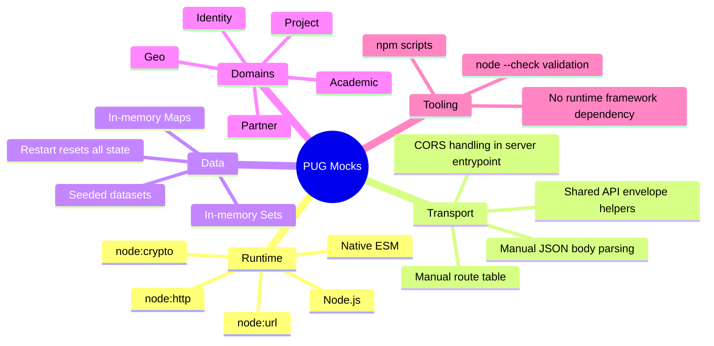
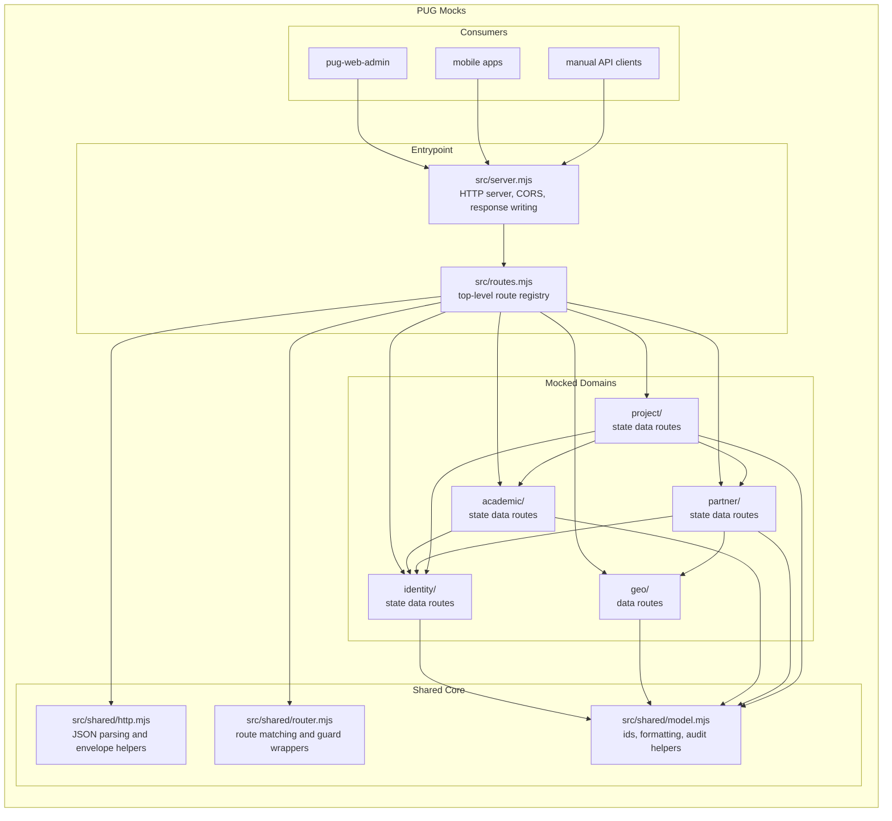
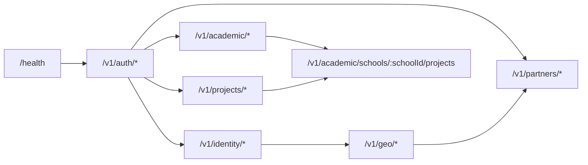
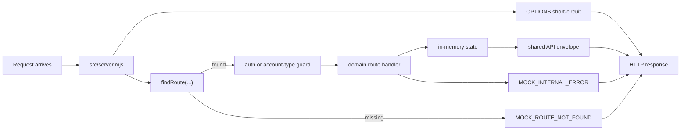
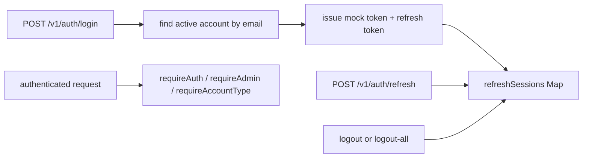
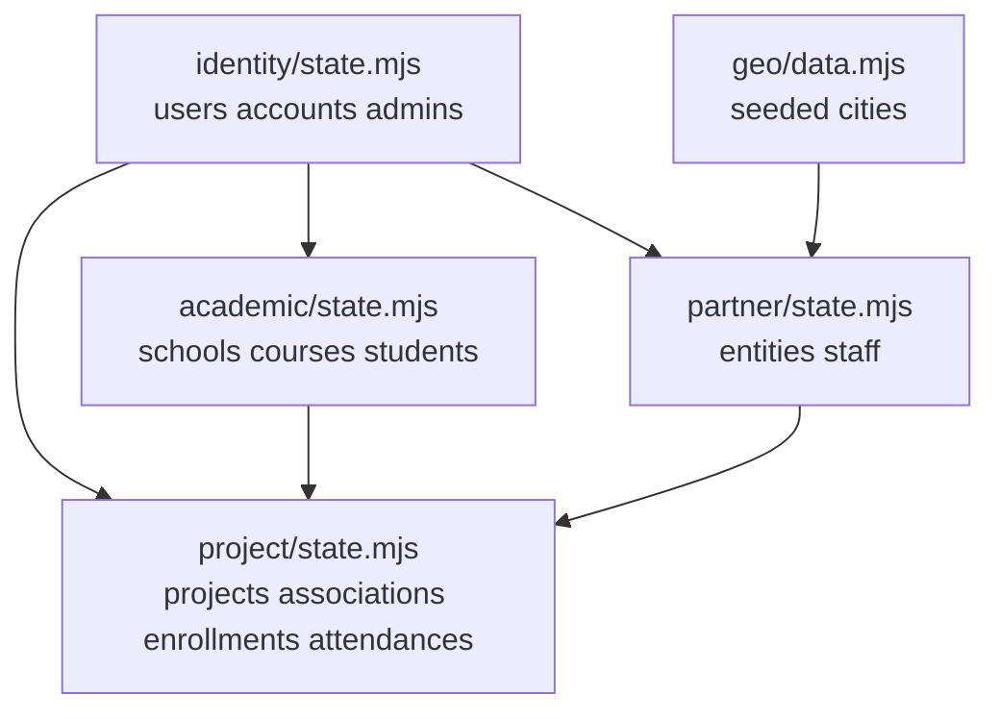
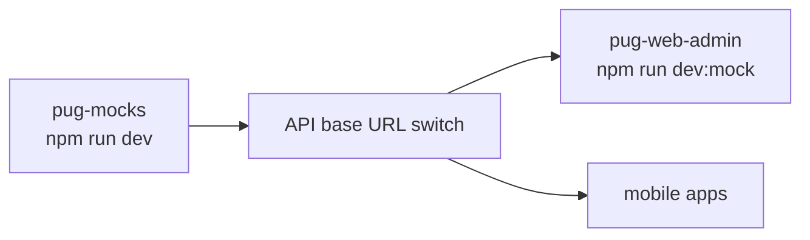

# PUG Mocks

> PUG Mocks is the shared mock backend for the PUG platform. It is the lightweight HTTP server used to preserve the current backend contract for web and mobile clients when they need a shared in-memory API target.

## Project Overview

`pug-mocks` is a small Node.js ESM server built directly on the standard library. It keeps the mock backend behavior in one place so the client applications can stay API-contract driven and switch backend targets by base URL only.

The current mocked product surface covers:

- `academic`
- `geo`
- `identity`
- `partner`
- `project`

The application is organized around:

- a single HTTP entrypoint in `src/server.mjs`
- centralized route aggregation in `src/routes.mjs`
- shared HTTP, routing, and formatting helpers under `src/shared`
- domain-local `state/data/routes` modules under each mocked domain

## Tech Stack



## Application Architecture

The mock server uses a clear split between transport entrypoint, shared helpers, and domain-local state modules.



## Route Model



Current high-level route groups include:

- `GET /health`
- auth routes under `/v1/auth`
- identity account, admin, and user routes under `/v1/identity`
- geo city lookup routes under `/v1/geo`
- academic school, course, and student routes under `/v1/academic`
- partner entity and staff routes under `/v1/partners`
- project, project-school, enrollment, and attendance routes under `/v1/projects`

## Request Flow



## Auth and Session Flow

Auth is mock-oriented but still contract-shaped. Login issues an unsigned JWT-shaped bearer token plus a refresh token stored in memory.



Important behavior:

- the access token is not cryptographically signed
- refresh sessions are stored in process memory only
- restarting the server clears sessions and all mocked state
- admin and account-type checks are enforced in the route layer

## State Model

The project uses separate in-memory state modules with explicit cross-domain links.



The main relationships are:

- identity is the shared base for users, accounts, admins, students, and partner staff
- academic owns schools, courses, and student-specific profiles
- partner owns entities and staff profiles and depends on geo and identity data
- project owns project records plus school associations, enrollments, and attendances
- the default seeded identity dataset keeps at least 20% of accounts inactive so client apps can exercise inactive-account flows immediately
- seeded `auditInfo` values are generated with distinct random `createdAt` and `updatedAt` timestamps between January 1, 2024 and the current runtime moment
- admin, staff, and student responses flatten shared identity fields (`accountId`, `accountEmail`, `userId`, `userName`) instead of nesting an account object, and staff responses also expose `entityName`

## High-Level Folder Layout

```text
pug-mocks/
|-- src/
|   |-- server.mjs          HTTP entrypoint and CORS handling
|   |-- routes.mjs          top-level route aggregation
|   |-- shared/             envelope helpers, route matcher, ids, formatters
|   |-- identity/           auth/session plus account admin user state
|   |-- geo/                seeded city dataset and routes
|   |-- academic/           schools courses students
|   |-- partner/            entities and staff
|   `-- project/            projects, associations, enrollments, attendances
|-- package.json            scripts and runtime metadata
`-- README.md               repo-specific development guidance
```

## Current Mock Coverage

The current mock backend already covers the main contracts consumed by the active clients:

- auth login, refresh, logout, and logout-all
- identity account, admin, and user lookups
- geo city lookup and search
- academic school, course, and student CRUD-style flows, including student account activation toggles on `PATCH /v1/academic/students/:id`
- partner entity and staff CRUD-style flows
- project lifecycle, project-school associations, enrollments, and attendances

This makes `pug-mocks` the shared contract surface for:

- `pug-web-admin`
- mobile applications
- manual contract testing through any REST client

## Local Development

### Prerequisites

- Node.js
- `npm`

### Install dependencies

The project currently has no third-party runtime dependencies, so a fresh install is usually unnecessary. Standard `npm install` remains valid if package metadata changes later.

### Start the server

```bash
npm run dev
```

The default address is:

```text
http://0.0.0.0:8090
```

## Consumer Workflow

`pug-mocks` is a standalone backend process. Consumer apps should start it separately and point their API base URL at it.



Important behavior:

- `pug-mocks` does not start consumer apps
- consumer apps should not know whether the target is real or mocked
- switching between real and mock happens through base-URL configuration only

## Scripts

| Script | Purpose |
|---|---|
| `npm run dev` | Start the mock server |
| `npm run start` | Start the mock server |
| `npm run check` | Syntax-check every source module with `node --check` |

## Validation

Use the default project validation command:

```bash
npm run check
```

Current validation scope is intentionally narrow:

- syntax validation for every checked-in source module

There is not yet a dedicated automated behavior test suite in this repo.

## Current Working Conventions

- keep route aggregation centralized in `src/routes.mjs`
- keep domain behavior in `state.mjs` and expose it through `data.mjs`
- keep route-level auth checks in the route layer
- preserve the shared API envelope for both success and error responses
- keep consumers contract-driven and switch targets through configuration only
- use stable seeded ids where client flows depend on them

## Related Documentation

Centralized docs for this mock backend live here:

- `pug-docs/pug-mocks`

Repo-specific implementation conventions remain in the source repository:

- `pug-mocks/README.md`
