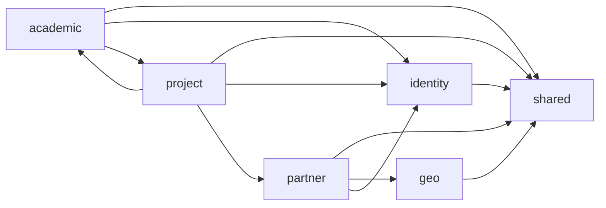

# PUG Mocks

`pug-mocks` is the shared mock backend for the PUG applications. It is a small Node.js ESM HTTP server built directly on the standard library and exists so clients can run against a backend-shaped API without needing the full `pug-service` stack.

## 🎯 Project purpose

This repository provides:

- a lightweight mock HTTP server for PUG clients
- route families that mirror the real backend contract under `/v1/*`
- in-memory seeded state for academic, geo, identity, partner, and project flows
- mock auth and session behavior so frontend and mobile flows can exercise login, refresh, logout, logout-all, and credential wiring
- a shared seed dataset currently aligned with `pug-mobile-partner/mock`

Representative files:

- [package.json](https://github.com/Plataforma-Universidade-Gratuita/pug-mocks/blob/main/package.json)
- [src/server.mjs](https://github.com/Plataforma-Universidade-Gratuita/pug-mocks/blob/main/src/server.mjs)
- [src/routes.mjs](https://github.com/Plataforma-Universidade-Gratuita/pug-mocks/blob/main/src/routes.mjs)
- [src/identity/auth/session.mjs](https://github.com/Plataforma-Universidade-Gratuita/pug-mocks/blob/main/src/identity/auth/session.mjs)

## ✨ High-level feature summary

- **Shared HTTP platform** with `/health`, centralized CORS, shared envelope helpers, and route matching
- **Identity flows** covering auth, accounts, admins, users, refresh tokens, and credential wiring
- **Geo coverage** for city listing, search, and detail
- **Academic coverage** for areas of expertise, courses, and former students
- **Partner coverage** for entities and staff
- **Project coverage** for projects, project-area links, enrollments, and attendances
- **Mutable in-memory state** reset on process restart



## 🧰 Tech stack

| Area | Repository |
| --- | --- |
| Language | JavaScript |
| Runtime | Node.js |
| Module format | native ESM |
| HTTP layer | Node standard library `http` |
| Persistence | in-memory only |
| Package manager | npm |
| Verification | `node --check` through `npm run check` |
| CI | GitHub Actions |

## 🗂️ Repository and module overview

### Main repository areas

| Path | Purpose |
| --- | --- |
| [`src/server.mjs`](https://github.com/Plataforma-Universidade-Gratuita/pug-mocks/blob/main/src/server.mjs) | server bootstrap, env parsing, CORS, request dispatch |
| [`src/routes.mjs`](https://github.com/Plataforma-Universidade-Gratuita/pug-mocks/blob/main/src/routes.mjs) | top-level route aggregation including `/health` |
| [`src/shared`](https://github.com/Plataforma-Universidade-Gratuita/pug-mocks/tree/main/src/shared) | shared HTTP envelope, routing, ids, and state helpers |
| [`src/identity`](https://github.com/Plataforma-Universidade-Gratuita/pug-mocks/tree/main/src/identity) | auth, accounts, admins, users |
| [`src/geo`](https://github.com/Plataforma-Universidade-Gratuita/pug-mocks/tree/main/src/geo) | cities |
| [`src/academic`](https://github.com/Plataforma-Universidade-Gratuita/pug-mocks/tree/main/src/academic) | areas of expertise, courses, former students |
| [`src/partner`](https://github.com/Plataforma-Universidade-Gratuita/pug-mocks/tree/main/src/partner) | entities and staff |
| [`src/project`](https://github.com/Plataforma-Universidade-Gratuita/pug-mocks/tree/main/src/project) | projects, enrollments, attendances |
| [`scripts/check.mjs`](https://github.com/Plataforma-Universidade-Gratuita/pug-mocks/blob/main/scripts/check.mjs) | syntax verification across `src` |

### Module layout pattern

Each domain leaf module follows the same structure:

- `data.mjs` for seeded mutable data
- `state.mjs` for domain reads, writes, and behavior
- `routes.mjs` for HTTP route definitions

The seeded `data.mjs` files are the main synchronization surface when aligning this repository with the mobile mock datasets.

## ▶️ How to run locally

1. Install dependencies:

```bash
npm ci
```

2. Start the mock server:

```bash
npm run mock:dev
```

or:

```bash
npm run start
```

3. Use the default local base URL:

```text
http://localhost:8090
```

Current runtime variables from [`src/server.mjs`](https://github.com/Plataforma-Universidade-Gratuita/pug-mocks/blob/main/src/server.mjs):

- `MOCK_API_HOST=0.0.0.0`
- `MOCK_API_PORT=8090`
- `MOCK_API_VERBOSE=true`
- `MOCK_API_CORS_ORIGIN=*`

Important local note:

- this repository does **not** currently provide tunnel helper scripts; if a mobile device needs a public URL, expose the server through your own tunnel tool

## 🏗️ How to build

There is no separate production build artifact step in the repository. The server runs directly from source.

Useful operational commands are:

```bash
npm run start
npm run check
npm run verify
```

## ✅ How to test and verify

Dedicated automated tests are not part of the repository.

Current verification commands are:

```bash
npm run check
npm run verify
```

`npm run verify` currently delegates to `npm run check`, which runs `node --check` across every `*.mjs` file under `src`.

After any seeded-data sync, the expected validation step is:

```bash
npm run check
```

## 📚 Documentation

- [Repository README](https://github.com/Plataforma-Universidade-Gratuita/pug-mocks/blob/main/README.md)
