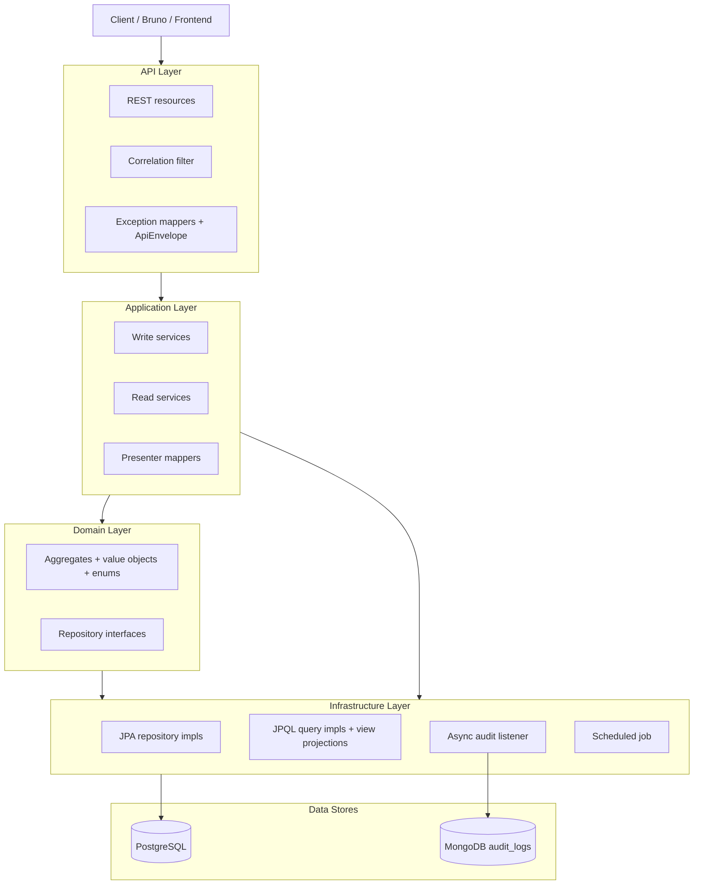
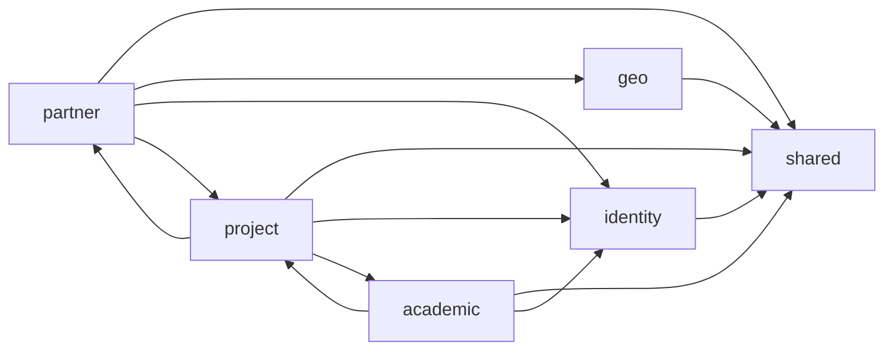
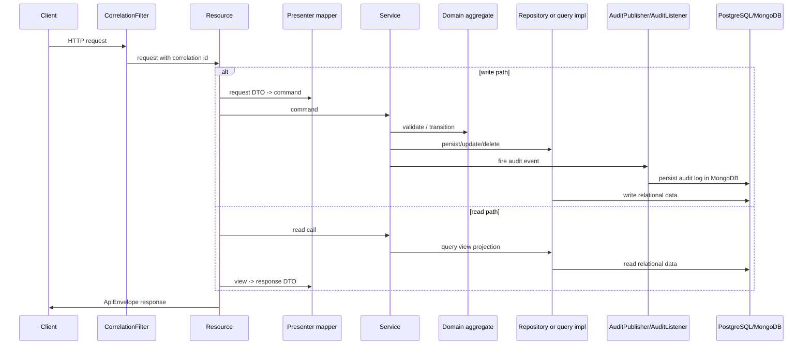
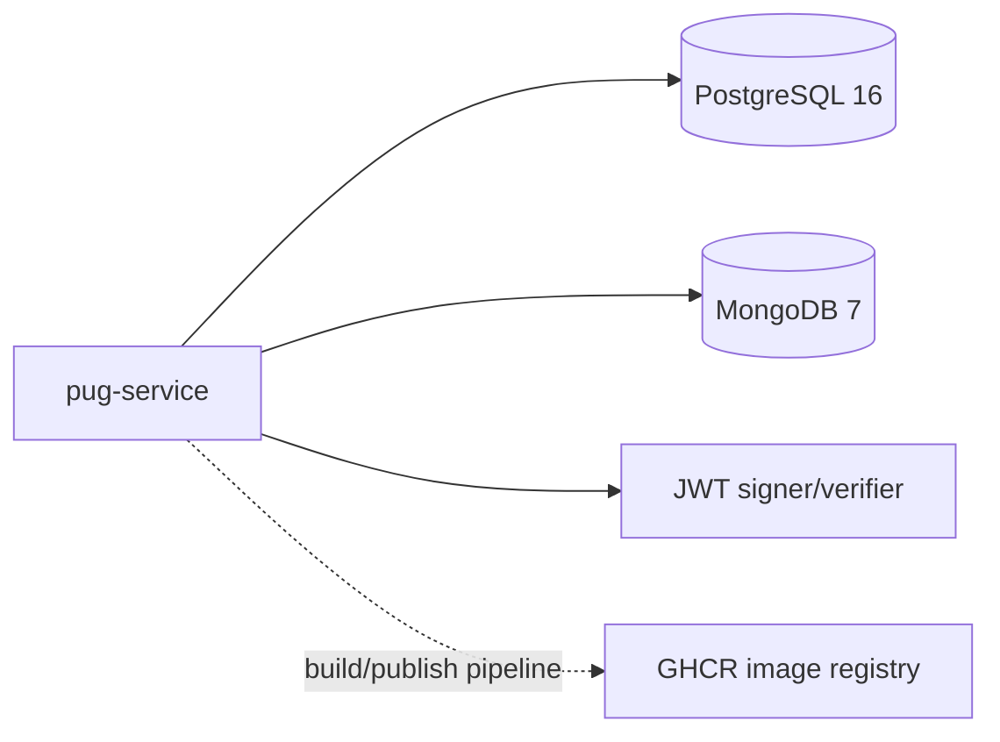

# Architecture Overview

See the [main README](./README.md) for the developer-facing overview and entry-point links.

## Overall architecture

`pug-service` is a single Quarkus 3.14 application built with Maven and Java 21. It is not a multi-module Maven repo; instead, it is a modular monolith organized under `src/main/java/br/org/catolicasc/pug`.

The main business modules are:

- `shared`
- `geo`
- `identity`
- `partner`
- `academic`
- `project`

At runtime, the application combines:

- REST resources built with Quarkus REST
- write-side domain services and repositories backed by PostgreSQL
- read-side JPQL projections for richer API responses
- JWT-based authentication and role checks
- asynchronous audit persistence to MongoDB
- one scheduled cleanup job for expired refresh tokens

## Main layers and components

### What lives where

- [`shared`](../../pug-service/src/main/java/br/org/catolicasc/pug/shared): API envelope, shared exceptions, i18n, correlation IDs, audit, pagination, shared persistence helpers
- [`geo`](../../pug-service/src/main/java/br/org/catolicasc/pug/geo): read-only city catalog
- [`identity`](../../pug-service/src/main/java/br/org/catolicasc/pug/identity): authentication, refresh tokens, accounts, admins, users
- [`partner`](../../pug-service/src/main/java/br/org/catolicasc/pug/partner): partner entities and staff
- [`academic`](../../pug-service/src/main/java/br/org/catolicasc/pug/academic): areas of expertise, courses, former students
- [`project`](../../pug-service/src/main/java/br/org/catolicasc/pug/project): projects, enrollments, attendances, project-area associations

## Module relationships

The modules are not fully isolated. The codebase uses direct in-process service/query calls between modules where the business rules require it.

Concrete examples from the code:

- `project` calls `FormerStudentsService`, `EntitiesService`, and `AuthService`
- `academic` calls `ProjectAreaOfExpertiseService` and `EnrollmentsService`
- `partner` calls `ProjectService` and `AttendancesService`
- `shared` calls `AuthService` for audit context and `PasswordService` for admin password seeding

## Request and data flow

The API follows a repeatable request flow across modules.

### Cross-cutting parts of that flow

- [`CorrelationFilter`](../../pug-service/src/main/java/br/org/catolicasc/pug/shared/http/CorrelationFilter.java) manages `X-Correlation-Id`.
- [`ApiEnvelope`](../../pug-service/src/main/java/br/org/catolicasc/pug/shared/presenter/rest/ApiEnvelope.java) standardizes success payloads.
- shared exception mappers standardize error payloads.
- presenter mappers shape localized status/info responses instead of returning domain or JPA objects directly.

## External dependencies and integrations

### Runtime libraries and frameworks

The build in [`pom.xml`](../../pug-service/pom.xml) shows the main stack:

- Quarkus REST + Jackson
- Hibernate ORM + Panache + PostgreSQL JDBC
- Flyway
- MongoDB + Panache Mongo
- SmallRye JWT
- Hibernate Validator
- SmallRye OpenAPI and Health
- Micrometer
- Scheduler
- Lombok

### Runtime integrations

Not found in the current codebase:

- outbound HTTP clients in `src/main/java`
- message brokers or message-driven consumers/producers
- deployment manifests or deploy workflows in this repository

What was checked:

- `src/main/java` for `@RegisterRestClient`, `@RestClient`, and similar client usage
- `.github/workflows` for deployment workflows
- `src/main/java` for `@Incoming`, `@Outgoing`, and `@ConsumeEvent`

## Persistence and integration boundaries

### PostgreSQL

PostgreSQL is the primary business data store.

Flyway migrations currently define:

- UUIDv7 DB helper function
- identity tables (`users`, `accounts`, `admins`, `refresh_tokens`)
- geo table (`cities`)
- partner tables (`entities`, `staff`)
- academic tables (`areas_of_expertise`, `courses`, `former_students`)
- project tables (`projects`, `project_areas_of_expertise`, `enrollments`, `attendances`)
- seed data (`V015` through `V018`)

### MongoDB

MongoDB is used only for audit logs through the async listener in [`AuditListener`](../../pug-service/src/main/java/br/org/catolicasc/pug/shared/infra/audit/AuditListener.java).

### Startup and scheduled behavior

Two repo-wide background behaviors are present:

- [`AdminPasswordSeeder`](../../pug-service/src/main/java/br/org/catolicasc/pug/shared/infra/AdminPasswordSeeder.java): re-hashes the seeded `admin@pug.com` password on every non-test startup
- [`ExpiredTokenCleanupJob`](../../pug-service/src/main/java/br/org/catolicasc/pug/identity/infra/ExpiredTokenCleanupJob.java): purges expired refresh tokens daily at `03:00`

Those are the only scheduled/startup behaviors that were found directly in the current codebase.

## Architectural decisions visible in code

- **Single deployable service:** one `pom.xml`, one Quarkus application, multiple business packages.
- **Modular monolith:** modules are separate in code organization, but they still collaborate through direct service interfaces.
- **CQRS-style reads inside modules:** write aggregates and read projections are separate, especially in `identity`, `partner`, `academic`, and `project`.
- **Strict API shaping:** responses are built through presenter mappers and `ApiEnvelope`, not raw entities.
- **Shared validation and localization:** `UuidV7`, i18n bundles, shared error codes, and shared exception mappers are reused across modules.
- **Audit as async side-effect:** write services publish audit events without making MongoDB part of the primary request transaction.

## Links

- [Back to README](./README.md)
