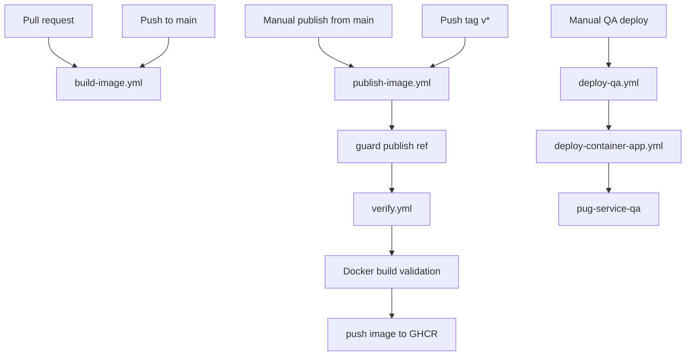
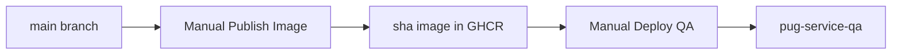

# PUG Service CI/CD Guide

Back to [README.md](https://github.com/Plataforma-Universidade-Gratuita/pug-docs/blob/main/pug-service/README.md).

This document covers the GitHub Actions workflows currently present in [`pug-service/.github/workflows`](https://github.com/Plataforma-Universidade-Gratuita/pug-service/tree/main/.github/workflows).

The current repository supports:

- verification
- Docker image build validation
- GHCR image publishing
- manual QA deployment to Azure Container Apps

A dedicated PRD deployment workflow is not currently present in this repository.

## 🚦 Pipeline overview

Current workflow set:

| Workflow | File | Trigger | Purpose |
| --- | --- | --- | --- |
| Verify | [`verify.yml`](https://github.com/Plataforma-Universidade-Gratuita/pug-service/blob/main/.github/workflows/verify.yml) | reusable `workflow_call` | Run Maven verification against PostgreSQL and MongoDB services |
| Build Image | [`build-image.yml`](https://github.com/Plataforma-Universidade-Gratuita/pug-service/blob/main/.github/workflows/build-image.yml) | pull request, push to `main` | Validate that the Docker image builds |
| Publish Image | [`publish-image.yml`](https://github.com/Plataforma-Universidade-Gratuita/pug-service/blob/main/.github/workflows/publish-image.yml) | `workflow_dispatch`, tag push `v*` | Verify, build, and publish a container image to GHCR |
| Deploy QA | [`deploy-qa.yml`](https://github.com/Plataforma-Universidade-Gratuita/pug-service/blob/main/.github/workflows/deploy-qa.yml) | `workflow_dispatch` | Deploy a selected image to the QA Container App |
| Deploy Container App | [`deploy-container-app.yml`](https://github.com/Plataforma-Universidade-Gratuita/pug-service/blob/main/.github/workflows/deploy-container-app.yml) | reusable `workflow_call` | Shared Azure Container Apps deployment implementation |



## 🔔 Workflow triggers

### Verify

`verify.yml` is reusable and is called by other workflows.

It is currently invoked by `publish-image.yml`.

### Build Image

`build-image.yml` validates that the Docker image can be built.

It runs on:

- pull requests
- pushes to `main`

It keeps `push: false`, so it does not publish an image.

### Publish Image

`publish-image.yml` runs on:

- manual `workflow_dispatch`
- pushed tags matching `v*`

Manual publish is only allowed from `main`.

Tag publish is only allowed when the tagged commit is contained in `main`.

### Deploy QA

`deploy-qa.yml` is manual.

It requires a full image reference, for example:

```text
ghcr.io/plataforma-universidade-gratuita/pug-service:sha-abc123
```

## ✅ Verify pipeline

[`verify.yml`](https://github.com/Plataforma-Universidade-Gratuita/pug-service/blob/main/.github/workflows/verify.yml) is the main quality gate.

It provisions service containers and runs Maven verification.

### Service containers

The workflow starts:

| Service | Image | Host port |
| --- | --- | --- |
| PostgreSQL | `postgres:16` | `5434` |
| MongoDB | `mongo:7.0` | `27019` |

PostgreSQL is configured with:

```text
POSTGRES_USER=pug_test
POSTGRES_PASSWORD=pug_test
POSTGRES_DB=pug_test
```

MongoDB is configured with:

```text
MONGO_INITDB_ROOT_USERNAME=pug_test
MONGO_INITDB_ROOT_PASSWORD=pug_test
```

### Verify steps

The verify job:

1. checks out the repository
2. installs Temurin Java `21`
3. restores Maven cache
4. makes `mvnw` executable
5. runs:

```bash
./mvnw -B clean verify
```

### Build, test, lint, and coverage behavior

Because the workflow runs `clean verify`, it executes the Maven lifecycle and the checks bound in `pom.xml`, including:

- compile/build
- test execution
- formatting/linting plugins configured in Maven
- static analysis plugins configured in Maven
- JaCoCo report and coverage checks, if bound to the Maven lifecycle

Local equivalent:

```bash
chmod +x ./mvnw
./mvnw -B clean verify
```

## 🐳 Build Image workflow

[`build-image.yml`](https://github.com/Plataforma-Universidade-Gratuita/pug-service/blob/main/.github/workflows/build-image.yml) only verifies that the Docker image can be built.

Steps:

1. checks out the repository
2. sets up Docker Buildx
3. runs `docker/build-push-action@v6`
4. keeps `push: false`

This workflow is a packaging smoke test.

It does not publish an image.

## 📦 Publish Image workflow

[`publish-image.yml`](https://github.com/Plataforma-Universidade-Gratuita/pug-service/blob/main/.github/workflows/publish-image.yml) builds and publishes a container image to GitHub Container Registry.

It:

1. validates the ref
2. runs the reusable verify workflow
3. validates the Docker image build
4. computes image tags
5. logs in to GHCR
6. builds and pushes the image

### Ref guards

Manual publish is only allowed from:

```text
refs/heads/main
```

Tag publish is only allowed when:

```text
refs/tags/v*
```

and the tagged commit is contained in:

```text
origin/main
```

### Image name

The image name is fixed by the workflow:

```text
ghcr.io/plataforma-universidade-gratuita/pug-service
```

### Manual publish tags

Manual publish from `main` publishes:

```text
ghcr.io/plataforma-universidade-gratuita/pug-service:sha-<shortsha>
```

Example:

```text
ghcr.io/plataforma-universidade-gratuita/pug-service:sha-abc123def456
```

This is the expected image format for QA deployments.

### Version tag publish tags

When a tag like this is pushed:

```text
v1.0.0
```

the workflow publishes:

```text
ghcr.io/plataforma-universidade-gratuita/pug-service:1.0.0
ghcr.io/plataforma-universidade-gratuita/pug-service:latest
```

### Provenance and SBOM

The publish step disables Docker provenance and SBOM generation:

```yaml
provenance: false
sbom: false
```

This keeps GHCR package versions simpler and avoids extra untagged package entries.

## ☁️ Deploy Container App workflow

`deploy-container-app.yml` is the reusable Azure Container Apps deployment workflow.

It receives:

| Input | Purpose |
| --- | --- |
| `environment_name` | GitHub Environment name, such as `qa` |
| `azure_resource_group` | Azure resource group containing the Container App |
| `azure_container_app` | Azure Container App name |
| `quarkus_profile` | Quarkus runtime profile to activate |
| `image` | Full container image reference to deploy |

It performs these steps:

1. logs in to Azure using `AZURE_CREDENTIALS`
2. ensures the Azure Container Apps extension exists
3. configures GHCR as the Container App registry
4. writes application secrets to the Azure Container App
5. updates the Container App image
6. sets runtime environment variables
7. prints the deployed URL and Swagger URL

## 🔐 Runtime secrets and variables

### GitHub secrets

The deploy workflow expects these secrets:

| Secret | Purpose |
| --- | --- |
| `AZURE_CREDENTIALS` | Azure service principal JSON used by `azure/login` |
| `GHCR_USERNAME` | username used by Azure Container Apps to pull from GHCR |
| `GHCR_TOKEN` | token used by Azure Container Apps to pull from GHCR |
| `DB_URL` | runtime PostgreSQL JDBC URL |
| `DB_USER` | runtime PostgreSQL username |
| `DB_PASS` | runtime PostgreSQL password |
| `MONGODB_URI` | runtime MongoDB connection string |
| `JWT_SECRET_KEY` | JWT signing/verification secret |
| `PASSWORD_PEPPER` | password pepper |
| `QR_PEPPER` | QR-code pepper |

`GITHUB_TOKEN` is also used by the publish workflow to push images to GHCR. It is provided automatically by GitHub Actions.

### GitHub variables

The deploy workflow expects:

| Variable | Purpose |
| --- | --- |
| `CORS_ORIGINS` | comma-separated list of allowed CORS origins |

Example:

```text
https://pug-web-admin-qa.example.com,https://q0xjvi0-anonymous-3001.exp.direct
```

Do not include spaces between origins.

Do not add trailing slashes unless the frontend origin actually includes them. Browser origins normally do not include path or trailing slash.

## 🔑 Azure Container App secret mapping

The deploy workflow writes these Azure Container App secrets:

| Azure Container App secret | GitHub secret source |
| --- | --- |
| `db-url` | `DB_URL` |
| `db-user` | `DB_USER` |
| `db-pass` | `DB_PASS` |
| `mongodb-uri` | `MONGODB_URI` |
| `jwt-secret-key` | `JWT_SECRET_KEY` |
| `password-pepper` | `PASSWORD_PEPPER` |
| `qr-pepper` | `QR_PEPPER` |

Then the revision is updated with secret references:

```text
DB_URL=secretref:db-url
DB_USER=secretref:db-user
DB_PASS=secretref:db-pass
MONGODB_URI=secretref:mongodb-uri
JWT_SECRET_KEY=secretref:jwt-secret-key
PASSWORD_PEPPER=secretref:password-pepper
QR_PEPPER=secretref:qr-pepper
```

The workflow also sets:

```text
QUARKUS_PROFILE=<workflow input>
CORS_ORIGINS=<GitHub variable value>
```

## 🚚 QA deployment

`deploy-qa.yml` is manual.

It asks for:

```text
image
```

Example:

```text
ghcr.io/plataforma-universidade-gratuita/pug-service:sha-abc123def456
```

Deployment target:

| Setting | Value |
| --- | --- |
| GitHub Environment | `qa` |
| Azure resource group | `rg-pug-qa` |
| Azure Container App | `pug-service-qa` |
| Quarkus profile | `qa` |

After deploy, the workflow prints:

```text
https://<container-app-fqdn>
https://<container-app-fqdn>/swagger-ui
```

Typical QA flow:



## 🚀 PRD deployment

A dedicated PRD deploy workflow is not currently present in `pug-service`.

Version tag publishing still creates production-style image tags:

```text
ghcr.io/plataforma-universidade-gratuita/pug-service:<version>
ghcr.io/plataforma-universidade-gratuita/pug-service:latest
```

but deploying those images to PRD must be handled separately unless a `deploy-prd.yml` workflow is added.

## 🧪 Test, lint, and coverage responsibilities

| Responsibility | Where it happens today |
| --- | --- |
| compile/build | `verify.yml`, Docker build stage, local Maven |
| JVM test suite | `verify.yml`, local `./mvnw test` / `./mvnw verify` |
| formatting checks | Maven lifecycle during `verify`, depending on `pom.xml` configuration |
| static analysis | Maven lifecycle during `verify`, depending on `pom.xml` configuration |
| JaCoCo report and coverage check | Maven lifecycle during `verify`, depending on `pom.xml` configuration |
| image build smoke test | `build-image.yml` |
| image publish | `publish-image.yml` |
| QA deployment | `deploy-qa.yml` |
| PRD deployment | not currently present |

## Docker build path

The current [`Dockerfile`](https://github.com/Plataforma-Universidade-Gratuita/pug-service/blob/main/Dockerfile) uses a multi-stage build.

Operational details:

- the service runs on port `8080`
- the final image runs the packaged Quarkus application
- tests are skipped during Docker image packaging because verification is handled before image publishing

## Common pitfalls

- A green `build-image` run does not mean the full Maven quality gate passed; the quality gate is `verify`.
- Manual publish is only allowed from `main`.
- Tag publish requires a `v*` tag whose commit is contained in `main`.
- Manual QA deploy requires the full image tag, usually `sha-<shortsha>`.
- `CORS_ORIGINS` must include every browser frontend origin that will call the backend.
- Multiple CORS origins should be comma-separated without spaces.
- Azure Container App must already exist before `az containerapp update` can deploy a revision.
- The deploy workflow configures secrets on the existing Container App; it does not create the database, MongoDB instance, or Container App environment.
- PRD image tags may exist, but this repository currently does not contain a PRD deploy workflow.

## Links

- [Back to README](https://github.com/Plataforma-Universidade-Gratuita/pug-docs/blob/main/pug-service/README.md)
- [`pug-service` repository](https://github.com/Plataforma-Universidade-Gratuita/pug-service)
- [`pug-service` workflows](https://github.com/Plataforma-Universidade-Gratuita/pug-service/tree/main/.github/workflows)