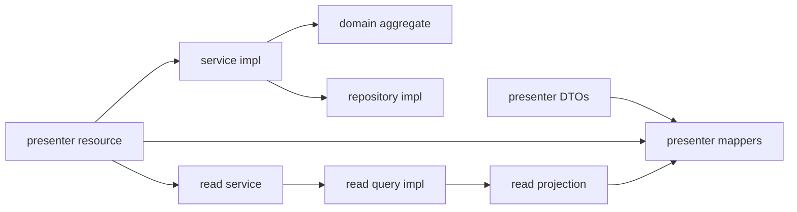

# Development Guide

This guide documents the coding patterns that are already established in `pug-service`.

## Development model

`pug-service` is a single Maven/Quarkus application, not a multi-module Maven build. The codebase is organized as a modular monolith with six feature packages plus one cross-cutting package:

- `shared`
- `geo`
- `identity`
- `partner`
- `academic`
- `project`

Each feature package follows roughly the same shape:

That structure is visible across modules such as:

- [`identity`](https://github.com/Plataforma-Universidade-Gratuita/pug-service/tree/main/src/main/java/br/org/catolicasc/pug/identity)
- [`partner`](https://github.com/Plataforma-Universidade-Gratuita/pug-service/tree/main/src/main/java/br/org/catolicasc/pug/partner)
- [`academic`](https://github.com/Plataforma-Universidade-Gratuita/pug-service/tree/main/src/main/java/br/org/catolicasc/pug/academic)
- [`project`](https://github.com/Plataforma-Universidade-Gratuita/pug-service/tree/main/src/main/java/br/org/catolicasc/pug/project)

## Established code patterns

### 1. Keep REST, orchestration, domain, and persistence separate

- REST resources live under `presenter/` and stay thin.
- Request/response contracts are records under `presenter/dtos/...`.
- Mapping between REST DTOs and service commands lives in `presenter/mappers/...`.
- Write orchestration lives in `service/impl/...`.
- Read orchestration lives in `*ReadServiceImpl` classes.
- Domain rules live in aggregates, enums, and value objects under `domain/...`.
- JPA write models live under `infra/persistence/...`.
- Read projections and JPQL queries live under `infra/read/...`.

Concrete examples:

- [`ProjectsResource`](https://github.com/Plataforma-Universidade-Gratuita/pug-service/blob/main/src/main/java/br/org/catolicasc/pug/project/presenter/ProjectsResource.java)
- [`ProjectPresenter`](https://github.com/Plataforma-Universidade-Gratuita/pug-service/blob/main/src/main/java/br/org/catolicasc/pug/project/presenter/mappers/ProjectPresenter.java)
- [`ProjectServiceImpl`](https://github.com/Plataforma-Universidade-Gratuita/pug-service/blob/main/src/main/java/br/org/catolicasc/pug/project/service/impl/ProjectServiceImpl.java)
- [`Project`](https://github.com/Plataforma-Universidade-Gratuita/pug-service/blob/main/src/main/java/br/org/catolicasc/pug/project/domain/Project.java)
- [`ProjectQueriesImpl`](https://github.com/Plataforma-Universidade-Gratuita/pug-service/blob/main/src/main/java/br/org/catolicasc/pug/project/infra/read/impl/ProjectQueriesImpl.java)

### 2. Use commands and criteria between the presenter and service layers

The codebase does not pass request DTOs directly into services.

- create/update flows use `*CreateCommand` and `*UpdateCommand`
- search flows use `*ComplexSearchCriteria`
- read endpoints return `*View` projections and presenter-built responses

Examples:

- [`ProjectCreateCommand`](https://github.com/Plataforma-Universidade-Gratuita/pug-service/blob/main/src/main/java/br/org/catolicasc/pug/project/service/dtos/projects/ProjectCreateCommand.java)
- [`EnrollmentComplexSearchCriteria`](https://github.com/Plataforma-Universidade-Gratuita/pug-service/blob/main/src/main/java/br/org/catolicasc/pug/project/service/dtos/enrollments/EnrollmentComplexSearchCriteria.java)
- [`FormerStudentComplexSearchRequest`](https://github.com/Plataforma-Universidade-Gratuita/pug-service/blob/main/src/main/java/br/org/catolicasc/pug/academic/presenter/dtos/formerstudents/FormerStudentComplexSearchRequest.java)

### 3. Favor read projections for API reads

The codebase uses a CQRS-style split inside a single service:

- write paths operate on domain aggregates and repositories
- read paths operate on JPQL projections (`*View`)

That pattern is especially consistent in `academic`, `identity`, `partner`, and `project`.

### 4. Publish audit events from write services

Create, update, and delete flows typically publish audit events through [`AuditPublisher`](https://github.com/Plataforma-Universidade-Gratuita/pug-service/blob/main/src/main/java/br/org/catolicasc/pug/shared/infra/audit/AuditPublisher.java) after persistence succeeds. New write code should preserve that behavior.

### 5. Keep cross-module calls at the service/query boundary

The modules call each other through service interfaces or read-query contracts, not by directly reading another module's database tables from a random resource.

Concrete examples:

- `project` calls [`FormerStudentsService`](https://github.com/Plataforma-Universidade-Gratuita/pug-service/blob/main/src/main/java/br/org/catolicasc/pug/academic/service/FormerStudentsService.java) and [`EntitiesService`](https://github.com/Plataforma-Universidade-Gratuita/pug-service/blob/main/src/main/java/br/org/catolicasc/pug/partner/service/EntitiesService.java)
- `academic` calls [`ProjectAreaOfExpertiseService`](https://github.com/Plataforma-Universidade-Gratuita/pug-service/blob/main/src/main/java/br/org/catolicasc/pug/project/service/ProjectAreaOfExpertiseService.java)
- `shared` calls [`AuthService`](https://github.com/Plataforma-Universidade-Gratuita/pug-service/blob/main/src/main/java/br/org/catolicasc/pug/identity/service/AuthService.java) for audit context

## Package and module conventions

### Package conventions

Within a feature module, the current package naming is consistent:

- `presenter/` for REST resources
- `presenter/dtos/<feature>/` for request/response records
- `presenter/mappers/` for request/response mapping helpers
- `service/` for interfaces
- `service/dtos/<feature>/` for commands and search criteria
- `service/impl/` for application services
- `service/utils/` for aggregate construction helpers
- `domain/` for aggregates and repository interfaces
- `domain/enums/` for statuses and error codes
- `domain/vos/` for value objects
- `infra/persistence/` for JPA entities
- `infra/persistence/impl/` for repository implementations
- `infra/read/` for read contracts
- `infra/read/dtos/` for read-side projections
- `infra/read/impl/` for JPQL implementations

### Module conventions

- `shared` owns cross-cutting concerns: API envelope, exception mapping, i18n, correlation IDs, audit, shared validation, and persistence helpers.
- `geo` is read-only.
- `identity`, `partner`, `academic`, and `project` all follow the same layered package split.
- `project` is the module with the most visible internal CQRS split.

## Naming conventions

Patterns already visible in the repository:

- resources: pluralized `*Resource` names such as `ProjectsResource`, `CoursesResource`, `AccountsResource`
- service implementations: `*ServiceImpl`
- read services: `*ReadServiceImpl`
- repository implementations: `*RepositoryImpl`
- query implementations: `*QueriesImpl`
- request DTOs: `*CreateRequest`, `*UpdateRequest`, `*ComplexSearchRequest`, `*ValidateRequest`
- response DTOs: `*Response`, `*StatusResponse`, `*InfoResponse`, `*SimpleComplexSearchResponse`
- service DTOs: `*CreateCommand`, `*UpdateCommand`, `*ComplexSearchCriteria`
- read projections: `*View`
- enums: `*Status`, `*ErrorCodes`, `*FieldErrorCodes`
- value objects: under `domain/vos`, often records or immutable classes

Tests follow the same convention:

- `ProjectServiceImplTest`
- `AttendanceResourceTest`
- `ProjectQueriesImplTest`

## Error handling patterns

### API-level error mapping

The API does not build ad hoc error JSON in resources. Errors are normalized through the shared REST mappers under [`shared/presenter/rest/mappers`](https://github.com/Plataforma-Universidade-Gratuita/pug-service/tree/main/src/main/java/br/org/catolicasc/pug/shared/presenter/rest/mappers).

### Exception types already in use

- [`AppValidationException`](https://github.com/Plataforma-Universidade-Gratuita/pug-service/blob/main/src/main/java/br/org/catolicasc/pug/shared/exceptions/AppValidationException.java): request/domain validation errors collected into field-level details
- [`BusinessRuleException`](https://github.com/Plataforma-Universidade-Gratuita/pug-service/blob/main/src/main/java/br/org/catolicasc/pug/shared/exceptions/BusinessRuleException.java): invalid lifecycle transitions and rule violations
- [`DuplicateResourceException`](https://github.com/Plataforma-Universidade-Gratuita/pug-service/blob/main/src/main/java/br/org/catolicasc/pug/shared/exceptions/DuplicateResourceException.java): uniqueness collisions
- [`ResourceNotFoundException`](https://github.com/Plataforma-Universidade-Gratuita/pug-service/blob/main/src/main/java/br/org/catolicasc/pug/shared/exceptions/ResourceNotFoundException.java): missing records

### Practical rule

When adding a new write flow:

1. validate transport input with Jakarta Validation
2. validate domain invariants in the aggregate or processor
3. throw the right shared exception type from the service layer
4. let the shared exception mappers translate it to the API envelope

## Validation patterns

Validation is layered and duplicated deliberately across boundaries.

### Transport validation

REST DTOs use Jakarta annotations such as:

- `@NotNull`
- `@NotBlank`
- `@Size`
- `@DecimalMin`
- `@Min`
- [`@UuidV7`](https://github.com/Plataforma-Universidade-Gratuita/pug-service/blob/main/src/main/java/br/org/catolicasc/pug/shared/validation/UuidV7.java)

Examples:

- [`ProjectCreateRequest`](https://github.com/Plataforma-Universidade-Gratuita/pug-service/blob/main/src/main/java/br/org/catolicasc/pug/project/presenter/dtos/projects/ProjectCreateRequest.java)
- [`AttendanceValidateRequest`](https://github.com/Plataforma-Universidade-Gratuita/pug-service/blob/main/src/main/java/br/org/catolicasc/pug/project/presenter/dtos/attendance/AttendanceValidateRequest.java)
- [`FormerStudentCreateRequest`](https://github.com/Plataforma-Universidade-Gratuita/pug-service/blob/main/src/main/java/br/org/catolicasc/pug/academic/presenter/dtos/formerstudents/FormerStudentCreateRequest.java)

### Domain validation

Aggregates and value objects validate themselves in factory/update methods and either:

- collect field errors
- enforce lifecycle transitions
- reject invalid combinations with `BusinessRuleException`

Examples:

- `Project.start()/putOnHold()/retake()/complete()/cancel()`
- `Enrollment.approve()/reject()/exit()/remove()/complete()`
- `Attendance.validatePresence(...)`

### Query/paging validation

Search endpoints normalize null request bodies and null lists before passing criteria into the query layer. Pagination is standardized through:

- [`PageQuery`](https://github.com/Plataforma-Universidade-Gratuita/pug-service/blob/main/src/main/java/br/org/catolicasc/pug/shared/service/dtos/PageQuery.java)
- [`PageExecution`](https://github.com/Plataforma-Universidade-Gratuita/pug-service/blob/main/src/main/java/br/org/catolicasc/pug/shared/service/dtos/PageExecution.java)
- [`PageResult`](https://github.com/Plataforma-Universidade-Gratuita/pug-service/blob/main/src/main/java/br/org/catolicasc/pug/shared/service/dtos/PageResult.java)

## Local development workflow

The current repository expects Docker-backed infra in development.

1. Start databases:
   - `docker compose up -d postgres mongodb`
2. Run the service:
   - `./mvnw quarkus:dev`
3. Use the Bruno collection under [`requests`](https://github.com/Plataforma-Universidade-Gratuita/pug-service/tree/main/requests) with [`requests/environments/Local.bru`](https://github.com/Plataforma-Universidade-Gratuita/pug-service/blob/main/requests/environments/Local.bru)
4. In dev profile, Swagger UI is exposed at `/swagger-ui`

Important details:

- [`application-dev.properties`](https://github.com/Plataforma-Universidade-Gratuita/pug-service/blob/main/src/main/resources/application-dev.properties) disables Dev Services and points to PostgreSQL on `localhost:5433` and MongoDB on `localhost:27018`.
- [`docker-compose.yml`](https://github.com/Plataforma-Universidade-Gratuita/pug-service/blob/main/docker-compose.yml) uses `registry-docker.weg.net/postgres:16` and `registry-docker.weg.net/mongo:7.0`.
- If that registry is unavailable in your environment, the repository does not provide a second compose file. The docs should not assume one exists.

## Testing expectations for new code

The current quality bar is package-level, not file-level.

- New domain rules should add or update domain tests.
- New resources should add resource tests with `RestAssured`.
- New service orchestration should add service tests with `@InjectMock`.
- New query filters should add query tests covering filters and paging metadata.
- New write flows should keep audit behavior and verify it where the module already tests it.
- New DTO builders in tests should follow the existing `helpers/builders/...` structure instead of hand-constructing large payloads repeatedly.

Useful existing helpers:

- [`BaseResourceTest`](https://github.com/Plataforma-Universidade-Gratuita/pug-service/blob/main/src/test/java/br/org/catolicasc/pug/helpers/BaseResourceTest.java)
- [`TestDataFactory`](https://github.com/Plataforma-Universidade-Gratuita/pug-service/blob/main/src/test/java/br/org/catolicasc/pug/helpers/TestDataFactory.java)
- request builders under [`helpers/builders/requests`](https://github.com/Plataforma-Universidade-Gratuita/pug-service/tree/main/src/test/java/br/org/catolicasc/pug/helpers/builders/requests)
- command builders under [`helpers/builders/commands`](https://github.com/Plataforma-Universidade-Gratuita/pug-service/tree/main/src/test/java/br/org/catolicasc/pug/helpers/builders/commands)

## How to preserve existing standards

When adding new functionality:

- stay inside the existing module unless the use case is clearly cross-cutting
- add DTOs, commands, and presenter mappers instead of reusing unrelated types
- expose reads through read services and projections when the API needs joined response data
- keep domain lifecycle logic inside aggregates and value objects
- keep resources thin and free of repository logic
- keep new env/config entries in the appropriate profile-specific properties file
- keep UUID-facing APIs on `@UuidV7`
- preserve localized status/error formatting through `I18n` and presenter response objects

## Anti-patterns to avoid

- Returning JPA entities directly from resources
- Injecting repositories straight into resources
- Reusing request DTOs as service-layer commands
- Duplicating response shaping in multiple resources instead of using presenter mappers
- Adding write flows that skip `AuditPublisher`
- Hard-coding lifecycle transitions in resources instead of the aggregate/service layer
- Adding cross-module database reads when a service/query boundary already exists
- Assuming `mvn verify` is read-only: the current build runs `spotless:apply` during `validate`, so local source files may be reformatted automatically
- Treating test-only helpers as production patterns; builders and `TestDataFactory` belong in `src/test/java`

## Links

- [Back to README](https://github.com/Plataforma-Universidade-Gratuita/pug-docs/blob/main/pug-service/README.md)
