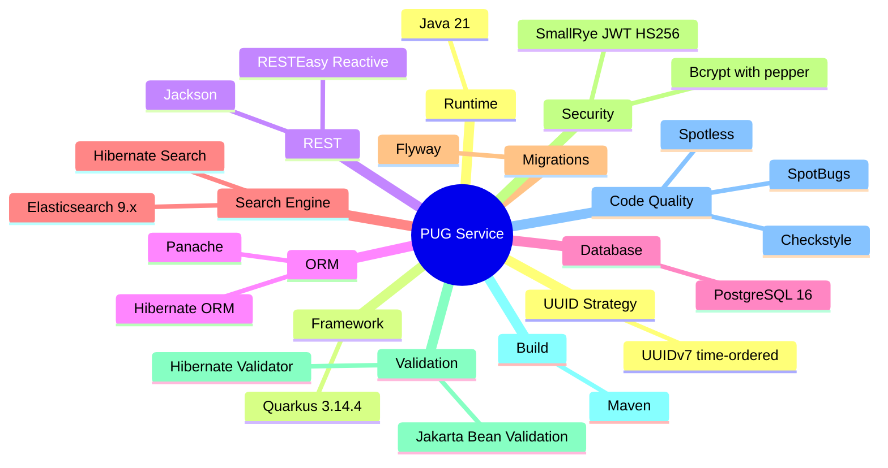
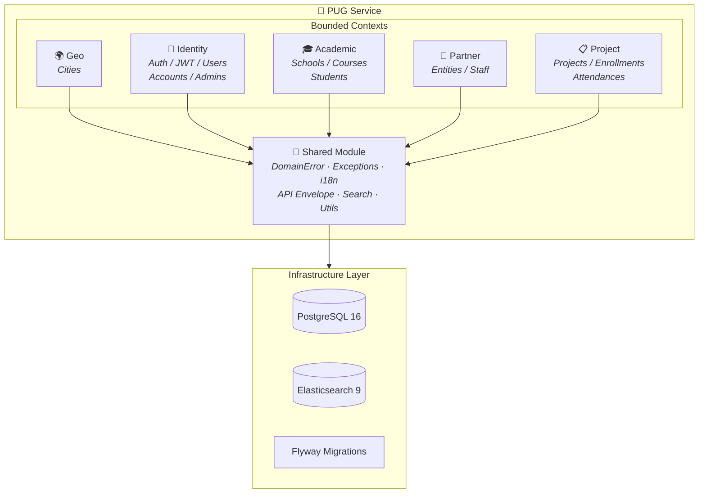
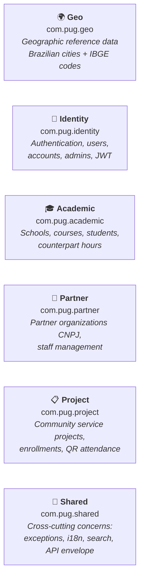
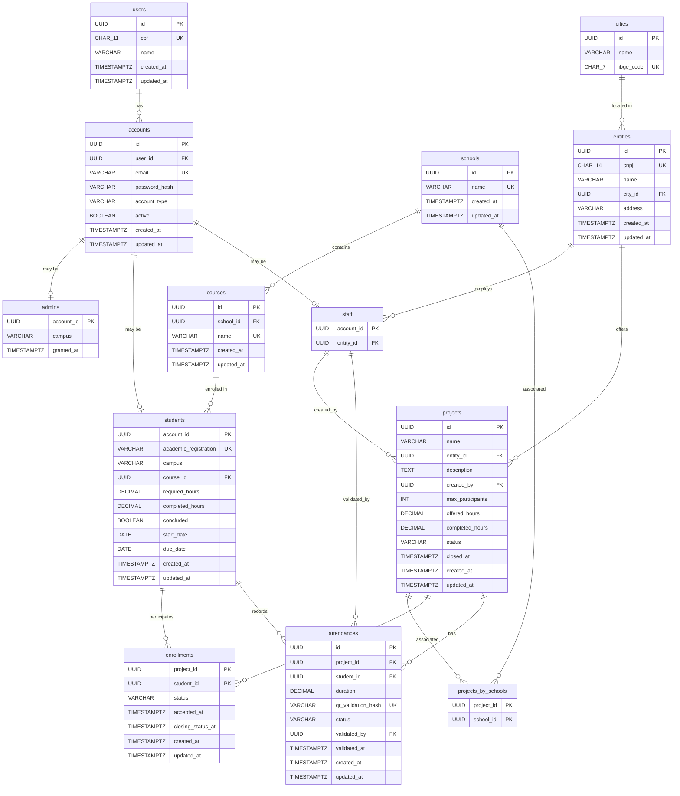
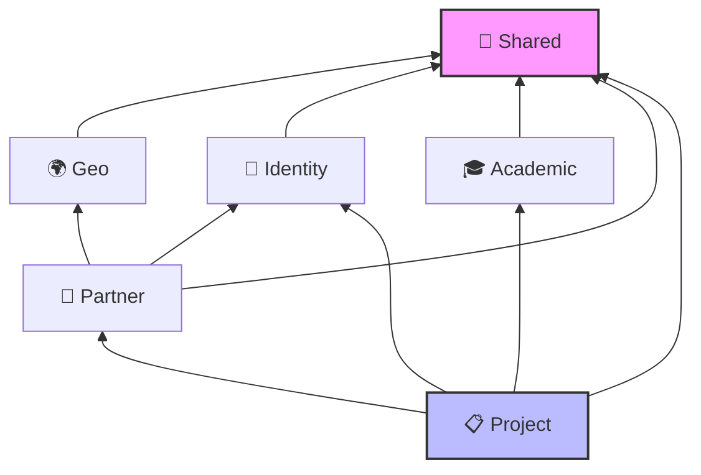
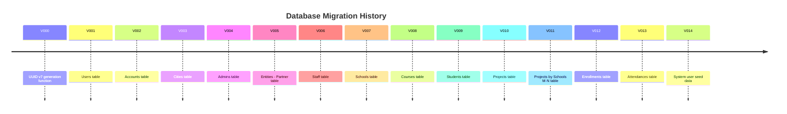

# 🐾 PUG Service

> **P**lataforma **U**niversitária de **G**estão — A comprehensive backend service for managing university community service (counterpart hours) programs.

## 📖 Project Overview

**PUG Service** is a modular, monolithic REST API built with **Quarkus** and **Java 21** that supports the full lifecycle of university community service programs in Brazil. It enables administrators to manage partner organizations, academic structures, student enrollments, community service projects, and QR-based attendance tracking — all through a unified, secure API.

### Key Features

- 🔐 **JWT Authentication** with role-based access control (ADMIN, PARTNER, STUDENT)
- 🏢 **Partner Management** — Organizations identified by CNPJ with staff assignments
- 🎓 **Academic Structure** — Schools → Courses → Students with counterpart hour tracking
- 📋 **Project Lifecycle** — Full state machine (Planned → In Progress → Completed/Canceled)
- 📝 **Enrollment Management** — Student-to-project enrollment with lifecycle states
- 📱 **QR Attendance** — QR-code-based attendance registration and staff validation
- 🔍 **Full-text Search** — Elasticsearch-powered fuzzy, autocomplete, accent-insensitive search
- 🌍 **Internationalization** — Full i18n support (pt_BR, en_US)
- 📊 **CQRS Architecture** — Separated read (Query) and write (Command) paths

## 🛠️ Tech Stack



## 🏗️ Architecture

The project follows a **modular monolith** pattern using **Domain-Driven Design (DDD)** with clearly separated bounded contexts. Each module follows a clean layered architecture with strict anti-corruption boundaries.

### Architecture Diagram



### Module Layer Pattern

Each bounded context follows this consistent internal structure:

```
module/
├── domain/          ← Pure business logic (entities, value objects, repository interfaces)
├── service/         ← Application services (CQRS: commands + queries)
├── infra/           ← Infrastructure (JPA entities, mappers, repository implementations)
│   ├── persistence/ ← Hibernate/JPA entities
│   └── read/        ← CQRS Query implementations (JPQL + Elasticsearch)
└── presenter/       ← REST controllers, DTOs, request/response mapping
    ├── dtos/        ← Request/Response records
    └── mappers/     ← View → Response transformers
```

## 📦 Modules



## 🗃️ Full Entity-Relationship Model (ERM)



## 🔗 Module Dependencies



## 🗄️ Database Migrations

Managed by Flyway in `src/main/resources/db/migration/`:



## 🚀 Getting Started

### Prerequisites

- Java 21+
- Docker (for PostgreSQL and Elasticsearch dev services)
- Maven 3.9+

### Running in Development Mode

```bash
./mvnw quarkus:dev
```

Quarkus Dev Services will automatically provision PostgreSQL and Elasticsearch containers.

> **_NOTE:_** Quarkus ships with a Dev UI, available in dev mode at <http://localhost:8080/q/dev/>.

### Packaging and Running

```bash
./mvnw package
java -jar target/quarkus-app/quarkus-run.jar
```

### Building an Über-jar

```bash
./mvnw package -Dquarkus.package.jar.type=uber-jar
java -jar target/*-runner.jar
```

### Creating a Native Executable

```bash
./mvnw package -Dnative
```

Or using a container build:

```bash
./mvnw package -Dnative -Dquarkus.native.container-build=true
```

## 📄 API Response Format

All API responses follow a standardized envelope:

```json
{
  "success": true,
  "data": { ... },
  "error": null,
  "timestamp": "2026-04-10T12:00:00Z",
  "correlationId": "abc-123"
}
```

Error responses:

```json
{
  "success": false,
  "data": null,
  "error": {
    "code": "VALIDATION_ERROR",
    "message": "Validation failed.",
    "details": [
      {
        "field": "name",
        "errors": [
          { "code": "INVALID_NAME_BLANK", "message": "Name cannot be blank." }
        ]
      }
    ]
  },
  "timestamp": "2026-04-10T12:00:00Z",
  "correlationId": "abc-123"
}
```

## 📜 License

This project is part of an academic portfolio.
