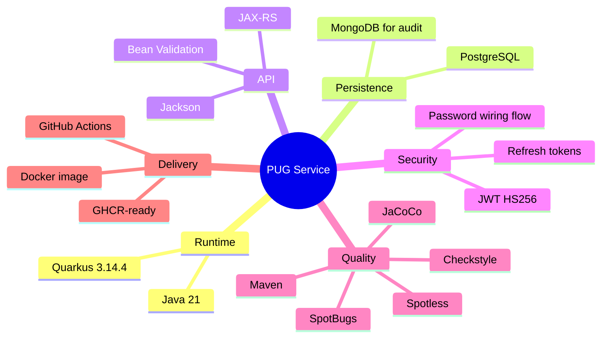
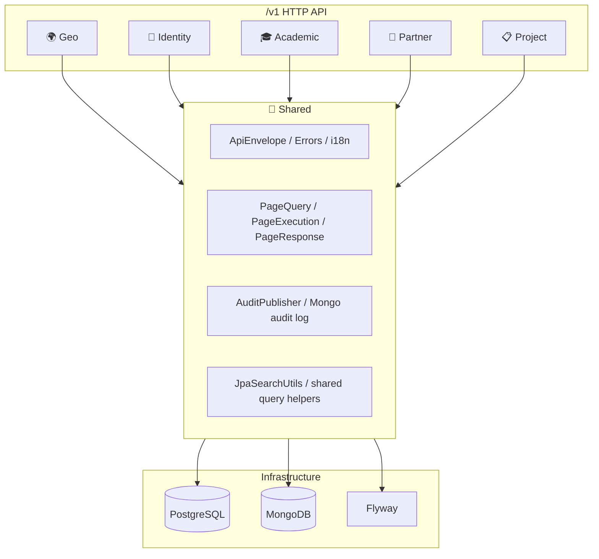
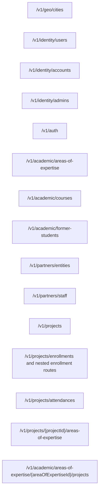

# 🐾 PUG Service

> Architecture overview for the `pug-service` backend.

## 📌 Overview

`pug-service` is a Quarkus 3.14.4 modular monolith built on Java 21. It exposes the versioned API under `/v1` and is organized by bounded contexts instead of by technical framework only.

The public domain naming currently in force is:

- `geo` -> cities
- `identity` -> users, accounts, admins, auth
- `academic` -> areas of expertise, courses, former students
- `partner` -> entities, staff
- `project` -> projects, enrollments, attendances, project-area-of-expertise associations

## 🧱 Runtime stack



## 🏗️ Architecture



Each bounded context follows the same internal pattern:

```text
module/
  domain/
  service/
    dtos/
    impl/
    utils/
  infra/
    persistence/
    read/
  presenter/
    dtos/
    mappers/
```

## 🔄 Contract patterns

### Complex search

The current read-side search contract is standardized:

- route shape: `POST /<collection>/search`
- paging input: `page` and `size` query params
- payload naming: `*ComplexSearchRequest`
- result shape: `ApiEnvelope<PageResponse<...>>`
- combination semantics:
  - optional filters
  - `AND` across provided fields
  - `IN` for list filters
  - shared folded text matching through `JpaSearchUtils`

### Status-only updates

Lifecycle or activation changes use dedicated `PATCH` endpoints instead of mixing them into normal updates.

Examples:

- `PATCH /v1/identity/admins/{id}/status`
- `PATCH /v1/partners/staff/{id}/status`
- `PATCH /v1/academic/former-students/{id}/status`
- `PATCH /v1/projects/{id}/status`
- enrollment status updates under nested project routes

### Password wiring

Account creation for admins, former students, and staff no longer sets a password immediately.

The first-access flow is:

```mermaid
sequenceDiagram
    participant Create as Create Account Flow
    participant Auth as Auth Module
    participant User as End User

    Create->>Auth: create account with null password hash
    User->>Auth: POST /v1/auth/login
    Auth-->>User: token with passwordWired=false
    User->>Auth: POST /v1/auth/wire-credentials
    Auth->>Auth: PasswordService validates and hashes
    Auth-->>User: credentials wired
```

## 📦 Module map

- [academic/README.md](./academic/README.md)
- [geo/README.md](./geo/README.md)
- [identity/README.md](./identity/README.md)
- [partner/README.md](./partner/README.md)
- [project/README.md](./project/README.md)
- [shared/README.md](./shared/README.md)
- [tests/README.md](./tests/README.md)
- [cicd/README.md](./cicd/README.md)

## 🗃️ Public route overview



## ✅ Notes

- The codebase still contains some internal compatibility scaffolding in persistence and migrations, but the public API and presenter contracts should follow the renamed domains above.
- Tests now rely on Quarkus Dev Services for PostgreSQL and MongoDB during the `%test` profile.
- Image creation and CI are documented separately in the CI/CD guide.
