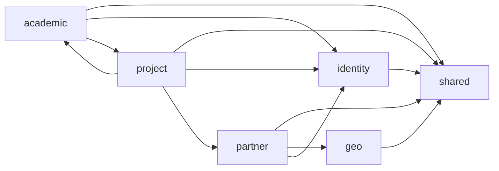

# pug-service Documentation

`pug-service` is the backend service for the PUG platform. It is a single Quarkus application that centralizes authentication, partner management, academic records, project execution, geo reference data, and shared infrastructure such as auditing, localization, and API error handling.

## Project purpose

The service provides the business API for the Universidade Gratuita platform. It currently includes:

- JWT login, refresh-token sessions, and account identity flows
- admin, user, and partner staff administration
- partner entities and geo-backed city references
- academic areas of expertise, courses, and former-student records
- projects, enrollments, attendances, and completed-hour tracking
- shared API contracts, validation, correlation IDs, and audit logging

## High-level feature summary

- 🔐 `identity`: auth, accounts, admins, users, refresh tokens
- 🌍 `geo`: city catalog used by partner entities
- 🏢 `partner`: partner organizations and staff
- 🎓 `academic`: areas of expertise, courses, former students
- 🚀 `project`: projects, enrollments, attendances, project-area links
- 🧰 `shared`: API envelope, exception mapping, i18n, audit, pagination, UUIDv7 validation



## Tech stack

| Area | Repository |
| --- | --- |
| Language | Java 21 |
| Framework | Quarkus 3.14.4 |
| Build tool | Maven Wrapper (`mvnw`) |
| Primary database | PostgreSQL 16 |
| Secondary store | MongoDB 7 for audit logs |
| ORM | Hibernate ORM + Panache |
| Migrations | Flyway |
| Auth | SmallRye JWT |
| Validation | Hibernate Validator |
| API docs | SmallRye OpenAPI + Swagger UI |
| Metrics/health | Micrometer + SmallRye Health |
| Test stack | JUnit 5, Quarkus Test, Mockito, RestAssured, AssertJ, Awaitility |
| Request collection | Bruno under [`requests`](https://github.com/Plataforma-Universidade-Gratuita/pug-service/tree/main/requests) |
| Container build | Docker multi-stage build |
| CI | GitHub Actions |

## Repository and module overview

### Main repository areas

| Path | Purpose |
| --- | --- |
| [`src/main/java/br/org/catolicasc/pug`](https://github.com/Plataforma-Universidade-Gratuita/pug-service/tree/main/src/main/java/br/org/catolicasc/pug) | production code by module |
| [`src/main/resources`](https://github.com/Plataforma-Universidade-Gratuita/pug-service/tree/main/src/main/resources) | Quarkus profiles, i18n bundles, Flyway migrations |
| [`src/test/java/br/org/catolicasc/pug`](https://github.com/Plataforma-Universidade-Gratuita/pug-service/tree/main/src/test/java/br/org/catolicasc/pug) | test suites and helpers |
| [`requests`](https://github.com/Plataforma-Universidade-Gratuita/pug-service/tree/main/requests) | Bruno API collection and local environment file |
| [`.github/workflows`](https://github.com/Plataforma-Universidade-Gratuita/pug-service/tree/main/.github/workflows) | CI/image workflows |
| [`docker-compose.yml`](https://github.com/Plataforma-Universidade-Gratuita/pug-service/blob/main/docker-compose.yml) | local PostgreSQL + MongoDB containers |
| [`Dockerfile`](https://github.com/Plataforma-Universidade-Gratuita/pug-service/tree/main/Dockerfile) | application image build |
| [`pom.xml`](https://github.com/Plataforma-Universidade-Gratuita/pug-service/blob/main/pom.xml) | single-module build, quality plugins, coverage rules |

### Module docs

| Module | Purpose | Docs |
| --- | --- | --- |
| `shared` | cross-cutting infrastructure and contracts | [README](https://github.com/Plataforma-Universidade-Gratuita/pug-docs/blob/main/pug-service/shared/README.md) |
| `geo` | read-only city catalog | [README](https://github.com/Plataforma-Universidade-Gratuita/pug-docs/blob/main/pug-service/geo/README.md) |
| `identity` | auth, accounts, admins, users | [README](https://github.com/Plataforma-Universidade-Gratuita/pug-docs/blob/main/pug-service/identity/README.md) |
| `partner` | entities and staff | [README](https://github.com/Plataforma-Universidade-Gratuita/pug-docs/blob/main/pug-service/partner/README.md) |
| `academic` | areas of expertise, courses, former students | [README](https://github.com/Plataforma-Universidade-Gratuita/pug-docs/blob/main/pug-service/academic/README.md) |
| `project` | projects, enrollments, attendances | [README](https://github.com/Plataforma-Universidade-Gratuita/pug-docs/blob/main/pug-service/project/README.md) |

## How to run locally

The current development profile expects local PostgreSQL and MongoDB containers.

1. Start infra:

```bash
docker compose up -d postgres mongodb
```

2. Start the service:

```bash
./mvnw quarkus:dev
```

3. Use the local Bruno environment:

- [`requests/environments/Local.bru`](https://github.com/Plataforma-Universidade-Gratuita/pug-service/blob/main/requests/environments/Local.bru)

4. Useful local URLs from the current config:

- app base URL: `http://localhost:8080`
- Swagger UI in dev: `http://localhost:8080/swagger-ui`

Important repository notes:

- [`application-dev.properties`](https://github.com/Plataforma-Universidade-Gratuita/pug-service/blob/main/src/main/resources/application-dev.properties) disables Dev Services in dev mode and points to PostgreSQL on `5433` and MongoDB on `27018`.
- [`docker-compose.yml`](https://github.com/Plataforma-Universidade-Gratuita/pug-service/blob/main/docker-compose.yml) uses `registry-docker.weg.net/postgres:16` and `registry-docker.weg.net/mongo:7.0`.
- local test runs behave differently from dev mode: tests use Quarkus Dev Services by default unless overridden by CI.

## How to build

### JVM package

```bash
./mvnw clean package
```

### Full local quality gate

```bash
./mvnw clean verify
```

### Native profile

```bash
./mvnw package -Dnative
```

The `native` profile exists in `pom.xml`, but dedicated `@QuarkusIntegrationTest` classes are not part of the repository.

## How to test

### Standard local run

```bash
./mvnw test
```

### CI-equivalent local run

```bash
./mvnw clean verify
```

### Focused run

```bash
./mvnw -Dtest=ProjectServiceImplTest test
```

Test behavior that matters:

- local tests use Quarkus Dev Services for PostgreSQL 16 and MongoDB 7
- CI tests in `verify.yml` disable Dev Services and use GitHub Actions service containers
- JaCoCo enforces **85% instruction coverage per package** for the six application modules

## Top-level docs

- [Development guide](https://github.com/Plataforma-Universidade-Gratuita/pug-docs/blob/main/pug-service/DEVELOPMENT.md)
- [Testing guide](https://github.com/Plataforma-Universidade-Gratuita/pug-docs/blob/main/pug-service/TESTS.md)
- [Architecture overview](https://github.com/Plataforma-Universidade-Gratuita/pug-docs/blob/main/pug-service/ARCHITECTURE.md)
- [CI/CD guide](https://github.com/Plataforma-Universidade-Gratuita/pug-docs/blob/main/pug-service/CICD.md)

## Module docs

- [Shared README](https://github.com/Plataforma-Universidade-Gratuita/pug-docs/blob/main/pug-service/shared/README.md)
- [Geo README](https://github.com/Plataforma-Universidade-Gratuita/pug-docs/blob/main/pug-service/geo/README.md)
- [Identity README](https://github.com/Plataforma-Universidade-Gratuita/pug-docs/blob/main/pug-service/identity/README.md)
- [Partner README](https://github.com/Plataforma-Universidade-Gratuita/pug-docs/blob/main/pug-service/partner/README.md)
- [Academic README](https://github.com/Plataforma-Universidade-Gratuita/pug-docs/blob/main/pug-service/academic/README.md)
- [Project README](https://github.com/Plataforma-Universidade-Gratuita/pug-docs/blob/main/pug-service/project/README.md)
