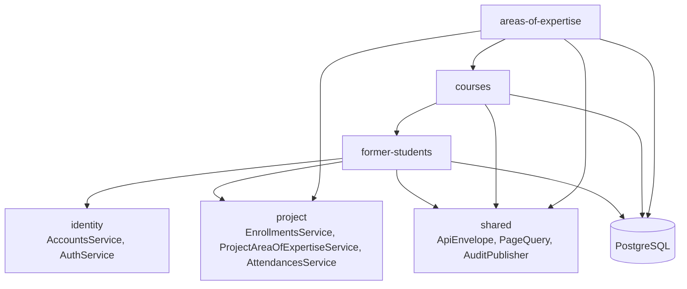
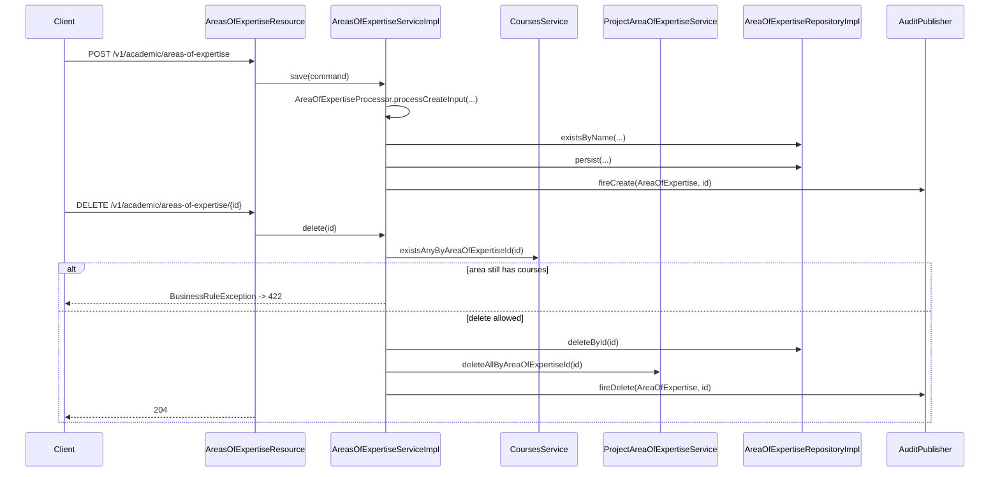
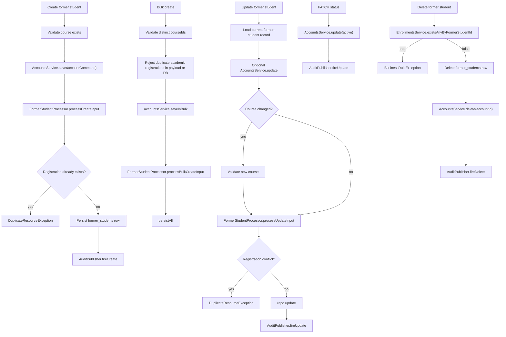
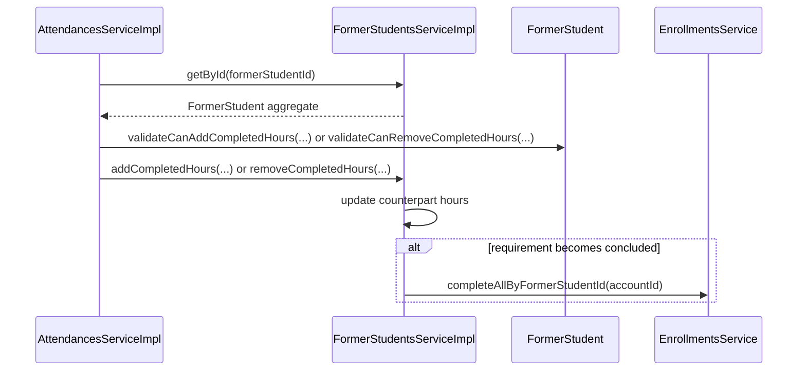
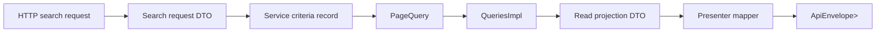

# Academic Module Architecture

[Back to module README](./README.md)

## Overview

The `academic` package is a package-level module inside the Quarkus monolith. It contains three internal slices that build on each other:

1. `areas-of-expertise` defines broad academic groupings.
2. `courses` attaches concrete courses to one area of expertise.
3. `former-students` attaches one identity account to one course plus academic progress data.

That hierarchy is visible in both the schema and the services. `areas_of_expertise` can exist alone, `courses` depend on areas, and `former_students` depend on courses and linked identity accounts.

## Internal structure

| Package | Role |
| --- | --- |
| `domain` | Immutable aggregates (`AreaOfExpertise`, `Course`, `FormerStudent`) and academic value objects (`AcademicRegistration`, `CounterpartHours`, `Period`). |
| `service` | Write orchestration, read facades, and criteria/command DTOs. |
| `service/utils` | Stateless processors that build or mutate aggregates from raw command input. |
| `infra/persistence` | JPA entities for `areas_of_expertise`, `courses`, and `former_students`. |
| `infra/persistence/impl` | Panache-backed repositories for write-side persistence. |
| `infra/read` | CQRS-style projections and custom JPA queries for list/search endpoints. |
| `presenter` | JAX-RS resources, request/response DTOs, and presenter mappers. |

Unlike `partner`, this module is not split around one resource. It is a small internal subsystem with three public resource controllers:

- [`AreasOfExpertiseResource`](../../../pug-service/src/main/java/br/org/catolicasc/pug/academic/presenter/AreasOfExpertiseResource.java)
- [`CoursesResource`](../../../pug-service/src/main/java/br/org/catolicasc/pug/academic/presenter/CoursesResource.java)
- [`FormerStudentsResource`](../../../pug-service/src/main/java/br/org/catolicasc/pug/academic/presenter/FormerStudentsResource.java)

## Data model and persistence

### Write-side tables

| Table | Owned by | Key fields |
| --- | --- | --- |
| `areas_of_expertise` | `academic` | UUIDv7 `id`, unique `name`, `created_at`, `updated_at` |
| `courses` | `academic` | UUIDv7 `id`, unique `name`, `area_of_expertise_id`, `created_at`, `updated_at` |
| `former_students` | `academic` | `account_id` as PK/FK to `accounts.id`, unique `academic_registration`, `campus`, `course_id`, required/completed hours, `concluded`, period dates, audit timestamps |

Schema files:

- [`V007__create_areas_of_expertise_table.sql`](../../../pug-service/src/main/resources/db/migration/V007__create_areas_of_expertise_table.sql)
- [`V008__create_courses_table.sql`](../../../pug-service/src/main/resources/db/migration/V008__create_courses_table.sql)
- [`V009__create_former_students_table.sql`](../../../pug-service/src/main/resources/db/migration/V009__create_former_students_table.sql)

Important constraints from the code and migrations:

- area name is unique
- course name is unique
- former-student academic registration is unique
- former-student `due_date >= start_date`
- former-student `required_hours > 0`
- former-student `completed_hours >= 0`
- `former_students.account_id` is the primary key, which makes the academic record a one-to-one extension of an identity account

### Domain aggregates and value objects

| Type | Purpose |
| --- | --- |
| [`AreaOfExpertise`](../../../pug-service/src/main/java/br/org/catolicasc/pug/academic/domain/AreaOfExpertise.java) | Immutable catalog aggregate with rename behavior and audit info. |
| [`Course`](../../../pug-service/src/main/java/br/org/catolicasc/pug/academic/domain/Course.java) | Immutable course aggregate linked to one area of expertise. |
| [`FormerStudent`](../../../pug-service/src/main/java/br/org/catolicasc/pug/academic/domain/FormerStudent.java) | Academic record linked to one account, one course, one campus, one registration, one progress window. |
| [`AcademicRegistration`](../../../pug-service/src/main/java/br/org/catolicasc/pug/academic/domain/vos/AcademicRegistration.java) | Trimmed registration value with max-length validation. |
| [`CounterpartHours`](../../../pug-service/src/main/java/br/org/catolicasc/pug/academic/domain/vos/CounterpartHours.java) | Required/completed hour accounting plus concluded flag. |
| [`Period`](../../../pug-service/src/main/java/br/org/catolicasc/pug/academic/domain/vos/Period.java) | Enrollment start/due date pair with range validation. |

### Read-side projections

| Projection | Used by | Shape |
| --- | --- | --- |
| [`AreaOfExpertiseView`](../../../pug-service/src/main/java/br/org/catolicasc/pug/academic/infra/read/dtos/AreaOfExpertiseView.java) | area list/get/search | area plus audit timestamps |
| [`CourseView`](../../../pug-service/src/main/java/br/org/catolicasc/pug/academic/infra/read/dtos/CourseView.java) | course list/get/search | course plus nested area view |
| [`FormerStudentView`](../../../pug-service/src/main/java/br/org/catolicasc/pug/academic/infra/read/dtos/FormerStudentView.java) | former-student list/get/me | former-student scalars only, including `courseId` |
| [`FormerStudentComplexSearchView`](../../../pug-service/src/main/java/br/org/catolicasc/pug/academic/infra/read/dtos/FormerStudentComplexSearchView.java) | former-student search | nested account projection plus nested course and area projections |

That split matters for the API contract:

- plain former-student reads return `courseId`, not course details
- former-student search returns nested account, course, and area-of-expertise data
- course search returns nested area data plus audit info

## Main flows

### Catalog lifecycle: areas of expertise and courses

The same pattern repeats for courses:

- [`CoursesServiceImpl`](../../../pug-service/src/main/java/br/org/catolicasc/pug/academic/service/impl/CoursesServiceImpl.java) validates the referenced area through `AreasOfExpertiseService.getById(...)`
- duplicate course names are blocked in both service code and schema
- deletion is blocked when `FormerStudentsService.existsAnyByCourseId(...)` reports enrolled former students

### Former-student create, bulk create, update, status, and delete

Key implementation details from [`FormerStudentsServiceImpl`](../../../pug-service/src/main/java/br/org/catolicasc/pug/academic/service/impl/FormerStudentsServiceImpl.java):

- the identity account is provisioned by `AccountsService`; the academic module stores only the academic extension row
- single create checks duplicate academic registration after account creation but before persisting the academic row
- bulk create rejects duplicate registrations before bulk account creation starts
- `/bulk` accepts a raw JSON array, not a wrapper object
- status updates write to the linked account, not a field unique to `former_students`

### Former-student progress updates from project attendances

There is no academic REST endpoint for completed-hour mutation. That behavior is driven internally from the `project` module.

The actual call sites are in:

- [`AttendancesServiceImpl`](../../../pug-service/src/main/java/br/org/catolicasc/pug/project/service/impl/AttendancesServiceImpl.java)
- [`FormerStudentsServiceImpl`](../../../pug-service/src/main/java/br/org/catolicasc/pug/academic/service/impl/FormerStudentsServiceImpl.java)

### Enrollment area-of-expertise matching

The `academic` module also provides the data that the `project` module uses to decide whether a former student can enroll in a project.

- [`FormerStudent.validateCanEnroll()`](../../../pug-service/src/main/java/br/org/catolicasc/pug/academic/domain/FormerStudent.java) blocks new enrollments when required hours are already concluded.
- [`FormerStudentsService.getAreaOfExpertise(...)`](../../../pug-service/src/main/java/br/org/catolicasc/pug/academic/service/FormerStudentsService.java) resolves the former student's academic area through `former_students -> courses -> areas_of_expertise`.
- [`EnrollmentsServiceImpl`](../../../pug-service/src/main/java/br/org/catolicasc/pug/project/service/impl/EnrollmentsServiceImpl.java) compares that area against the areas linked to the target project.

## Search and request/data flow

### Areas of expertise

- [`AreasOfExpertiseQueriesImpl`](../../../pug-service/src/main/java/br/org/catolicasc/pug/academic/infra/read/impl/AreasOfExpertiseQueriesImpl.java) supports only one filter: partial `name`.
- Results are ordered by area name ascending.
- `size = 1` uses the shared fetch-all sentinel behavior.

### Courses

- [`CoursesQueriesImpl`](../../../pug-service/src/main/java/br/org/catolicasc/pug/academic/infra/read/impl/CoursesQueriesImpl.java) supports partial `name` plus `areaOfExpertiseIds`.
- Read projections always join the linked area-of-expertise row.
- Search responses use [`CourseWithAuditInfoComplexSearchResponse`](../../../pug-service/src/main/java/br/org/catolicasc/pug/academic/presenter/dtos/courses/CourseWithAuditInfoComplexSearchResponse.java), which includes nested area data and audit info.

### Former students

- [`FormerStudentsQueriesImpl`](../../../pug-service/src/main/java/br/org/catolicasc/pug/academic/infra/read/impl/FormerStudentsQueriesImpl.java) joins `FormerStudentEntity`, `AccountEntity`, `UserEntity`, `CourseEntity`, and `AreaOfExpertiseEntity`.
- Supported filters are:
  - `name`
  - `cpf`
  - `email`
  - `academicRegistration`
  - `campi`
  - `periodFrom` / `periodTo`
  - `dateFrom` / `dateTo`
  - `activeOnly`
  - `includeConcluded`
  - `courseIds`
  - `areaOfExpertiseIds`
- Default behavior is intentionally restrictive:
  - `activeOnly = true` unless the request explicitly sends `false`
  - `includeConcluded = false` unless the request explicitly sends `true`
- Plain lists order by academic registration; complex search orders by user name.

## Presentation-layer details

- [`FormerStudentPresenter`](../../../pug-service/src/main/java/br/org/catolicasc/pug/academic/presenter/mappers/FormerStudentPresenter.java) computes derived response data that is not stored directly in the database:
  - `missingHours`
  - `progress` percentage
  - `remainingDays`
  - localized `remainingDaysFormatted`
- `remainingDaysFormatted` is relative to `LocalDate.now()`, so it changes over time even when the underlying row is unchanged.
- Campus labels are localized through shared i18n helpers and the `Campi` enum.
- Course and area-of-expertise responses reuse shared `AuditInfoResponse` formatting.

## Important design decisions

1. **Three academic concepts live in one package, but the dependency direction is strict.**
   - area of expertise -> course -> former student
   - services enforce that order when validating foreign keys and deletes

2. **Former students are modeled as an academic extension of identity accounts.**
   - `former_students.account_id` is the primary key
   - names, CPF, email, active state, and account type stay in `identity`

3. **The read model is richer than the plain GET model.**
   - plain former-student reads return scalars and `courseId`
   - complex search returns nested account, course, and area data

4. **Progress accounting is internal domain behavior, not a public academic REST feature.**
   - `addCompletedHours` and `removeCompletedHours` exist on the service contract
   - the project module calls them after attendance validation

5. **Search defaults bias toward operationally relevant former students.**
   - inactive accounts are excluded by default
   - concluded former students are excluded by default

6. **Bulk creation has stricter upfront validation than single creation.**
   - duplicate academic registrations are checked across the payload and database before bulk account creation
   - course IDs are validated in distinct batches before any academic rows are built

## Dependencies and boundaries

### Outbound dependencies

- `shared`
  - envelopes, page DTOs, UUIDv7 validation, `Campi`, i18n helpers, audit publishing, search helpers
- `identity`
  - `AccountsService` and `AuthService`
  - nested account presenters and DTOs in former-student responses
- `project`
  - `ProjectAreaOfExpertiseService` from area deletion
  - `EnrollmentsService` from former-student delete and concluded-hour propagation
  - internal call sites in `AttendancesServiceImpl` and `EnrollmentsServiceImpl`

### Inbound dependencies

- The `project` module imports academic domain types, academic services, and academic presenter DTOs.

### Persistence and integration boundaries

- Primary persistence is PostgreSQL through JPA/Panache.
- Audit persistence is not owned by this module; writes publish events through `shared`.
- Seed data exists for local/test scenarios in:
  - [`V017__seed_areas_of_expertise_and_courses.sql`](../../../pug-service/src/main/resources/db/migration/V017__seed_areas_of_expertise_and_courses.sql)
  - [`V018__seed_test_data.sql`](../../../pug-service/src/main/resources/db/migration/V018__seed_test_data.sql)
