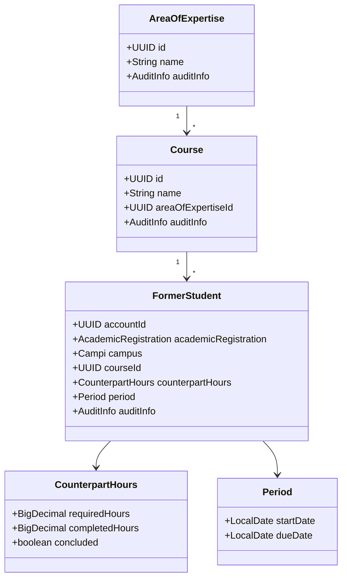
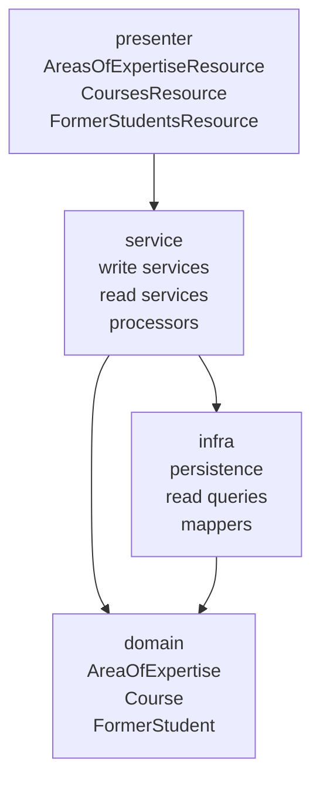
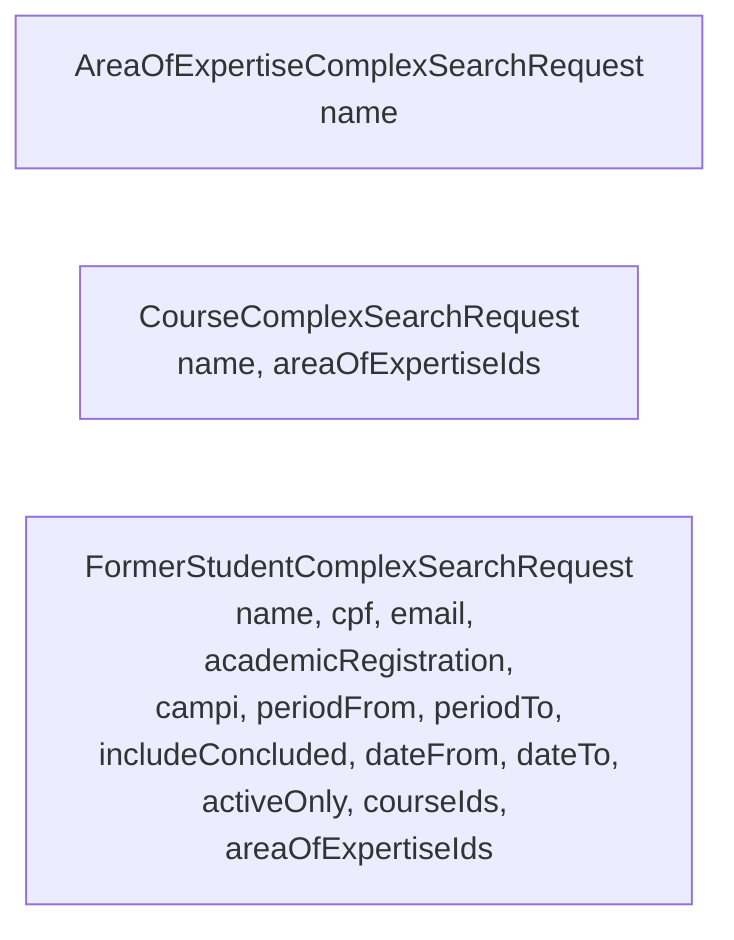
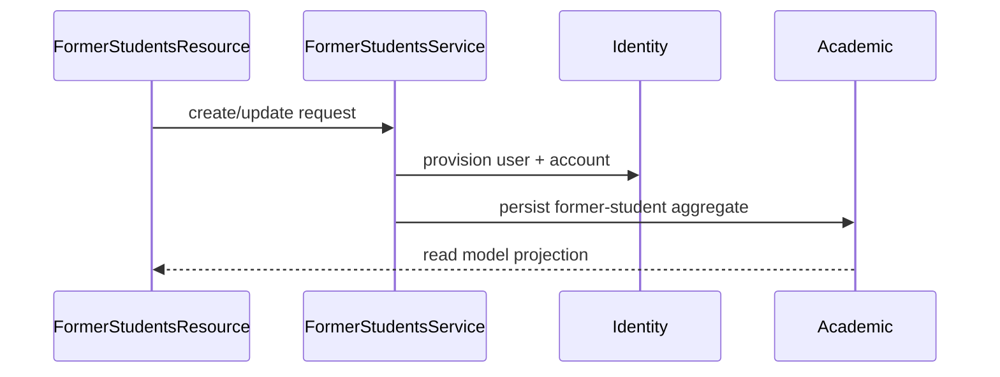

# 🎓 Academic Module

## 📌 Overview

The academic module owns the university-side catalog and former-student lifecycle.

Main responsibilities:

- manage areas of expertise
- manage courses
- create and update former students
- track counterpart hours and period information
- expose complex-search for frontend filtering

## 🧠 Domain model



## 🏗️ Internal structure



## 🌐 Public endpoints

### Areas of expertise

```text
GET    /v1/academic/areas-of-expertise/{id}
GET    /v1/academic/areas-of-expertise?ids=
POST   /v1/academic/areas-of-expertise/search
POST   /v1/academic/areas-of-expertise
PUT    /v1/academic/areas-of-expertise/{id}
DELETE /v1/academic/areas-of-expertise/{id}
```

### Courses

```text
GET    /v1/academic/courses/{id}
GET    /v1/academic/courses?ids=
POST   /v1/academic/courses/search
POST   /v1/academic/courses
PUT    /v1/academic/courses/{id}
DELETE /v1/academic/courses/{id}
```

### Former students

```text
GET    /v1/academic/former-students/{id}
GET    /v1/academic/former-students/me
GET    /v1/academic/former-students?ids=
POST   /v1/academic/former-students/search
POST   /v1/academic/former-students
POST   /v1/academic/former-students/bulk
PUT    /v1/academic/former-students/{id}
PATCH  /v1/academic/former-students/{id}/status
DELETE /v1/academic/former-students/{id}
```

## 🔍 Complex-search contracts



Important search behavior:

- all provided filters combine with `AND`
- `dateFrom` / `dateTo` apply to relevant timestamp fields
- `periodFrom` / `periodTo` apply to `startDate` and `dueDate`
- `includeConcluded=false` keeps concluded former students out unless explicitly requested

## 🔗 Identity coupling

Former-student creation is an aggregate workflow across modules:



Current account type used for former students:

- `FORMER_STUDENT`

## 📦 Response composition

Former-student read responses now expose grouped structures instead of a flatter model:

- account information
- campus information
- counterpart hours information
- period information
- course information
- area-of-expertise information through course nesting

## ✅ Notes

- The public API is fully renamed to `former-students` and `areas-of-expertise`.
- Some deep persistence/internal compatibility details may still reference earlier schema evolution, but new documentation and public contracts should not.
