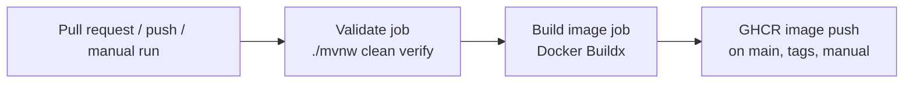

# 🚀 CI/CD

## 📌 Overview

`pug-service` now has GitHub-based CI and container image creation configured up to the build/push stage. Deployment is intentionally left for a later decision because the deploy target is not defined yet.

## 🧱 Current pipeline shape



## 📂 Relevant files

```text
.github/workflows/ci-image.yml
Dockerfile
.dockerignore
```

## ✅ Validate job

Current validation workflow characteristics:

- runs on GitHub Actions
- uses Java 21
- runs `./mvnw -B clean verify`
- uses Maven cache
- relies on Quarkus Dev Services for test PostgreSQL and MongoDB containers

## 🐳 Image build

The image build is a multi-stage JVM build:


Current image characteristics:

- Quarkus fast-jar packaging
- Java 21 runtime
- non-root runtime user
- exposes port `8080`
- ready for registry publishing

## 🏷️ Registry strategy

The workflow currently targets GitHub Container Registry:

- `ghcr.io/<owner>/<repo>`

Generated tags include:

- commit SHA
- branch ref
- tag ref
- `latest` on default branch

## 🔐 Required GitHub permissions

The workflow requires:

- repository Actions enabled
- package write permission for `GITHUB_TOKEN`

No additional registry secret is needed for GHCR in the current setup.

## ⏭️ What is not covered yet

Not configured yet:

- QA deploy workflow
- production deploy workflow
- environment approvals
- runtime secret injection strategy
- infrastructure-specific rollout steps

## 📈 Recommended next step

Once the deploy target is known, add:

1. deployment environment definition
2. environment secrets
3. deployment workflow
4. rollback strategy
