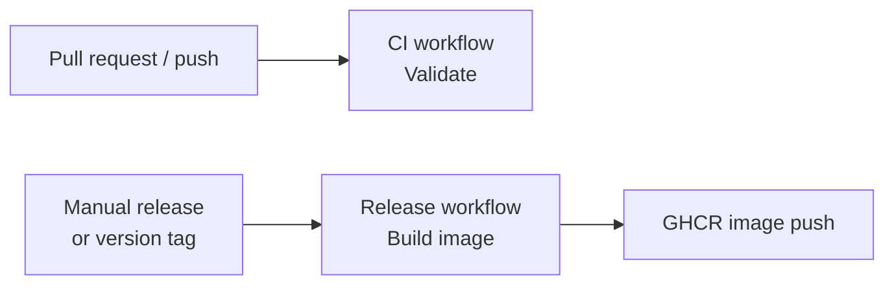
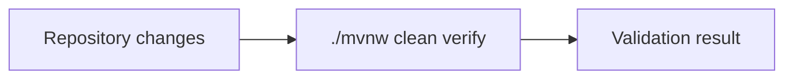
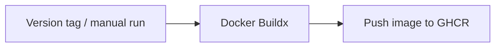
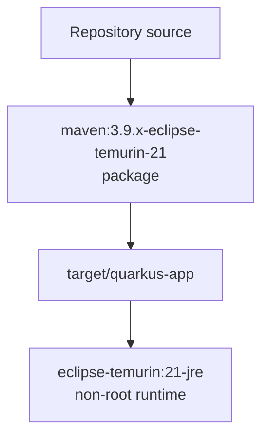

# 🚀 CI/CD

## 📌 Overview

`pug-service` uses GitHub Actions for continuous integration and container image publishing.

The pipeline is split into two independent workflows:

* **CI** (`ci.yml`) for validation and test execution
* **Release** (`release.yml`) for container image creation and publishing

Deployment is intentionally left for a later decision because the deploy target is not defined yet.

## 🧱 Current pipeline shape



## 📂 Relevant files

```text
.github/workflows/ci.yml
.github/workflows/release.yml
Dockerfile
.dockerignore
```

## ✅ CI workflow

The CI workflow runs on:

* pull requests
* pushes to any branch

Validation characteristics:

* runs on GitHub Actions
* uses Java 21
* runs `./mvnw -B clean verify`
* uses Maven dependency cache
* provisions PostgreSQL and MongoDB service containers
* validates build, tests, and Quarkus packaging



## 🐳 Release workflow

The release workflow is responsible only for container image creation and publishing.

It runs on:

* manual workflow dispatch
* version tags (`v*`)



## 🏗️ Image build

The image build is a multi-stage JVM build:



Current image characteristics:

* Quarkus fast-jar packaging
* Java 21 runtime
* non-root runtime user
* exposes port `8080`
* ready for registry publishing

## 🏷️ Registry strategy

Published images target GitHub Container Registry:

```text
ghcr.io/<owner>/<repo>
```

Generated tags include:

* commit SHA
* Git tag reference
* `latest`

## 🔐 Required GitHub permissions

The release workflow requires:

* repository Actions enabled
* package write permission for `GITHUB_TOKEN`

No additional registry secret is required for GHCR.

## ⏭️ What is not covered yet

Not configured yet:

* QA deployment workflow
* production deployment workflow
* environment approvals
* runtime secret injection strategy
* infrastructure-specific rollout steps
* automated rollback strategy

## 📈 Recommended next step

Once the deployment target is known, add:

1. deployment environment definition
2. environment secrets
3. deployment workflow
4. rollout strategy
5. rollback strategy
