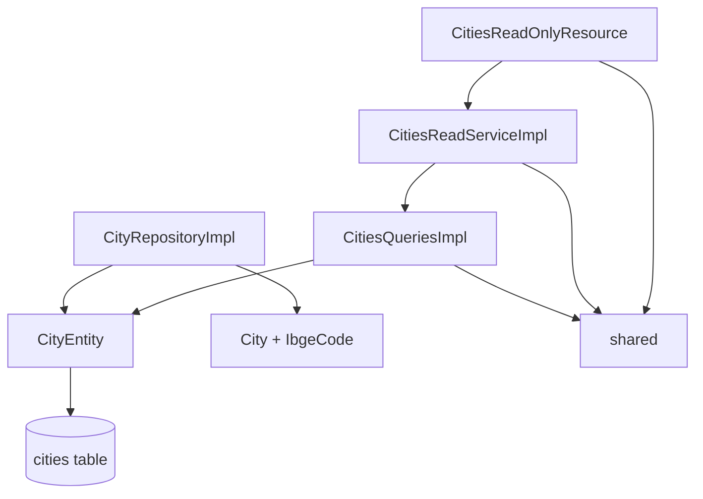
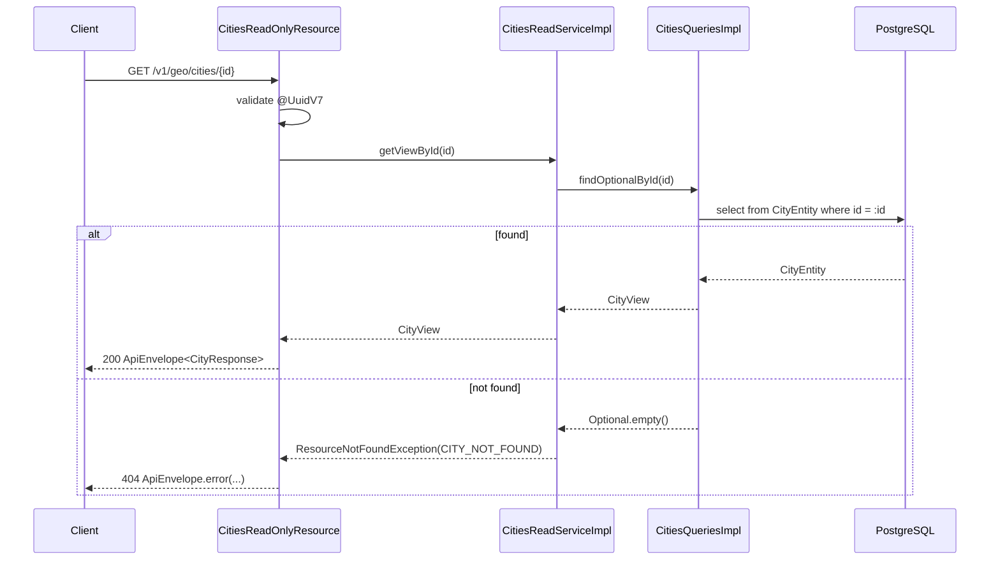
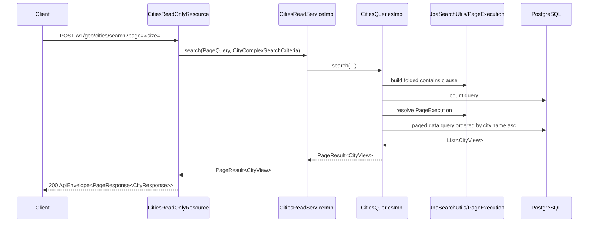
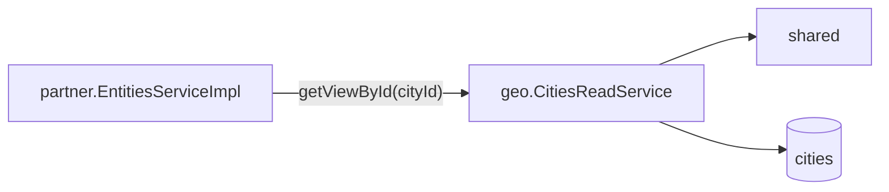

# Geo Module Architecture

[Back to module README](https://github.com/Plataforma-Universidade-Gratuita/pug-docs/blob/main/pug-service/geo/README.md)

## Overview

The `geo` package is a small, read-oriented module centered on the `cities` dictionary. It has domain classes, persistence mapping, and query infrastructure, but the public HTTP surface is intentionally read-only.

The most important practical fact is that city data is seeded through Flyway and then served as reference data to the rest of the system.

## Internal structure

| Package | Role |
| --- | --- |
| `domain` | Immutable `City` aggregate, `IbgeCode` value object, and geo-specific error enums. |
| `infra` | Mapping and persistence classes, including JPA entity and repository implementation. |
| `infra/read` | Query-side projections and paginated search implementation. |
| `presenter` | REST resource, request/response DTOs, and response mapping. |
| `service` | Read-service API and implementation that wraps query-side access with not-found handling. |
| `service/utils` | Geo-specific exception factory helpers. |

## Public request flows

### Get city by ID

### Search cities by name

## Main components

### Domain model

- [`City`](https://github.com/Plataforma-Universidade-Gratuita/pug-service/blob/main/src/main/java/br/org/catolicasc/pug/geo/domain/City.java)
  - immutable aggregate with `id`, `name`, and `IbgeCode`
  - validates ID and name through shared `DomainError`
  - exposes `rename(...)` and `changeIbgeCode(...)`, but no command service or REST write endpoint uses them
- [`IbgeCode`](https://github.com/Plataforma-Universidade-Gratuita/pug-service/blob/main/src/main/java/br/org/catolicasc/pug/geo/domain/vos/IbgeCode.java)
  - accepts only 7 numeric digits
  - reports `INVALID_IBGE_CODE_BLANK` or `INVALID_IBGE_CODE_FORMAT`

### Persistence model

- [`CityEntity`](https://github.com/Plataforma-Universidade-Gratuita/pug-service/blob/main/src/main/java/br/org/catolicasc/pug/geo/infra/persistence/CityEntity.java)
  - maps to table `cities`
  - extends shared `BaseUuidV7Entity`
  - enforces unique `ibge_code`
- [`CityRepositoryImpl`](https://github.com/Plataforma-Universidade-Gratuita/pug-service/blob/main/src/main/java/br/org/catolicasc/pug/geo/infra/persistence/impl/CityRepositoryImpl.java)
  - only supports `findOptionalById(UUID)`
  - reconstitutes pure domain `City` through `CityMapper`

### Query/read model

- [`CitiesQueriesImpl`](https://github.com/Plataforma-Universidade-Gratuita/pug-service/blob/main/src/main/java/br/org/catolicasc/pug/geo/infra/read/impl/CitiesQueriesImpl.java)
  - handles `findOptionalById`, `listAllByIds`, `listAllCities`, and paginated `search`
  - returns lightweight [`CityView`](https://github.com/Plataforma-Universidade-Gratuita/pug-service/blob/main/src/main/java/br/org/catolicasc/pug/geo/infra/read/dtos/CityView.java) projections instead of domain aggregates
  - orders results by `city.name asc`
  - uses shared `JpaSearchUtils` for accent-insensitive search and `PageExecution` for pagination
- [`CitiesReadServiceImpl`](https://github.com/Plataforma-Universidade-Gratuita/pug-service/blob/main/src/main/java/br/org/catolicasc/pug/geo/service/impl/CitiesReadServiceImpl.java)
  - delegates to `CitiesQueries`
  - translates missing cities to `ResourceNotFoundException(CITY_NOT_FOUND)` through [`ExceptionHelper`](https://github.com/Plataforma-Universidade-Gratuita/pug-service/blob/main/src/main/java/br/org/catolicasc/pug/geo/service/utils/ExceptionHelper.java)

### Presenter layer

- [`CitiesReadOnlyResource`](https://github.com/Plataforma-Universidade-Gratuita/pug-service/blob/main/src/main/java/br/org/catolicasc/pug/geo/presenter/CitiesReadOnlyResource.java)
  - annotated with `@Authenticated`
  - no explicit role restriction is present in the resource class
  - exposes only read/list/search operations
- [`CityPresenter`](https://github.com/Plataforma-Universidade-Gratuita/pug-service/blob/main/src/main/java/br/org/catolicasc/pug/geo/presenter/mappers/CityPresenter.java)
  - direct `CityView -> CityResponse` mapping with no extra formatting logic

## Seeded data and boundaries

The module depends on Flyway-created reference data.

- [`V003__create_cities_table.sql`](https://github.com/Plataforma-Universidade-Gratuita/pug-service/blob/main/src/main/resources/db/migration/V003__create_cities_table.sql) creates the `cities` table with unique `ibge_code`.
- [`V016__seed_cities.sql`](https://github.com/Plataforma-Universidade-Gratuita/pug-service/blob/main/src/main/resources/db/migration/V016__seed_cities.sql) inserts **295 cities from Santa Catarina**.
- Geo tests rely on that seeded dataset; for example, `CitiesReadOnlyResourceTest` and `CitiesQueriesImplTest` assert the list size is greater than 200.

That means this module behaves more like a reference-data catalog than a mutable CRUD boundary.

## Dependencies and module boundaries

### Outbound dependencies

- `shared`
  - `ApiEnvelope`, `PageResponse`
  - `PageQuery`, `PageResult`, `PageExecution`
  - `ResourceNotFoundException`
  - `JpaSearchUtils`
  - `@UuidV7`
- PostgreSQL/JPA
  - `cities` table and `EntityManager`

### Inbound dependencies

- `partner`
  - [`EntitiesServiceImpl`](https://github.com/Plataforma-Universidade-Gratuita/pug-service/blob/main/src/main/java/br/org/catolicasc/pug/partner/service/impl/EntitiesServiceImpl.java) validates `cityId` by calling `CitiesReadService.getViewById(...)` during create and update flows.

## Important design decisions

1. **Public surface is read-only.**
   - There is one REST resource and it only exposes `GET /{id}`, `GET /`, and `POST /search`.
   - No command service, mutation resource, or audit publisher usage exists in this module.

2. **The module keeps both domain and query models.**
   - `City` and `IbgeCode` exist as proper immutable domain objects.
   - Public HTTP reads still prefer `CityView` projections, which is consistent with the repo-wide CQRS-style split.

3. **Search is database-backed and normalized.**
   - `CitiesQueriesImpl` builds JPQL dynamically.
   - `JpaSearchUtils.containsClause(...)` and `bindContains(...)` apply lowercase, accent-insensitive matching.

4. **Reference validation is centralized here.**
   - Other modules do not query the `cities` table directly.
   - They depend on `CitiesReadService` to confirm a city exists.

5. **Pagination follows the shared sentinel convention.**
   - `size = 1` means fetch all matches.
   - `CitiesQueriesImplTest.shouldFetchAllWhenPageSizeIsOne()` verifies that behavior for geo search.

## Data models

| Type | Kind | Purpose |
| --- | --- | --- |
| `City` | Domain aggregate | Immutable city object with shared validation support. |
| `IbgeCode` | Value object | Encapsulates 7-digit IBGE validation. |
| `CityEntity` | JPA entity | Database representation of a city row. |
| `CityView` | Query DTO | Lightweight projection returned by query-side reads. |
| `CityResponse` | API DTO | External JSON shape for city responses. |
| `CityComplexSearchRequest` | API DTO | Request body for `/search`. |
| `CityComplexSearchCriteria` | Service DTO | Internal search criteria passed into query execution. |

## Testing shape

The tests map cleanly to the module layers.

- Domain:
  - [`CityTest`](https://github.com/Plataforma-Universidade-Gratuita/pug-service/blob/main/src/test/java/br/org/catolicasc/pug/geo/domain/CityTest.java)
  - [`IbgeCodeTest`](https://github.com/Plataforma-Universidade-Gratuita/pug-service/blob/main/src/test/java/br/org/catolicasc/pug/geo/domain/vos/IbgeCodeTest.java)
- Mapping:
  - [`CityMapperTest`](https://github.com/Plataforma-Universidade-Gratuita/pug-service/blob/main/src/test/java/br/org/catolicasc/pug/geo/infra/CityMapperTest.java)
  - [`CityPresenterTest`](https://github.com/Plataforma-Universidade-Gratuita/pug-service/blob/main/src/test/java/br/org/catolicasc/pug/geo/presenter/mappers/CityPresenterTest.java)
- Persistence and query:
  - [`CityRepositoryImplTest`](https://github.com/Plataforma-Universidade-Gratuita/pug-service/blob/main/src/test/java/br/org/catolicasc/pug/geo/infra/persistence/impl/CityRepositoryImplTest.java)
  - [`CitiesQueriesImplTest`](https://github.com/Plataforma-Universidade-Gratuita/pug-service/blob/main/src/test/java/br/org/catolicasc/pug/geo/infra/read/impl/CitiesQueriesImplTest.java)
- API/service:
  - [`CitiesReadServiceImplTest`](https://github.com/Plataforma-Universidade-Gratuita/pug-service/blob/main/src/test/java/br/org/catolicasc/pug/geo/service/impl/CitiesReadServiceImplTest.java)
  - [`CitiesReadOnlyResourceTest`](https://github.com/Plataforma-Universidade-Gratuita/pug-service/blob/main/src/test/java/br/org/catolicasc/pug/geo/presenter/CitiesReadOnlyResourceTest.java)
