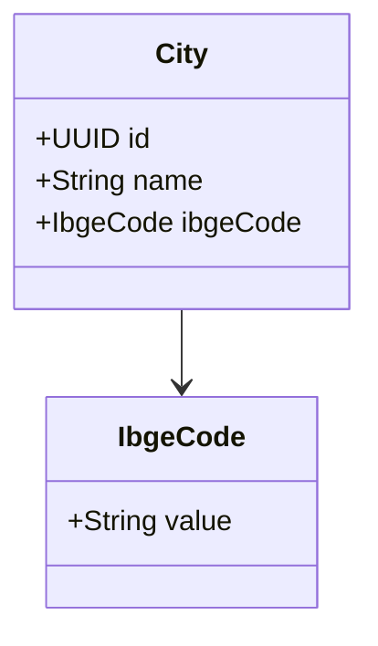
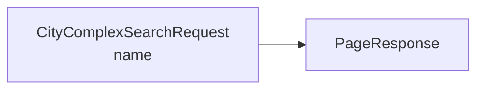

# 🌍 Geo Module

## 📌 Overview

The geo module is a small read-only bounded context that exposes city reference data used by the rest of the platform.

Responsibilities:

- return cities by id
- list all cities
- search cities by name through the complex-search contract

## 🧠 Domain model



## 🌐 Public endpoints

```text
GET  /v1/geo/cities/{id}
GET  /v1/geo/cities
POST /v1/geo/cities/search
```

## 🔍 Search contract

The geo search surface is intentionally small:



Notes:

- city listing is still available as plain `GET`
- search is explicit through `POST /search`
- this module no longer documents IBGE route lookups as public endpoints

## 🏗️ Structure

```text
geo/
  domain/
  service/
  infra/
    persistence/
    read/
  presenter/
```

## 🔗 Cross-module use

The partner module depends on geo for city references in entities. Academic and project modules consume the resulting partner/entity data rather than depending directly on geo.
