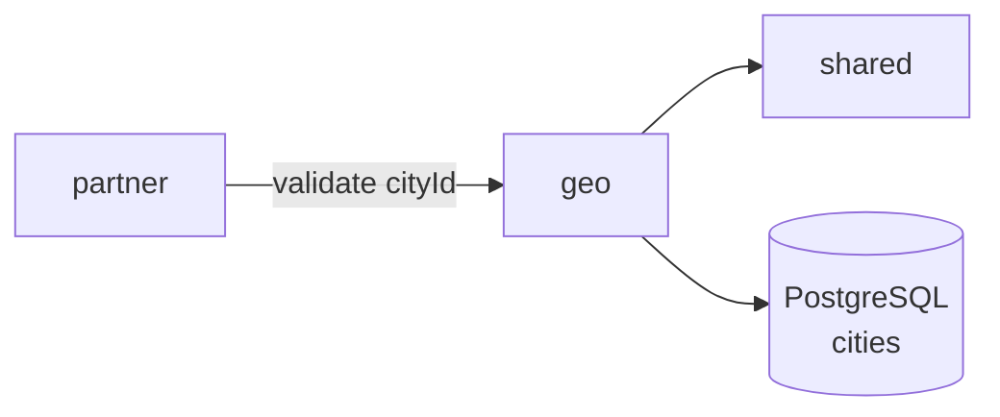

# Geo Module

The `geo` package provides the geographic dictionary used by `pug-service`. That means a read-only city catalog backed by PostgreSQL and seeded through Flyway.

## Module purpose

- Expose authenticated read access to cities through `/v1/geo/cities`.
- Keep city identity and IBGE-code validation in a small domain model.
- Provide an internal read service that other modules can use to validate referenced city IDs.
- Serve a bounded, seeded dataset: migration [`V016__seed_cities.sql`](../../../pug-service/src/main/resources/db/migration/V016__seed_cities.sql) inserts **295 cities from Santa Catarina (SC)**.

## Main responsibilities

- 🌍 Return city data by ID, full list, or paginated name search.
- 🔎 Execute accent-insensitive name filtering through shared `JpaSearchUtils`.
- 🧾 Standardize not-found behavior as `CITY_NOT_FOUND`.
- 🧱 Keep a small immutable domain model with `City` and `IbgeCode`.
- 🤝 Validate city references for other modules, the partner module.

## Public API, services, and jobs

### REST endpoints

Resource: [`CitiesReadOnlyResource`](../../../pug-service/src/main/java/br/org/catolicasc/pug/geo/presenter/CitiesReadOnlyResource.java)

- `GET /v1/geo/cities/{id}`
  - Requires authentication.
  - Path parameter uses shared `@UuidV7` validation.
  - Returns `404` with `CITY_NOT_FOUND` when the city does not exist.
- `GET /v1/geo/cities`
  - Requires authentication.
  - Returns the full city list ordered by name.
- `POST /v1/geo/cities/search?page={page}&size={size}`
  - Requires authentication.
  - Accepts optional body [`CityComplexSearchRequest`](../../../pug-service/src/main/java/br/org/catolicasc/pug/geo/presenter/dtos/CityComplexSearchRequest.java) with `name` filter.
  - Uses the shared pagination convention where `size=1` means fetch all matches in a single response page.

### Internal services

- [`CitiesReadService`](../../../pug-service/src/main/java/br/org/catolicasc/pug/geo/service/CitiesReadService.java)
  - `getViewById(UUID)`
  - `listViews()`
  - `listViewsByIds(List<UUID>)`
  - `search(PageQuery, CityComplexSearchCriteria)`
- [`CitiesQueries`](../../../pug-service/src/main/java/br/org/catolicasc/pug/geo/infra/read/CitiesQueries.java)
  - query-side projection interface used by `CitiesReadServiceImpl`
- [`CityRepository`](../../../pug-service/src/main/java/br/org/catolicasc/pug/geo/domain/CityRepository.java)
  - domain repository with only `findOptionalById(UUID)`

## Important classes and files

- Domain model:
  - [`City`](../../../pug-service/src/main/java/br/org/catolicasc/pug/geo/domain/City.java)
  - [`IbgeCode`](../../../pug-service/src/main/java/br/org/catolicasc/pug/geo/domain/vos/IbgeCode.java)
  - [`GeoErrorCodes`](../../../pug-service/src/main/java/br/org/catolicasc/pug/geo/domain/enums/GeoErrorCodes.java)
  - [`GeoFieldErrorCodes`](../../../pug-service/src/main/java/br/org/catolicasc/pug/geo/domain/enums/GeoFieldErrorCodes.java)
- Persistence and mapping:
  - [`CityEntity`](../../../pug-service/src/main/java/br/org/catolicasc/pug/geo/infra/persistence/CityEntity.java)
  - [`CityRepositoryImpl`](../../../pug-service/src/main/java/br/org/catolicasc/pug/geo/infra/persistence/impl/CityRepositoryImpl.java)
  - [`CityMapper`](../../../pug-service/src/main/java/br/org/catolicasc/pug/geo/infra/CityMapper.java)
- Query side:
  - [`CitiesQueriesImpl`](../../../pug-service/src/main/java/br/org/catolicasc/pug/geo/infra/read/impl/CitiesQueriesImpl.java)
  - [`CityView`](../../../pug-service/src/main/java/br/org/catolicasc/pug/geo/infra/read/dtos/CityView.java)
- Service and API:
  - [`CitiesReadServiceImpl`](../../../pug-service/src/main/java/br/org/catolicasc/pug/geo/service/impl/CitiesReadServiceImpl.java)
  - [`ExceptionHelper`](../../../pug-service/src/main/java/br/org/catolicasc/pug/geo/service/utils/ExceptionHelper.java)
  - [`CityPresenter`](../../../pug-service/src/main/java/br/org/catolicasc/pug/geo/presenter/mappers/CityPresenter.java)
  - [`CityResponse`](../../../pug-service/src/main/java/br/org/catolicasc/pug/geo/presenter/dtos/CityResponse.java)

## Dependencies on other modules

- Outbound dependencies:
  - `shared` for `ApiEnvelope`, pagination DTOs, UUIDv7 validation, exceptions, and accent-insensitive search helpers.
- Inbound dependencies:
  - [`EntitiesServiceImpl`](../../../pug-service/src/main/java/br/org/catolicasc/pug/partner/service/impl/EntitiesServiceImpl.java) calls `CitiesReadService.getViewById(...)` when creating or updating partner entities, so partner organizations cannot reference a nonexistent city.
- Persistence boundary:
  - PostgreSQL table `cities`, created by [`V003__create_cities_table.sql`](../../../pug-service/src/main/resources/db/migration/V003__create_cities_table.sql) and seeded by [`V016__seed_cities.sql`](../../../pug-service/src/main/resources/db/migration/V016__seed_cities.sql).

## Module relationships

## How to test the module

- Geo tests live under `src/test/java/br/org/catolicasc/pug/geo`.
- Representative coverage:
  - [`CitiesReadOnlyResourceTest`](../../../pug-service/src/test/java/br/org/catolicasc/pug/geo/presenter/CitiesReadOnlyResourceTest.java)
  - [`CitiesReadServiceImplTest`](../../../pug-service/src/test/java/br/org/catolicasc/pug/geo/service/impl/CitiesReadServiceImplTest.java)
  - [`CitiesQueriesImplTest`](../../../pug-service/src/test/java/br/org/catolicasc/pug/geo/infra/read/impl/CitiesQueriesImplTest.java)
  - [`CityRepositoryImplTest`](../../../pug-service/src/test/java/br/org/catolicasc/pug/geo/infra/persistence/impl/CityRepositoryImplTest.java)
  - [`CityTest`](../../../pug-service/src/test/java/br/org/catolicasc/pug/geo/domain/CityTest.java)
  - [`IbgeCodeTest`](../../../pug-service/src/test/java/br/org/catolicasc/pug/geo/domain/vos/IbgeCodeTest.java)
- Useful commands:
  - Full suite: `./mvnw test`
  - Module-focused run: `./mvnw -Dtest=CitiesReadOnlyResourceTest,CitiesReadServiceImplTest,CitiesQueriesImplTest,CityRepositoryImplTest,CityTest,IbgeCodeTest test`
- Test expectations:
  - integration tests expect more than 200 cities, which matches the seeded SC dataset
  - unauthorized access to `/v1/geo/cities` returns `401`
  - search tests cover the shared fetch-all sentinel `size=1`

## Links

- [Geo architecture](./ARCHITECTURE.md)
- [Back to pug-service docs](../README.md)
