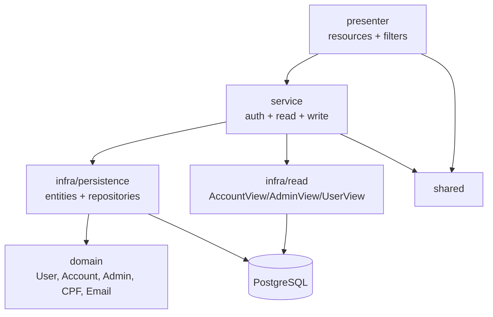
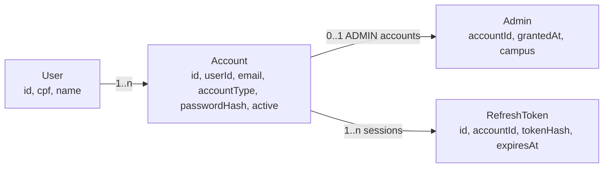
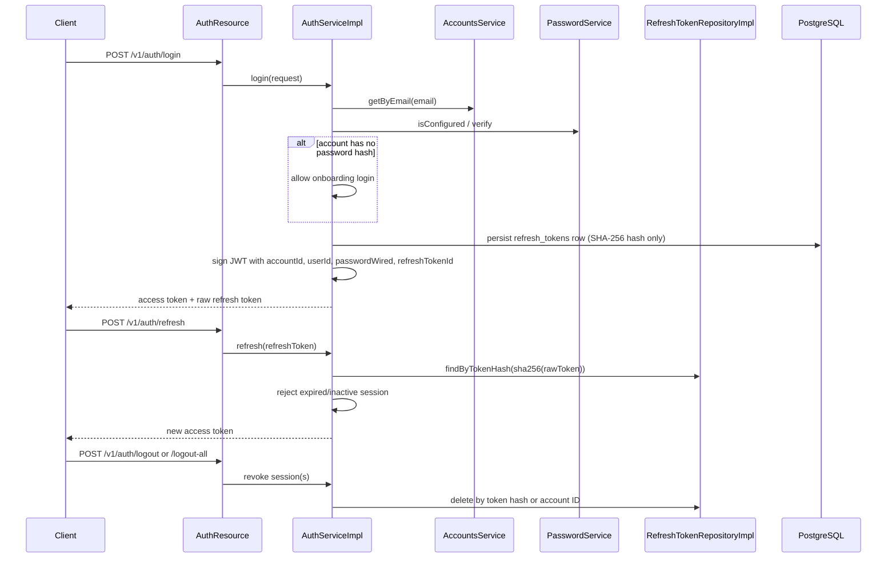
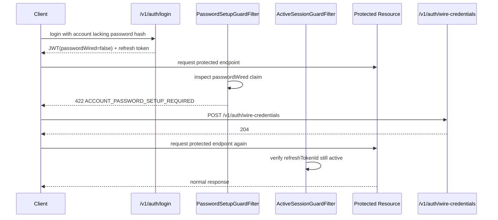
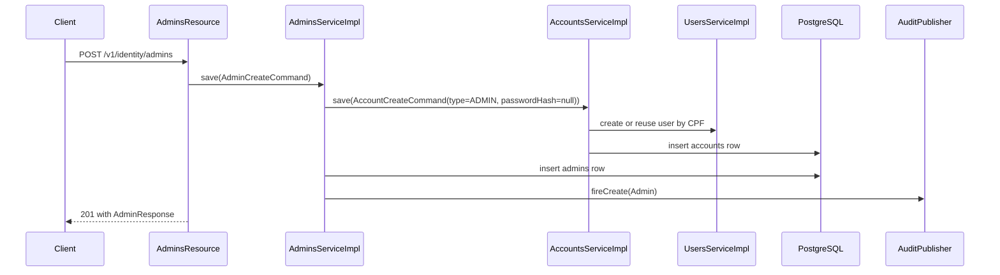

# Identity Module Architecture

[Back to module README](./README.md)

## Overview

`identity` is the module that ties authentication, authorization, and person/account records together. The important boundary is not just login: it also owns the internal relationship between `User`, `Account`, and `Admin`, plus the refresh-token session model that the rest of the API relies on.

## Internal structure

| Package | Role |
| --- | --- |
| `domain` | Immutable `User`, `Account`, and `Admin` aggregates plus CPF/email value objects and error enums. |
| `infra/persistence` | JPA entities and Panache repositories for `users`, `accounts`, `admins`, and `refresh_tokens`. |
| `infra/read` | Query-side projections and paginated search implementations for account/admin/user reads. |
| `infra` | Scheduled cleanup for expired refresh tokens. |
| `presenter` | JAX-RS resources, request/response DTOs, presenters, and security request filters. |
| `service` | Read services, write/orchestration services, auth/session services, and small processors/helpers. |

## Core data model

The identity schema is relational and layered.

### Tables and seed data

- [`V001__create_users_table.sql`](https://github.com/Plataforma-Universidade-Gratuita/pug-service/blob/main/src/main/resources/db/migration/V001__create_users_table.sql)
- [`V002__create_accounts_table.sql`](https://github.com/Plataforma-Universidade-Gratuita/pug-service/blob/main/src/main/resources/db/migration/V002__create_accounts_table.sql)
- [`V004__create_admins_table.sql`](https://github.com/Plataforma-Universidade-Gratuita/pug-service/blob/main/src/main/resources/db/migration/V004__create_admins_table.sql)
- [`V014__create_refresh_tokens_table.sql`](https://github.com/Plataforma-Universidade-Gratuita/pug-service/blob/main/src/main/resources/db/migration/V014__create_refresh_tokens_table.sql)
- [`V015__seed_system_user.sql`](https://github.com/Plataforma-Universidade-Gratuita/pug-service/blob/main/src/main/resources/db/migration/V015__seed_system_user.sql)
  - seeds `admin@pug.com`
  - stores a BCrypt hash for `Admin123*` without pepper
  - runtime re-hashing is completed by [`AdminPasswordSeeder`](https://github.com/Plataforma-Universidade-Gratuita/pug-service/blob/main/src/main/java/br/org/catolicasc/pug/shared/infra/AdminPasswordSeeder.java)

## Main flow: login, refresh, logout, and session checks

### What the code actually does

- [`AuthServiceImpl`](https://github.com/Plataforma-Universidade-Gratuita/pug-service/blob/main/src/main/java/br/org/catolicasc/pug/identity/service/impl/AuthServiceImpl.java) signs short-lived JWTs with claims:
  - `accountId`
  - `userId`
  - `passwordWired`
  - `refreshTokenId`
- Refresh tokens are opaque to clients and stored hashed with SHA-256 in `refresh_tokens`.
- Access-token lifespan and refresh-token lifespan come from:
  - `pug.auth.access-token.lifespan`
  - `pug.auth.refresh-token.lifespan`
- Password hashing uses BCrypt plus `security.password.pepper` through [`PasswordServiceImpl`](https://github.com/Plataforma-Universidade-Gratuita/pug-service/blob/main/src/main/java/br/org/catolicasc/pug/identity/service/impl/PasswordServiceImpl.java).
- Password strength requires:
  - minimum 8 characters
  - uppercase, lowercase, digit, and special character
  - no whitespace

## Main flow: guarded first login

This is one of the module's most important behaviors.

### Guard behavior

- [`PasswordSetupGuardFilter`](https://github.com/Plataforma-Universidade-Gratuita/pug-service/blob/main/src/main/java/br/org/catolicasc/pug/identity/presenter/security/PasswordSetupGuardFilter.java)
  - ignores anonymous requests
  - allows `/v1/auth/**`
  - allows `/me` endpoints
  - throws `ACCOUNT_PASSWORD_SETUP_REQUIRED` for most other protected routes when `passwordWired=false`
- [`ActiveSessionGuardFilter`](https://github.com/Plataforma-Universidade-Gratuita/pug-service/blob/main/src/main/java/br/org/catolicasc/pug/identity/presenter/security/ActiveSessionGuardFilter.java)
  - skips anonymous requests and `/v1/auth/**`
  - verifies the refresh-token session embedded in the access token still exists and is not expired
  - makes logout and logout-all effective immediately instead of waiting for JWT expiration

## Main flow: admin provisioning

Public admin creation is the clearest write-side orchestration flow in this module.

### Provisioning details

- [`AdminPresenter.toCommand(...)`](https://github.com/Plataforma-Universidade-Gratuita/pug-service/blob/main/src/main/java/br/org/catolicasc/pug/identity/presenter/mappers/AdminPresenter.java) builds:
  - `UserCreateCommand`
  - `AccountCreateCommand` with `AccountType.ADMIN`
  - `passwordHash = null`
  - `AdminCreateCommand`
- [`AccountsServiceImpl`](https://github.com/Plataforma-Universidade-Gratuita/pug-service/blob/main/src/main/java/br/org/catolicasc/pug/identity/service/impl/AccountsServiceImpl.java)
  - reuses an existing `User` when the CPF already exists
  - otherwise creates a new `User`
  - deletes orphan `User` rows when the last linked account is removed
- [`AdminsServiceImpl`](https://github.com/Plataforma-Universidade-Gratuita/pug-service/blob/main/src/main/java/br/org/catolicasc/pug/identity/service/impl/AdminsServiceImpl.java)
  - delegates account lifecycle to `AccountsService`
  - blocks deletion when [`ProjectService.existsByCreatedBy(...)`](https://github.com/Plataforma-Universidade-Gratuita/pug-service/blob/main/src/main/java/br/org/catolicasc/pug/project/service/ProjectService.java) returns true
  - `PATCH /status` updates the linked account's `active` flag, not a separate admin-active field

## Main flow: read/search side

The module uses read projections instead of domain aggregates for public list/search endpoints.

- Accounts:
  - [`AccountsQueriesImpl`](https://github.com/Plataforma-Universidade-Gratuita/pug-service/blob/main/src/main/java/br/org/catolicasc/pug/identity/infra/read/impl/AccountsQueriesImpl.java)
  - joins `AccountEntity` and `UserEntity`
  - filters by `name`, `cpf`, `email`, `accountTypes`, `dateFrom`, `dateTo`, `activeOnly`
- Admins:
  - [`AdminsQueriesImpl`](https://github.com/Plataforma-Universidade-Gratuita/pug-service/blob/main/src/main/java/br/org/catolicasc/pug/identity/infra/read/impl/AdminsQueriesImpl.java)
  - joins `AdminEntity`, `AccountEntity`, and `UserEntity`
  - filters by `name`, `cpf`, `email`, `dateFrom`, `dateTo`, `activeOnly`
- Users:
  - [`UsersQueriesImpl`](https://github.com/Plataforma-Universidade-Gratuita/pug-service/blob/main/src/main/java/br/org/catolicasc/pug/identity/infra/read/impl/UsersQueriesImpl.java)
  - filters by `cpf`, `dateFrom`, `dateTo`, `name`
- All three query implementations:
  - order by person name ascending
  - use shared `JpaSearchUtils` for accent-insensitive contains matching
  - use shared `PageExecution` and the `size = 1` fetch-all convention

## Presentation model

- [`AccountPresenter`](https://github.com/Plataforma-Universidade-Gratuita/pug-service/blob/main/src/main/java/br/org/catolicasc/pug/identity/presenter/mappers/AccountPresenter.java)
  - localizes `AccountType`
  - flattens account reads to `userId` instead of nesting full user payloads
  - account search responses include a lightweight nested user object with `id` and `name`
- [`AdminPresenter`](https://github.com/Plataforma-Universidade-Gratuita/pug-service/blob/main/src/main/java/br/org/catolicasc/pug/identity/presenter/mappers/AdminPresenter.java)
  - nests the account response
  - localizes campus values and formats `grantedAt`
- [`UserPresenter`](https://github.com/Plataforma-Universidade-Gratuita/pug-service/blob/main/src/main/java/br/org/catolicasc/pug/identity/presenter/mappers/UserPresenter.java)
  - formats CPF as `000.000.000-00`
  - attaches formatted audit timestamps

## Important design decisions

1. **Identity is split into person, account, and privilege records.**
   - `User` holds CPF and name.
   - `Account` holds email, role, activation, password hash, and the link to `User`.
   - `Admin` is a role extension keyed by `accountId`.

2. **First login is intentionally allowed before password wiring.**
   - Accounts without `passwordHash` can still authenticate.
   - Most protected routes are then blocked by `PasswordSetupGuardFilter` until credentials are wired.

3. **Refresh tokens are the session source of truth.**
   - JWTs are short-lived access artifacts.
   - Refresh-token rows let the API revoke sessions immediately.

4. **Public REST writes are selective.**
   - `AuthResource` and `AdminsResource` expose public write operations.
   - Generic user/account write operations exist as internal services, not public REST endpoints.

5. **Account lifecycle can cascade into user lifecycle.**
   - Creating an account may reuse an existing user by CPF.
   - Deleting the last account for a user prunes that now-orphaned user row.

## Dependencies and boundaries

### Outbound dependencies

- `shared`
  - envelopes, i18n, pagination, UUID validation, search helpers, audit publishing
- `project`
  - admin deletion guard via `ProjectService.existsByCreatedBy(...)`
- Quarkus security/runtime
  - `SecurityIdentity`, SmallRye JWT, scheduler, JAX-RS filters

### Inbound dependencies

- `academic`
  - former-student provisioning uses `AccountsService`
- `partner`
  - staff provisioning uses `AccountsService`
  - some presenter/service flows use `AuthService`
- `project`
  - uses `AuthService` role and claim helpers in project, enrollment, and attendance flows
- `shared`
  - uses `AuthService` for audit attribution and `PasswordService` for admin bootstrap hashing

## Testing shape

The tests mirror the module layers closely.

- domain and value objects:
  - `AccountTest`, `AdminTest`, `UserTest`, `CpfTest`, `EmailTest`
- persistence and query:
  - `AccountRepositoryImplTest`, `AdminRepositoryImplTest`, `UserRepositoryImplTest`, `RefreshTokenRepositoryImplTest`
  - `AccountsQueriesImplTest`, `AdminsQueriesImplTest`, `UsersQueriesImplTest`
- auth/session/security:
  - `AuthServiceImplTest`, `AuthServiceImplPersistenceTest`, `AuthResourceTest`
  - `PasswordSetupGuardFilterTest`, `SecurityGuardsIntegrationTest`
  - `ExpiredTokenCleanupJobTest`
- resources and presenters:
  - `AccountsReadOnlyResourceTest`, `AdminsResourceTest`, `UsersReadOnlyResourceTest`
  - `AccountPresenterTest`, `AdminPresenterTest`, `UserPresenterTest`
