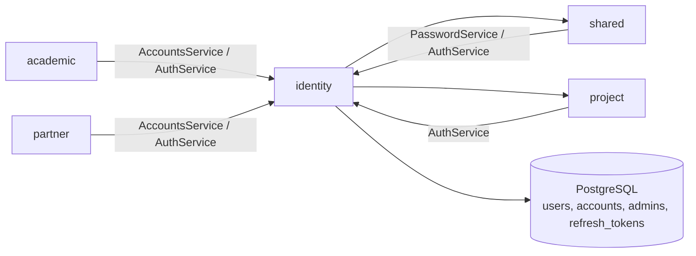

# Identity Module

The `identity` package is the authentication and core identity boundary of `pug-service`. It owns users, accounts, administrators, JWT access tokens, opaque refresh tokens, and the guards that keep first-login and logout behavior consistent across the rest of the API.

## Module purpose

- Authenticate platform accounts through `/v1/auth`.
- Store the identity graph `User -> Account -> Admin`.
- Expose read/search endpoints for users, accounts, and admins.
- Provide internal write services used by other modules to provision partner staff and former-student accounts.
- Enforce session validity and password-onboarding rules for protected endpoints.

## Main responsibilities

- 🔐 Issue JWT access tokens and opaque refresh tokens.
- 👤 Manage `User` identities with CPF validation and formatted read models.
- 📧 Manage `Account` credentials, role type, activation status, and orphan-user cleanup.
- 🛡 Manage `Admin` privileges and campus assignment.
- ⏱ Persist refresh-token sessions and purge expired rows daily.
- 🚧 Block protected routes until first-time credentials are wired.
- ♻ Make logout effective immediately through refresh-token backed session checks.

## Public API, services, and jobs

### Auth endpoints

Resource: [`AuthResource`](https://github.com/Plataforma-Universidade-Gratuita/pug-service/blob/main/src/main/java/br/org/catolicasc/pug/identity/presenter/AuthResource.java)

- `POST /v1/auth/login`
  - `@PermitAll`
  - accepts [`LoginRequest`](https://github.com/Plataforma-Universidade-Gratuita/pug-service/blob/main/src/main/java/br/org/catolicasc/pug/identity/presenter/dtos/auth/LoginRequest.java)
  - returns [`TokenResponse`](https://github.com/Plataforma-Universidade-Gratuita/pug-service/blob/main/src/main/java/br/org/catolicasc/pug/identity/presenter/dtos/auth/TokenResponse.java)
- `POST /v1/auth/refresh`
  - `@PermitAll`
  - validates the refresh token and issues a new access token
- `POST /v1/auth/logout`
  - `@PermitAll`
  - revokes one refresh-token session
- `POST /v1/auth/logout-all`
  - `@RolesAllowed({"ADMIN", "PARTNER", "FORMER_STUDENT"})`
  - revokes every refresh-token session for the current account
- `POST /v1/auth/wire-credentials`
  - `@Authenticated`
  - validates password strength, hashes with pepper, and stores the hash for an existing account

Concrete request examples already live in the repository:
- [`Login.bru`](https://github.com/Plataforma-Universidade-Gratuita/pug-service/blob/main/requests/identity/auth/Login.bru)
- [`Refresh.bru`](https://github.com/Plataforma-Universidade-Gratuita/pug-service/blob/main/requests/identity/auth/Refresh.bru)
- [`Wire Credentials.bru`](https://github.com/Plataforma-Universidade-Gratuita/pug-service/blob/main/requests/identity/auth/Wire%2520Credentials.bru)

### Account endpoints

Resource: [`AccountsReadOnlyResource`](https://github.com/Plataforma-Universidade-Gratuita/pug-service/blob/main/src/main/java/br/org/catolicasc/pug/identity/presenter/AccountsReadOnlyResource.java)

- `GET /v1/identity/accounts/{id}`
  - admin-only
- `GET /v1/identity/accounts/me`
  - any authenticated role
  - resolves the account from the JWT `accountId` claim
- `GET /v1/identity/accounts?ids=...`
  - admin-only list or filtered-by-ID retrieval
- `POST /v1/identity/accounts/search?page={page}&size={size}`
  - admin-only paginated search
  - filters: `name`, `cpf`, `email`, `accountTypes`, `dateFrom`, `dateTo`, `activeOnly`
  - defaults `activeOnly` to `true` when omitted

Example request collection:
- [`Search Accounts.bru`](https://github.com/Plataforma-Universidade-Gratuita/pug-service/blob/main/requests/identity/account/Search%2520Accounts.bru)

### Admin endpoints

Resource: [`AdminsResource`](https://github.com/Plataforma-Universidade-Gratuita/pug-service/blob/main/src/main/java/br/org/catolicasc/pug/identity/presenter/AdminsResource.java)

All public admin endpoints are `ADMIN`-only.

- `GET /v1/identity/admins/{id}`
- `GET /v1/identity/admins/me`
- `GET /v1/identity/admins?ids=...`
- `POST /v1/identity/admins/search?page={page}&size={size}`
  - filters: `name`, `cpf`, `email`, `dateFrom`, `dateTo`, `activeOnly`
  - defaults `activeOnly` to `true` when omitted
- `POST /v1/identity/admins`
  - provisions `User`, `Account`, and `Admin`
  - account starts without a password hash; the first-login flow finishes through `/v1/auth/wire-credentials`
- `PUT /v1/identity/admins/{id}`
  - updates campus plus linked account/user fields allowed by the request
- `PATCH /v1/identity/admins/{id}/status`
  - updates the linked account activation flag
- `DELETE /v1/identity/admins/{id}`
  - blocked when that admin still owns projects

Example requests:
- [`Create Admin.bru`](https://github.com/Plataforma-Universidade-Gratuita/pug-service/blob/main/requests/identity/admin/Create%2520Admin.bru)
- [`Update Admin Status.bru`](https://github.com/Plataforma-Universidade-Gratuita/pug-service/blob/main/requests/identity/admin/Update%2520Admin%2520Status.bru)

### User endpoints

Resource: [`UsersReadOnlyResource`](https://github.com/Plataforma-Universidade-Gratuita/pug-service/blob/main/src/main/java/br/org/catolicasc/pug/identity/presenter/UsersReadOnlyResource.java)

- `GET /v1/identity/users/{id}`
  - admin-only
- `GET /v1/identity/users/me`
  - any authenticated role
  - resolves the user from the JWT `userId` claim
- `GET /v1/identity/users?ids=...`
  - admin-only list or filtered-by-ID retrieval
- `POST /v1/identity/users/search?page={page}&size={size}`
  - admin-only paginated search
  - filters: `cpf`, `dateFrom`, `dateTo`, `name`

Example request collection:
- [`Search Users.bru`](https://github.com/Plataforma-Universidade-Gratuita/pug-service/blob/main/requests/identity/user/Search%2520Users.bru)

### Internal services

These are important because other modules use them directly even when no public REST endpoint exists.

- [`AuthService`](https://github.com/Plataforma-Universidade-Gratuita/pug-service/blob/main/src/main/java/br/org/catolicasc/pug/identity/service/AuthService.java)
- [`PasswordService`](https://github.com/Plataforma-Universidade-Gratuita/pug-service/blob/main/src/main/java/br/org/catolicasc/pug/identity/service/PasswordService.java)
- [`AccountsService`](https://github.com/Plataforma-Universidade-Gratuita/pug-service/blob/main/src/main/java/br/org/catolicasc/pug/identity/service/AccountsService.java)
- [`UsersService`](https://github.com/Plataforma-Universidade-Gratuita/pug-service/blob/main/src/main/java/br/org/catolicasc/pug/identity/service/UsersService.java)
- [`AdminsService`](https://github.com/Plataforma-Universidade-Gratuita/pug-service/blob/main/src/main/java/br/org/catolicasc/pug/identity/service/AdminsService.java)
- read-side services:
  - [`AccountsReadService`](https://github.com/Plataforma-Universidade-Gratuita/pug-service/blob/main/src/main/java/br/org/catolicasc/pug/identity/service/AccountsReadService.java)
  - [`UsersReadService`](https://github.com/Plataforma-Universidade-Gratuita/pug-service/blob/main/src/main/java/br/org/catolicasc/pug/identity/service/UsersReadService.java)
  - [`AdminsReadService`](https://github.com/Plataforma-Universidade-Gratuita/pug-service/blob/main/src/main/java/br/org/catolicasc/pug/identity/service/AdminsReadService.java)

### Jobs and security filters

- [`ExpiredTokenCleanupJob`](https://github.com/Plataforma-Universidade-Gratuita/pug-service/blob/main/src/main/java/br/org/catolicasc/pug/identity/infra/ExpiredTokenCleanupJob.java)
  - scheduled daily at `03:00`
  - deletes expired rows from `refresh_tokens`
- [`PasswordSetupGuardFilter`](https://github.com/Plataforma-Universidade-Gratuita/pug-service/blob/main/src/main/java/br/org/catolicasc/pug/identity/presenter/security/PasswordSetupGuardFilter.java)
  - blocks most protected endpoints when `passwordWired=false`
  - still allows `/v1/auth/**` and `/me` endpoints
- [`ActiveSessionGuardFilter`](https://github.com/Plataforma-Universidade-Gratuita/pug-service/blob/main/src/main/java/br/org/catolicasc/pug/identity/presenter/security/ActiveSessionGuardFilter.java)
  - rejects access tokens whose backing refresh-token session no longer exists

## Important classes and files

- Domain:
  - [`User`](https://github.com/Plataforma-Universidade-Gratuita/pug-service/blob/main/src/main/java/br/org/catolicasc/pug/identity/domain/User.java)
  - [`Account`](https://github.com/Plataforma-Universidade-Gratuita/pug-service/blob/main/src/main/java/br/org/catolicasc/pug/identity/domain/Account.java)
  - [`Admin`](https://github.com/Plataforma-Universidade-Gratuita/pug-service/blob/main/src/main/java/br/org/catolicasc/pug/identity/domain/Admin.java)
  - [`Cpf`](https://github.com/Plataforma-Universidade-Gratuita/pug-service/blob/main/src/main/java/br/org/catolicasc/pug/identity/domain/vos/Cpf.java)
  - [`Email`](https://github.com/Plataforma-Universidade-Gratuita/pug-service/blob/main/src/main/java/br/org/catolicasc/pug/identity/domain/vos/Email.java)
- Persistence:
  - [`UserEntity`](https://github.com/Plataforma-Universidade-Gratuita/pug-service/blob/main/src/main/java/br/org/catolicasc/pug/identity/infra/persistence/UserEntity.java)
  - [`AccountEntity`](https://github.com/Plataforma-Universidade-Gratuita/pug-service/blob/main/src/main/java/br/org/catolicasc/pug/identity/infra/persistence/AccountEntity.java)
  - [`AdminEntity`](https://github.com/Plataforma-Universidade-Gratuita/pug-service/blob/main/src/main/java/br/org/catolicasc/pug/identity/infra/persistence/AdminEntity.java)
  - [`RefreshTokenEntity`](https://github.com/Plataforma-Universidade-Gratuita/pug-service/blob/main/src/main/java/br/org/catolicasc/pug/identity/infra/persistence/RefreshTokenEntity.java)
  - [`RefreshTokenRepositoryImpl`](https://github.com/Plataforma-Universidade-Gratuita/pug-service/blob/main/src/main/java/br/org/catolicasc/pug/identity/infra/persistence/impl/RefreshTokenRepositoryImpl.java)
- Service layer:
  - [`AuthServiceImpl`](https://github.com/Plataforma-Universidade-Gratuita/pug-service/blob/main/src/main/java/br/org/catolicasc/pug/identity/service/impl/AuthServiceImpl.java)
  - [`PasswordServiceImpl`](https://github.com/Plataforma-Universidade-Gratuita/pug-service/blob/main/src/main/java/br/org/catolicasc/pug/identity/service/impl/PasswordServiceImpl.java)
  - [`AccountsServiceImpl`](https://github.com/Plataforma-Universidade-Gratuita/pug-service/blob/main/src/main/java/br/org/catolicasc/pug/identity/service/impl/AccountsServiceImpl.java)
  - [`AdminsServiceImpl`](https://github.com/Plataforma-Universidade-Gratuita/pug-service/blob/main/src/main/java/br/org/catolicasc/pug/identity/service/impl/AdminsServiceImpl.java)
  - [`UsersServiceImpl`](https://github.com/Plataforma-Universidade-Gratuita/pug-service/blob/main/src/main/java/br/org/catolicasc/pug/identity/service/impl/UsersServiceImpl.java)
- Read/query side:
  - [`AccountsQueriesImpl`](https://github.com/Plataforma-Universidade-Gratuita/pug-service/blob/main/src/main/java/br/org/catolicasc/pug/identity/infra/read/impl/AccountsQueriesImpl.java)
  - [`AdminsQueriesImpl`](https://github.com/Plataforma-Universidade-Gratuita/pug-service/blob/main/src/main/java/br/org/catolicasc/pug/identity/infra/read/impl/AdminsQueriesImpl.java)
  - [`UsersQueriesImpl`](https://github.com/Plataforma-Universidade-Gratuita/pug-service/blob/main/src/main/java/br/org/catolicasc/pug/identity/infra/read/impl/UsersQueriesImpl.java)
- Presentation:
  - [`AccountPresenter`](https://github.com/Plataforma-Universidade-Gratuita/pug-service/blob/main/src/main/java/br/org/catolicasc/pug/identity/presenter/mappers/AccountPresenter.java)
  - [`AdminPresenter`](https://github.com/Plataforma-Universidade-Gratuita/pug-service/blob/main/src/main/java/br/org/catolicasc/pug/identity/presenter/mappers/AdminPresenter.java)
  - [`UserPresenter`](https://github.com/Plataforma-Universidade-Gratuita/pug-service/blob/main/src/main/java/br/org/catolicasc/pug/identity/presenter/mappers/UserPresenter.java)

## Dependencies on other modules

- Outbound dependencies:
  - `shared` for API envelopes, pagination, localized enum/campus formatting, UUID validation, exceptions, audit publishing, and utility/search helpers.
  - `project` through [`ProjectService`](https://github.com/Plataforma-Universidade-Gratuita/pug-service/blob/main/src/main/java/br/org/catolicasc/pug/project/service/ProjectService.java), used by [`AdminsServiceImpl`](https://github.com/Plataforma-Universidade-Gratuita/pug-service/blob/main/src/main/java/br/org/catolicasc/pug/identity/service/impl/AdminsServiceImpl.java) to block deletion of admins who still own projects.
- Inbound dependencies:
  - [`FormerStudentsServiceImpl`](https://github.com/Plataforma-Universidade-Gratuita/pug-service/blob/main/src/main/java/br/org/catolicasc/pug/academic/service/impl/FormerStudentsServiceImpl.java) uses `AccountsService` to provision and delete former-student accounts.
  - [`StaffServiceImpl`](https://github.com/Plataforma-Universidade-Gratuita/pug-service/blob/main/src/main/java/br/org/catolicasc/pug/partner/service/impl/StaffServiceImpl.java) uses `AccountsService` to provision and delete partner staff accounts.
  - `academic`, `partner`, `project`, and `shared` import [`AuthService`](https://github.com/Plataforma-Universidade-Gratuita/pug-service/blob/main/src/main/java/br/org/catolicasc/pug/identity/service/AuthService.java) for current-account claims and role checks.
  - [`AdminPasswordSeeder`](https://github.com/Plataforma-Universidade-Gratuita/pug-service/blob/main/src/main/java/br/org/catolicasc/pug/shared/infra/AdminPasswordSeeder.java) depends on `PasswordService` to re-hash the seeded admin password.

## Module relationships

## How to test the module

- Identity tests live under `src/test/java/br/org/catolicasc/pug/identity`.
- Representative tests by area:
  - auth and sessions:
    - [`AuthResourceTest`](https://github.com/Plataforma-Universidade-Gratuita/pug-service/blob/main/src/test/java/br/org/catolicasc/pug/identity/presenter/AuthResourceTest.java)
    - [`AuthServiceImplTest`](https://github.com/Plataforma-Universidade-Gratuita/pug-service/blob/main/src/test/java/br/org/catolicasc/pug/identity/service/impl/AuthServiceImplTest.java)
    - [`AuthServiceImplPersistenceTest`](https://github.com/Plataforma-Universidade-Gratuita/pug-service/blob/main/src/test/java/br/org/catolicasc/pug/identity/service/impl/AuthServiceImplPersistenceTest.java)
    - [`ExpiredTokenCleanupJobTest`](https://github.com/Plataforma-Universidade-Gratuita/pug-service/blob/main/src/test/java/br/org/catolicasc/pug/identity/infra/ExpiredTokenCleanupJobTest.java)
  - security guards:
    - [`PasswordSetupGuardFilterTest`](https://github.com/Plataforma-Universidade-Gratuita/pug-service/blob/main/src/test/java/br/org/catolicasc/pug/identity/presenter/security/PasswordSetupGuardFilterTest.java)
    - [`SecurityGuardsIntegrationTest`](https://github.com/Plataforma-Universidade-Gratuita/pug-service/blob/main/src/test/java/br/org/catolicasc/pug/identity/presenter/security/SecurityGuardsIntegrationTest.java)
  - read/write resources:
    - [`AccountsReadOnlyResourceTest`](https://github.com/Plataforma-Universidade-Gratuita/pug-service/blob/main/src/test/java/br/org/catolicasc/pug/identity/presenter/AccountsReadOnlyResourceTest.java)
    - [`AdminsResourceTest`](https://github.com/Plataforma-Universidade-Gratuita/pug-service/blob/main/src/test/java/br/org/catolicasc/pug/identity/presenter/AdminsResourceTest.java)
    - [`UsersReadOnlyResourceTest`](https://github.com/Plataforma-Universidade-Gratuita/pug-service/blob/main/src/test/java/br/org/catolicasc/pug/identity/presenter/UsersReadOnlyResourceTest.java)
  - services and domain:
    - [`AccountsServiceImplTest`](https://github.com/Plataforma-Universidade-Gratuita/pug-service/blob/main/src/test/java/br/org/catolicasc/pug/identity/service/impl/AccountsServiceImplTest.java)
    - [`AdminsServiceImplTest`](https://github.com/Plataforma-Universidade-Gratuita/pug-service/blob/main/src/test/java/br/org/catolicasc/pug/identity/service/impl/AdminsServiceImplTest.java)
    - [`UsersServiceImplTest`](https://github.com/Plataforma-Universidade-Gratuita/pug-service/blob/main/src/test/java/br/org/catolicasc/pug/identity/service/impl/UsersServiceImplTest.java)
    - [`PasswordServiceImplTest`](https://github.com/Plataforma-Universidade-Gratuita/pug-service/blob/main/src/test/java/br/org/catolicasc/pug/identity/service/impl/PasswordServiceImplTest.java)
- Useful commands:
  - full suite: `./mvnw test`
  - focused identity run: `./mvnw -Dtest=AuthResourceTest,AuthServiceImplTest,AuthServiceImplPersistenceTest,AccountsReadOnlyResourceTest,AdminsResourceTest,UsersReadOnlyResourceTest,SecurityGuardsIntegrationTest test`
- Current expectations:
  - accounts without configured passwords can log in, but guards block most protected routes until credentials are wired
  - `/me` endpoints stay accessible during first-login password setup
  - revoked refresh-token sessions invalidate still-unexpired access tokens immediately

## Links

- [Identity architecture](./ARCHITECTURE.md)
- [Back to pug-service docs](../README.md)
