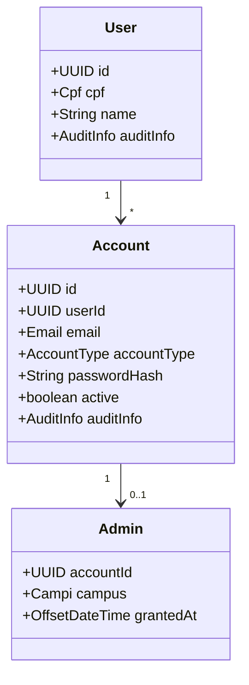
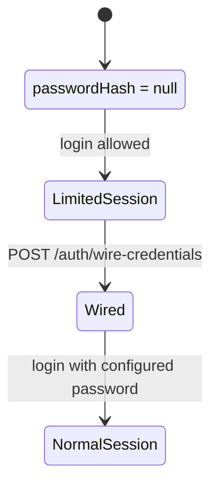
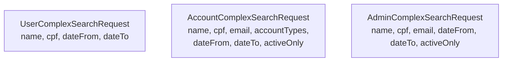
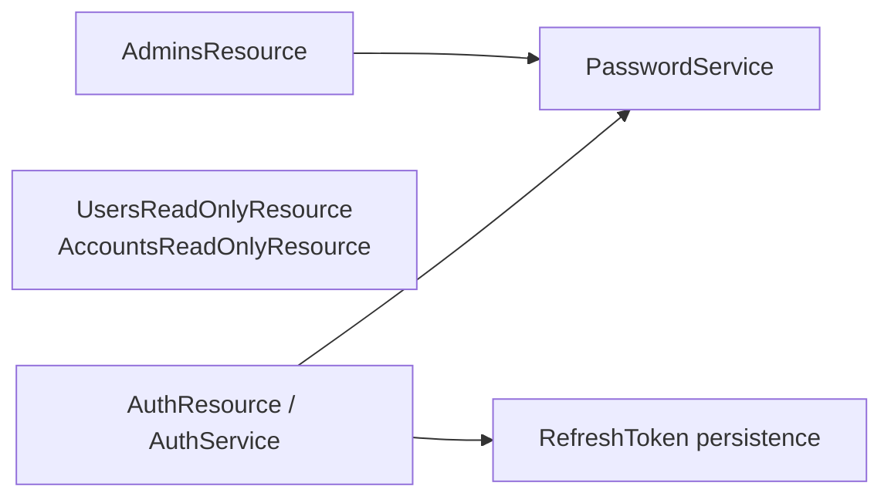

# 🔐 Identity Module

## 📌 Overview

The identity module owns authentication, account identity, and administrator management.

Core responsibilities:

- login, refresh, logout, logout-all
- first-access credential wiring
- read-side user and account lookup
- admin lifecycle management
- password hashing and strength validation
- refresh-token session management

## 🧠 Domain model



## 🌐 Public endpoints

### Auth

```text
POST /v1/auth/login
POST /v1/auth/logout
POST /v1/auth/logout-all
POST /v1/auth/refresh
POST /v1/auth/wire-credentials
```

### Users

```text
GET  /v1/identity/users/{id}
GET  /v1/identity/users/me
GET  /v1/identity/users?ids=
POST /v1/identity/users/search
```

### Accounts

```text
GET  /v1/identity/accounts/{id}
GET  /v1/identity/accounts/me
GET  /v1/identity/accounts?ids=
POST /v1/identity/accounts/search
```

### Admins

```text
GET    /v1/identity/admins/{id}
GET    /v1/identity/admins/me
GET    /v1/identity/admins?ids=
POST   /v1/identity/admins/search
POST   /v1/identity/admins
PUT    /v1/identity/admins/{id}
PATCH  /v1/identity/admins/{id}/status
DELETE /v1/identity/admins/{id}
```

## 🔄 Password setup flow



Important rules:

- new admin, former-student, and staff accounts start with `passwordHash = null`
- login still works for first access
- non-auth operations are blocked until credentials are wired
- password validation lives in `PasswordService`

## 🔍 Complex-search contracts



## 🔐 Security notes

- JWT access tokens are signed with HS256
- refresh tokens are persisted and revocable
- role checks stay in the presenter layer
- `PasswordSetupGuardFilter` restricts authenticated but not yet wired accounts

Current account types exposed through the platform:

- `ADMIN`
- `PARTNER`
- `FORMER_STUDENT`

## 🧱 Internal split


