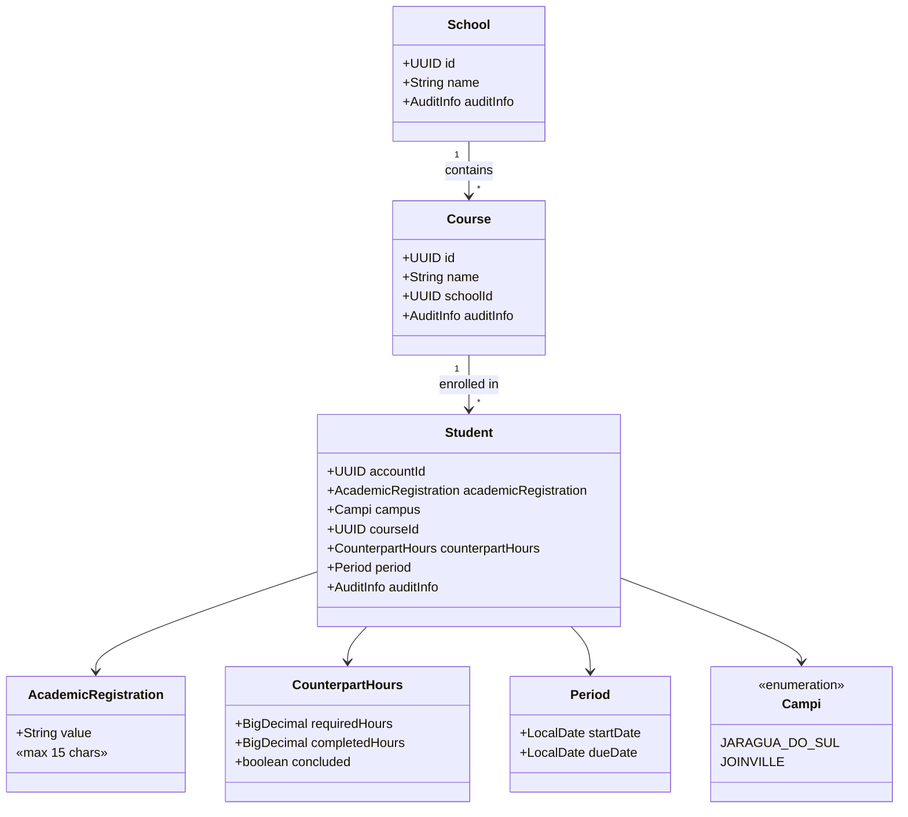
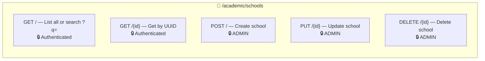
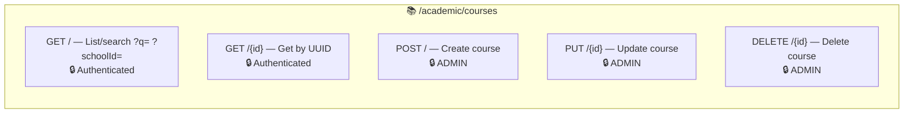
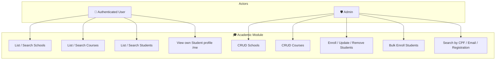
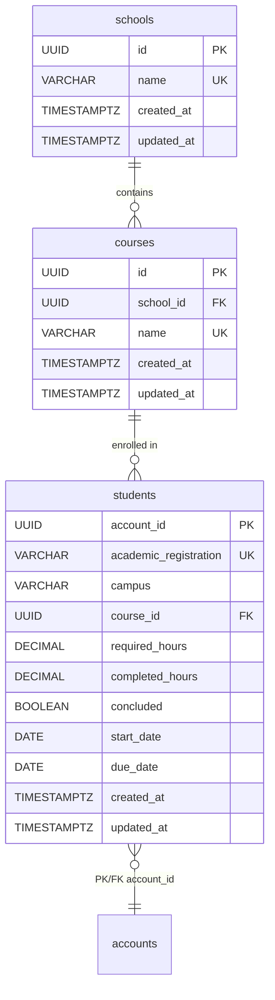

# 🎓 Academic Module

## Overview

The **Academic** module manages the university's educational structure: **Schools** (departments), **Courses**, and **Students**. Students are enrolled into courses, tracked by academic registration, campus, and counterpart hour requirements. This module integrates deeply with the Identity module to provision student accounts automatically.

## Domain Model



## Architecture

```
presenter/                      ← REST controllers
  SchoolResource                ← CRUD for schools
  CourseResource                ← CRUD for courses
  StudentResource               ← CRUD for students (incl. bulk create)
  dtos/                         ← Request/Response DTOs
  mappers/                      ← Presenter layer transformers
domain/                         ← Pure domain model
  School, Course, Student       ← Aggregate roots
  vos/                          ← Value Objects
  *Repository                   ← Repository interfaces
service/                        ← Application services (CQRS)
  SchoolService, CourseService  ← Write commands
  StudentService                ← Student enrollment commands
  *ReadService                  ← Query-side services
infra/                          ← Infrastructure layer
  persistence/                  ← JPA entities (Hibernate Search indexed)
  read/                         ← CQRS query implementations
  *Mapper                       ← Domain ↔ JPA anti-corruption layers
```

## Endpoints

### Schools — `/academic/schools`



### Courses — `/academic/courses`



### Students — `/academic/students`

```mermaid
graph LR
    subgraph Students["🎓 /academic/students"]
        direction TB
        GET_LIST["GET / — List/search ?q= ?courseId=<br/>🔒 Authenticated"]
        GET_ID["GET /{id} — Get by account ID<br/>🔒 Authenticated"]
        GET_CPF["GET /by-cpf/{cpf}<br/>🔒 ADMIN"]
        GET_EMAIL["GET /by-email/{email}<br/>🔒 ADMIN"]
        GET_REG["GET /by-registration/{reg}<br/>🔒 ADMIN"]
        GET_ME["GET /me — Current student profile<br/>🔒 Authenticated"]
        POST["POST / — Enroll student<br/>🔒 ADMIN"]
        POST_BULK["POST /bulk — Bulk enroll<br/>🔒 ADMIN"]
        PUT["PUT /{id} — Update student<br/>🔒 ADMIN"]
        DELETE["DELETE /{id} — Remove student<br/>🔒 ADMIN"]
    end
```



## Use Case Diagram



## ERM (Entity-Relationship Model)



## Business Rules

- School names must be unique.
- Course names must be unique.
- A school cannot be deleted while it has courses.
- A course cannot be deleted while it has students.
- A student cannot be deleted while they have project enrollments.
- Academic registration must be unique across all students.
- Student creation automatically provisions a User + Account (with STUDENT type) in the Identity module.
