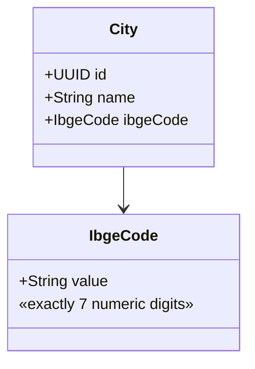
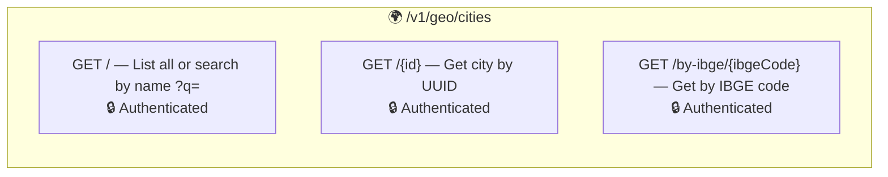
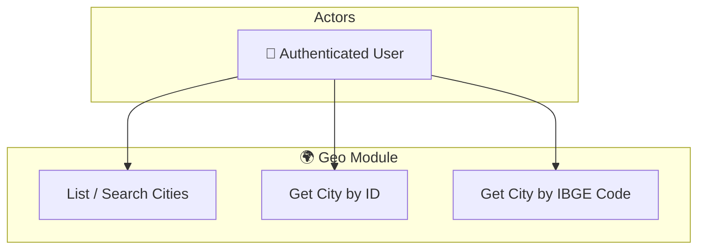
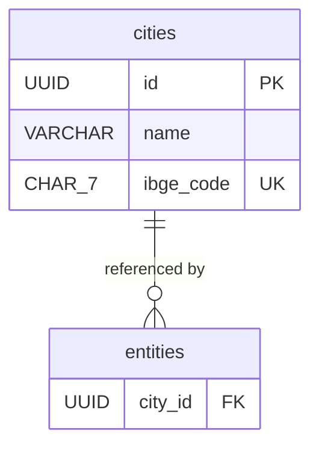

# 🌍 Geo Module

## Overview

The **Geo** module is a lightweight, read-only bounded context responsible for managing geographic reference data — specifically Brazilian cities and their IBGE codes. It serves as a shared dictionary consumed by other modules (Partner, Academic) to resolve location references.

## Domain Model



## Architecture

```
presenter/              ← REST controllers (read-only)
  CityReadOnlyResource  ← GET endpoints for cities
  mappers/              ← Presenter → Response mapping
    CityPresenter
domain/                 ← Pure domain model
  City                  ← Aggregate root
  CityRepository        ← Read-only repository interface
  vos/IbgeCode          ← Value Object
service/                ← Application services (CQRS Query side)
  CityReadService       ← Read service
infra/                  ← Infrastructure layer
  CityMapper            ← Domain ↔ JPA mapping
  persistence/          ← JPA entities
    CityEntity          ← Hibernate Search indexed
  read/                 ← CQRS Query implementations
    CityQueries         ← Query interface
    impl/               ← JPQL + Elasticsearch implementations
```

## Endpoints



## Use Case Diagram



## ERM (Entity-Relationship Model)



## Key Design Decisions

- **Read-only**: City data is seeded via Flyway migrations, not through REST endpoints.
- **Full-text search**: City names are indexed in Elasticsearch via Hibernate Search with accent-insensitive, fuzzy, and autocomplete analyzers.
- **Cross-module dependency**: Partner entities reference `city_id` as a foreign key.

