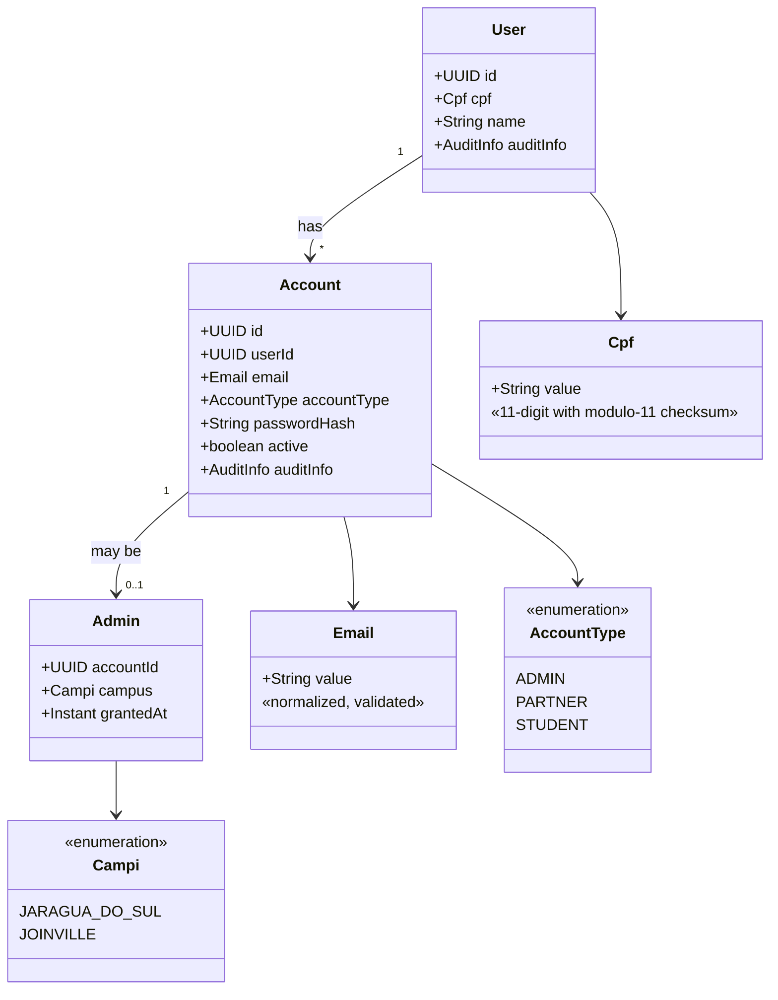
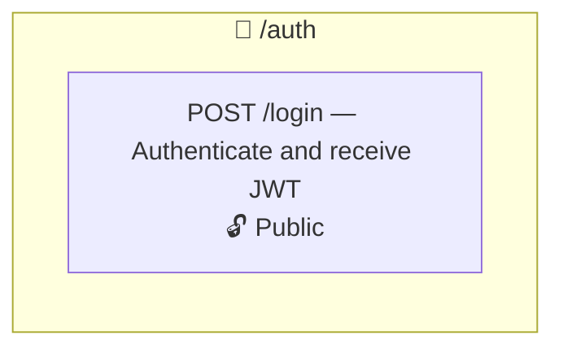
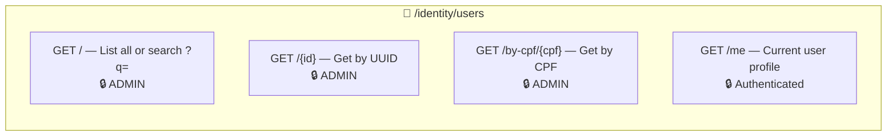
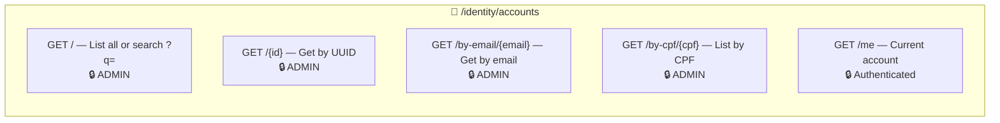
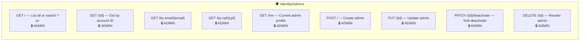
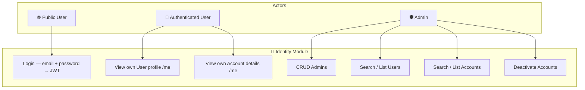
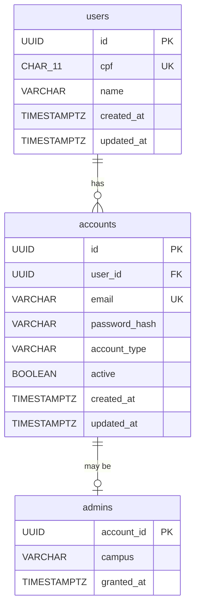

# 🔐 Identity Module

## Overview

The **Identity** module is the core authentication and authorization bounded context. It manages **Users** (personal identity — CPF and name), **Accounts** (authentication credentials — email, password, account type), and **Admins** (elevated administrative privileges tied to a campus). It provides JWT-based authentication and role-based access control (RBAC) for the entire platform.

## Domain Model



## Architecture

```
presenter/                     ← REST controllers
  AuthResource                 ← POST /auth/login (public)
  AdminResource                ← CRUD for admins (ADMIN role)
  AccountReadOnlyResource      ← Read-only account queries (ADMIN role)
  UserReadOnlyResource         ← Read-only user queries (ADMIN role)
  dtos/                        ← Request/Response DTOs
  mappers/                     ← Presenter layer transformers
domain/                        ← Pure domain model
  User, Account, Admin         ← Aggregate roots
  vos/Cpf, Email               ← Value Objects
  *Repository                  ← Repository interfaces
service/                       ← Application services (CQRS)
  AuthService                  ← Login + JWT generation
  PasswordService              ← Bcrypt hashing with pepper
  AccountService               ← Account CRUD commands
  AdminService                 ← Admin CRUD commands
  *ReadService                 ← Query-side services
infra/                         ← Infrastructure layer
  persistence/                 ← JPA entities (UserEntity, AccountEntity, AdminEntity)
  read/                        ← CQRS query implementations
  *Mapper                      ← Domain ↔ JPA anti-corruption layers
```

## Endpoints

### Authentication — `/auth`



### Users — `/identity/users`



### Accounts — `/identity/accounts`



### Admins — `/identity/admins`



## Use Case Diagram



## ERM (Entity-Relationship Model)



## Security Model

- **Password hashing**: Bcrypt with application-level pepper.
- **JWT tokens**: SmallRye JWT with HS256 signing. Claims include `accountId`, `userId`, `accountType`, and role groups.
- **Role-based access**: Enforced via `@RolesAllowed("ADMIN")`, `@Authenticated`, and `@PermitAll`.
