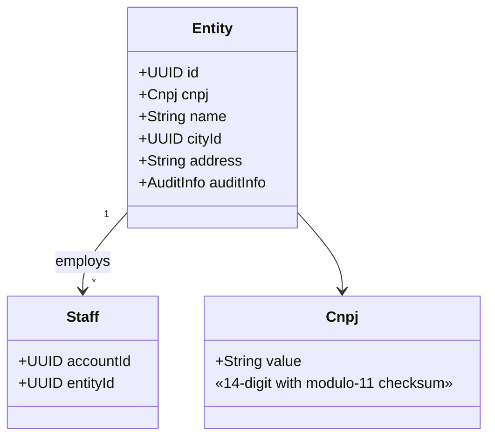
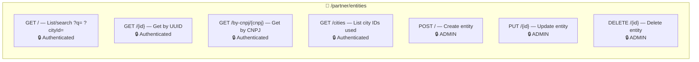
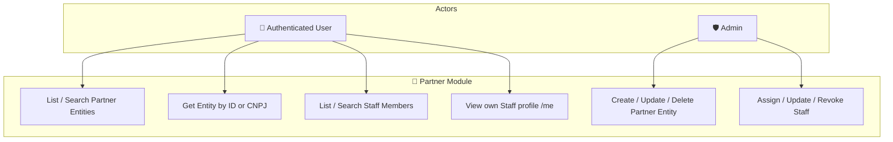
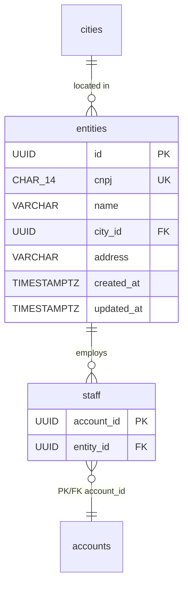

# 🏢 Partner Module

## Overview

The **Partner** module manages external partner organizations (entities) and their staff members. A partner entity represents a company or organization identified by a Brazilian CNPJ that offers community service projects. Staff members are accounts with privileges to manage that organization's projects.

## Domain Model



## Architecture

```
presenter/                    ← REST controllers
  EntityResource              ← CRUD for partner entities
  StaffResource               ← CRUD for staff members
  dtos/                       ← Request/Response DTOs
  mappers/                    ← Presenter layer transformers
domain/                       ← Pure domain model
  Entity                      ← Partner organization aggregate
  Staff                       ← Staff assignment aggregate
  vos/Cnpj                    ← Value Object
  *Repository                 ← Repository interfaces
service/                      ← Application services (CQRS)
  EntityService               ← Entity CRUD commands
  StaffService                ← Staff assignment commands
  *ReadService                ← Query-side services
infra/                        ← Infrastructure layer
  persistence/                ← JPA entities (Hibernate Search indexed)
  read/                       ← CQRS query implementations
  *Mapper                     ← Domain ↔ JPA anti-corruption layers
```

## Endpoints

### Partner Entities — `/partner/entities`



### Staff Members — `/partners/staff`

```mermaid
graph LR
    subgraph Staff["👥 /partners/staff"]
        direction TB
        GET_LIST["GET / — List/search ?q= ?entityId= ?cpf=<br/>🔒 Authenticated"]
        GET_ID["GET /{id} — Get by account ID<br/>🔒 Authenticated"]
        GET_EMAIL["GET /by-email/{email}<br/>🔒 Authenticated"]
        GET_CPF["GET /by-cpf/{cpf}<br/>🔒 Authenticated"]
        GET_ENTITY["GET /by-entity/{entityId}<br/>🔒 Authenticated"]
        GET_ME["GET /me — Current staff profile<br/>🔒 Authenticated"]
        POST["POST / — Assign staff to entity<br/>🔒 ADMIN"]
        PUT["PUT /{id} — Update staff<br/>🔒 ADMIN"]
        PATCH["PATCH /{id}/deactivate — Soft-deactivate<br/>🔒 ADMIN"]
        DELETE["DELETE /{id} — Revoke staff<br/>🔒 ADMIN"]
    end
```



## Use Case Diagram



## ERM (Entity-Relationship Model)



## Business Rules

- A CNPJ must be unique across all partner entities.
- An account can only be assigned as staff to **one** partner entity at a time.
- A partner entity cannot be deleted if it has associated projects.
- A staff member cannot be deleted if they have validated attendances or created projects.

