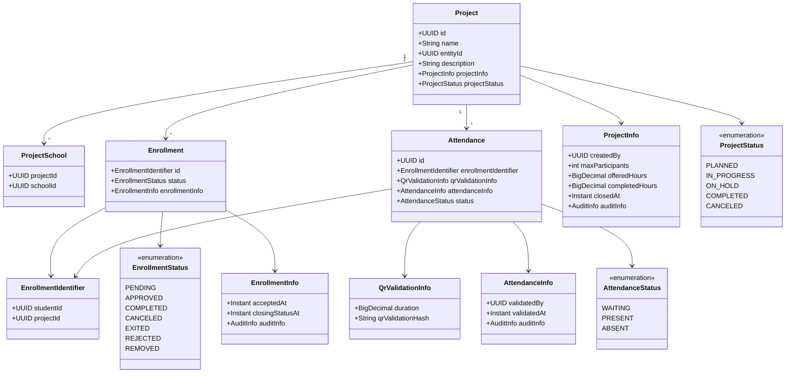
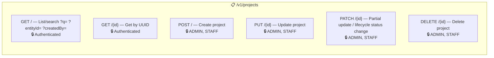
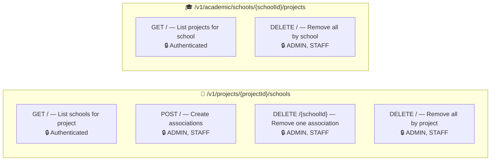
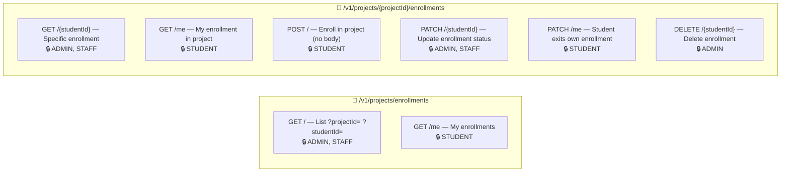
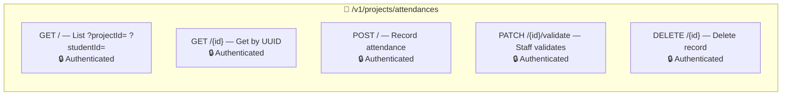
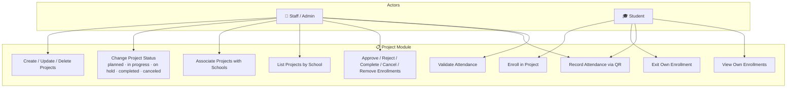
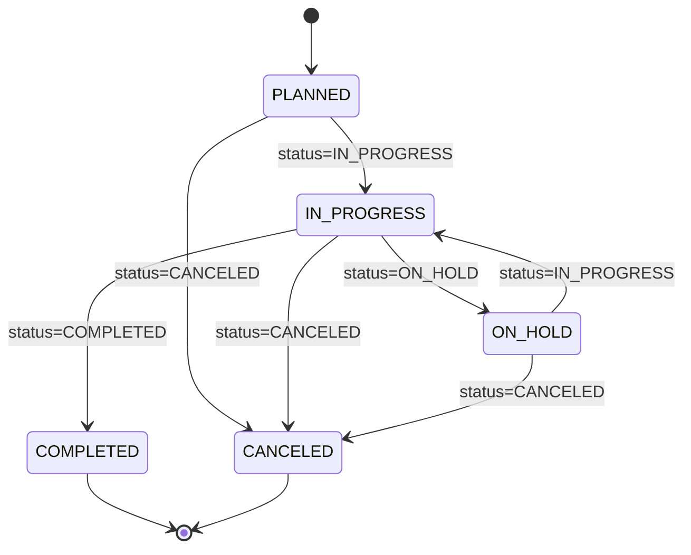
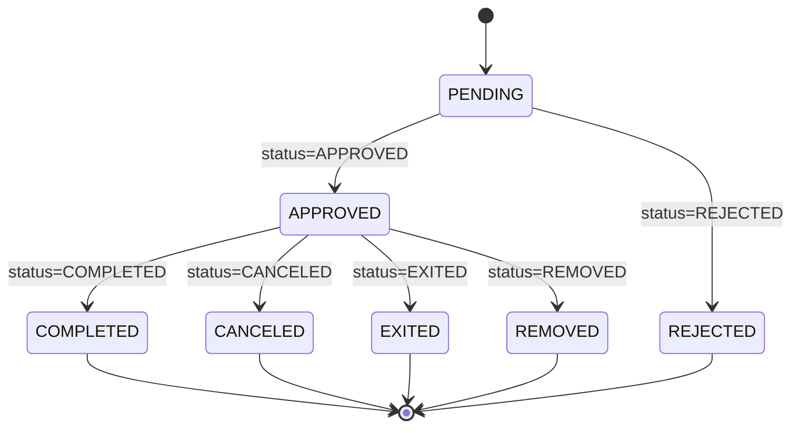
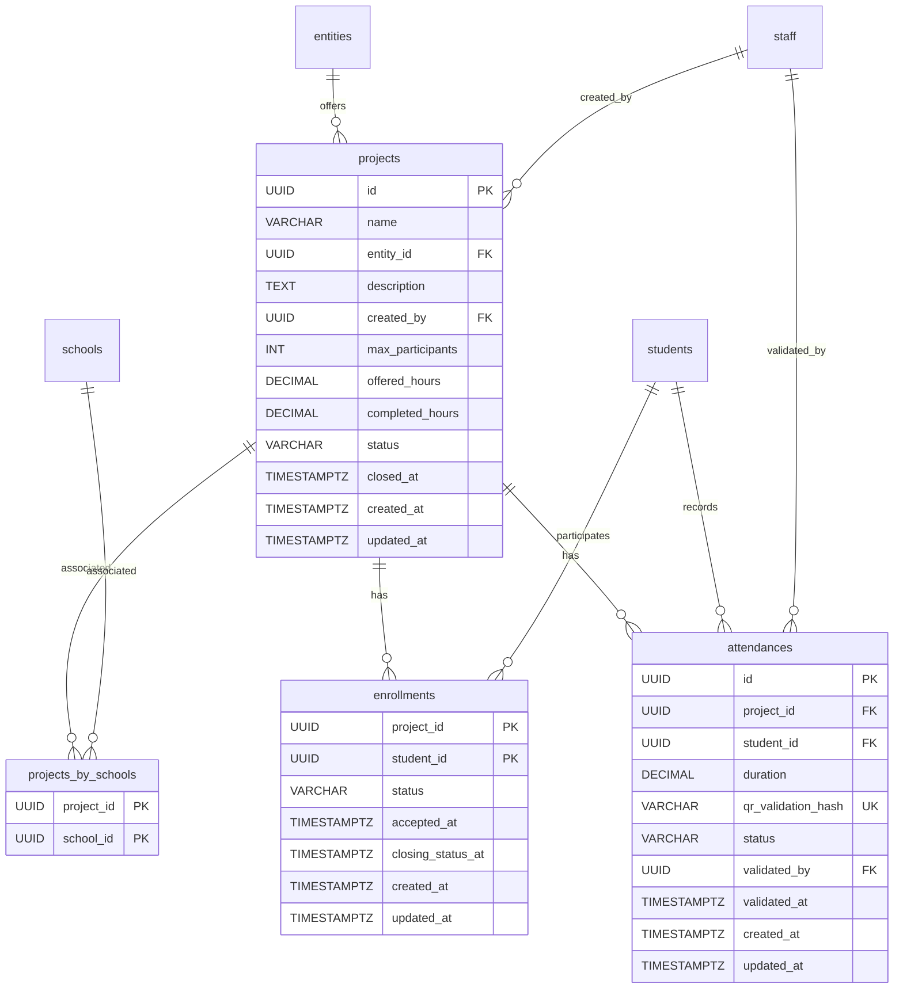

# 📋 Project Module

## Overview

The **Project** module is the operational core of the PUG platform. It manages community service **Projects** offered by partner entities, **Project-School associations**, **Enrollments** of students into projects, and **Attendance** tracking via QR code validation. Projects follow a lifecycle state machine and expose the workflow used by staff and students during execution.

## Domain Model



## Architecture

```
presenter/                        ← REST controllers
  ProjectResource                 ← CRUD + lifecycle updates for projects
  ProjectSchoolResource           ← Project → School association endpoints
  SchoolProjectResource           ← School → Project listing/removal endpoints
  EnrollmentResource              ← Enrollment queries + status transitions
  AttendanceResource              ← CRUD + QR validation for attendances
  dtos/                           ← Request/Response DTOs
  mappers/                        ← Presenter layer transformers
domain/                           ← Pure domain model
  Project, Enrollment, Attendance ← Aggregate roots
  ProjectSchool                   ← Association aggregate
  vos/                            ← Value Objects
  enums/                          ← Status enums
  *Repository                     ← Repository interfaces
service/                          ← Application services (CQRS)
  ProjectService                  ← Project commands + lifecycle
  ProjectSchoolService            ← Project-school association commands
  EnrollmentService               ← Enrollment commands + transitions
  AttendanceService               ← Attendance commands + QR validation
  *ReadService                    ← Query-side services
infra/                            ← Infrastructure layer
  persistence/                    ← JPA entities (Hibernate Search indexed)
  read/                           ← CQRS query implementations
  *Mapper                         ← Domain ↔ JPA anti-corruption layers
```

## Endpoints

### Projects — `/v1/projects`



### Project ↔ School Associations



### Enrollments



### Attendances — `/v1/projects/attendances`



## Use Case Diagram



## Project Lifecycle State Machine



## Enrollment Lifecycle



## ERM (Entity-Relationship Model)



## Business Rules

- Project names must be unique per partner entity.
- A project cannot be deleted while dependent data still blocks the operation.
- Project status transitions follow the lifecycle rules enforced by the domain.
- Project retake is represented by setting status back to `IN_PROGRESS`.
- Enrollment status transitions follow a strict state machine.
- Enrollment creation uses the project identifier from the route, not from a request body.
- Attendance QR hashes must be globally unique to prevent duplicate submissions.
- Attendance validation records who validated and when.


