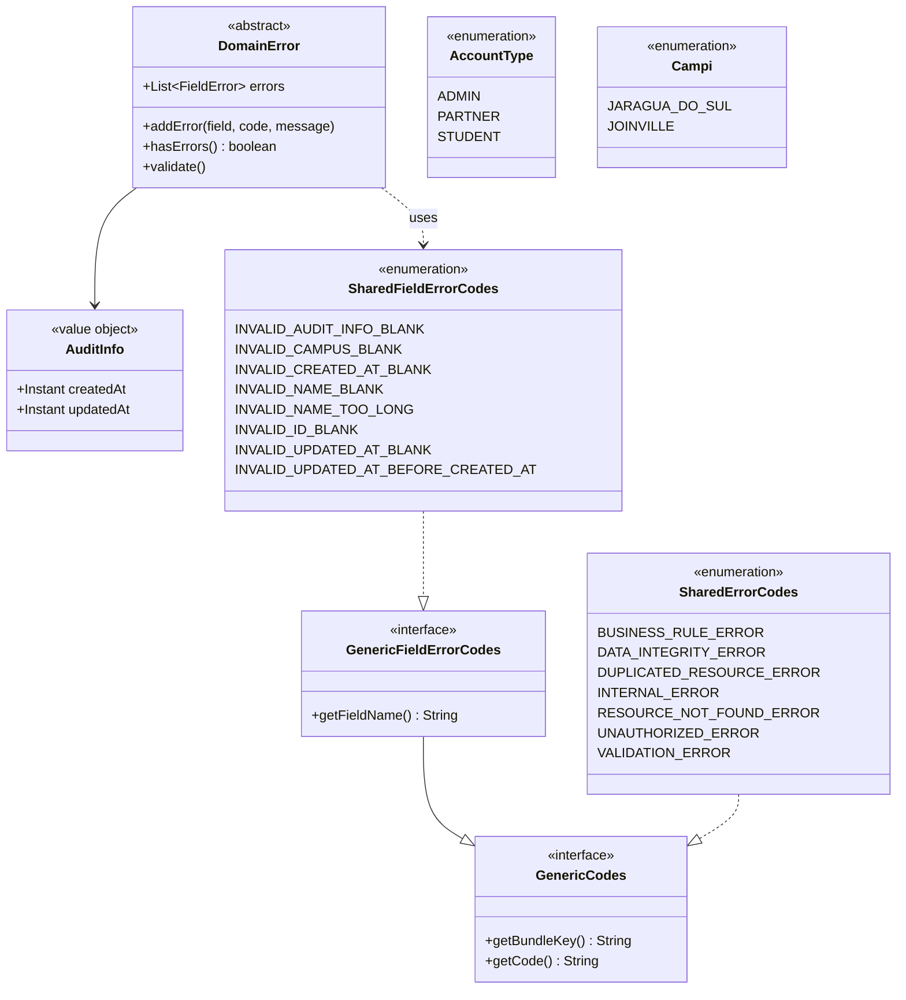
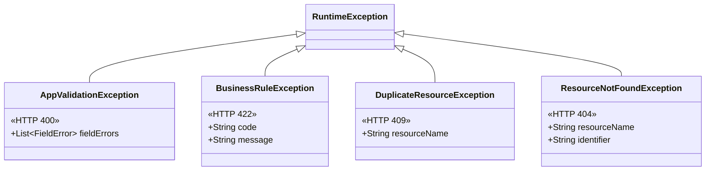
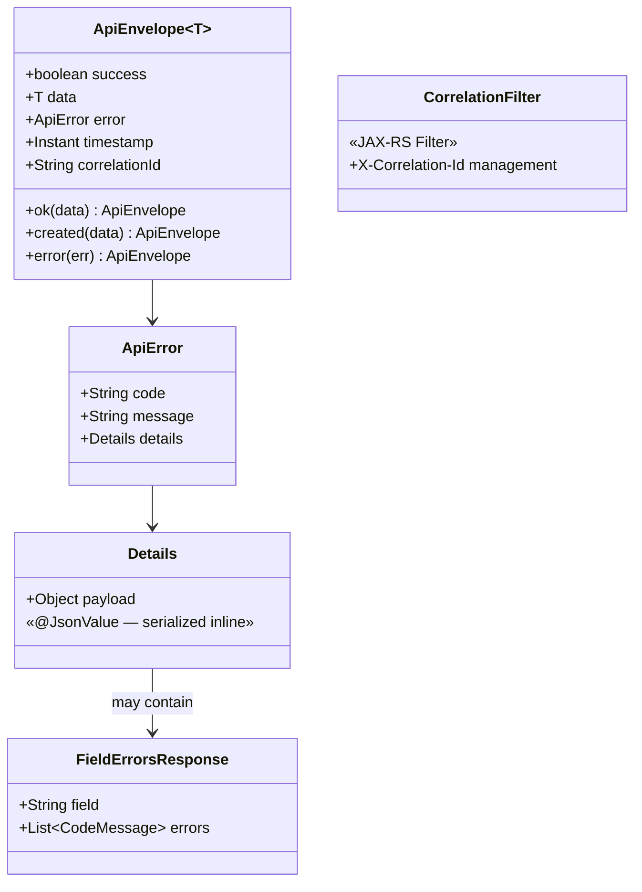
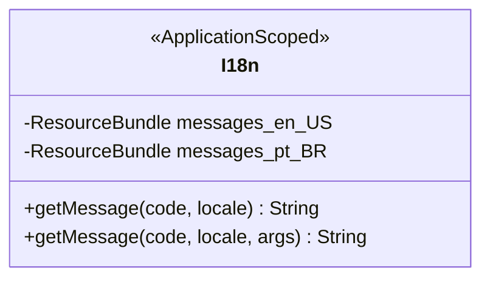
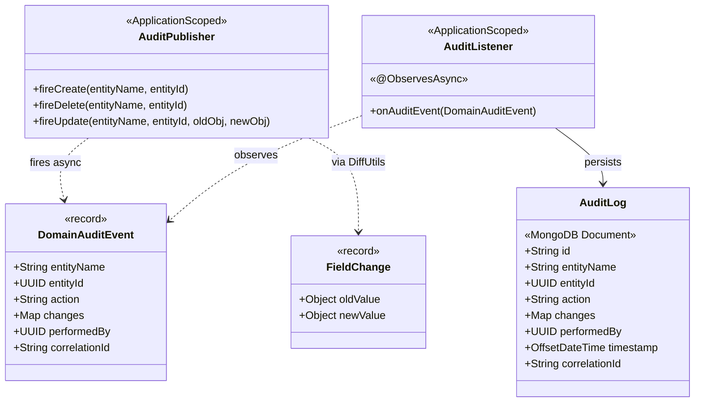
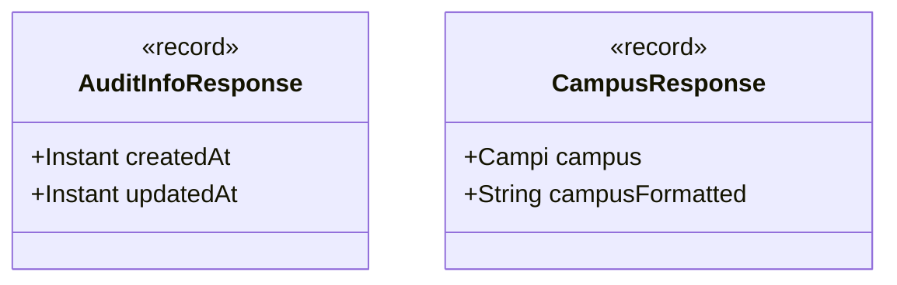
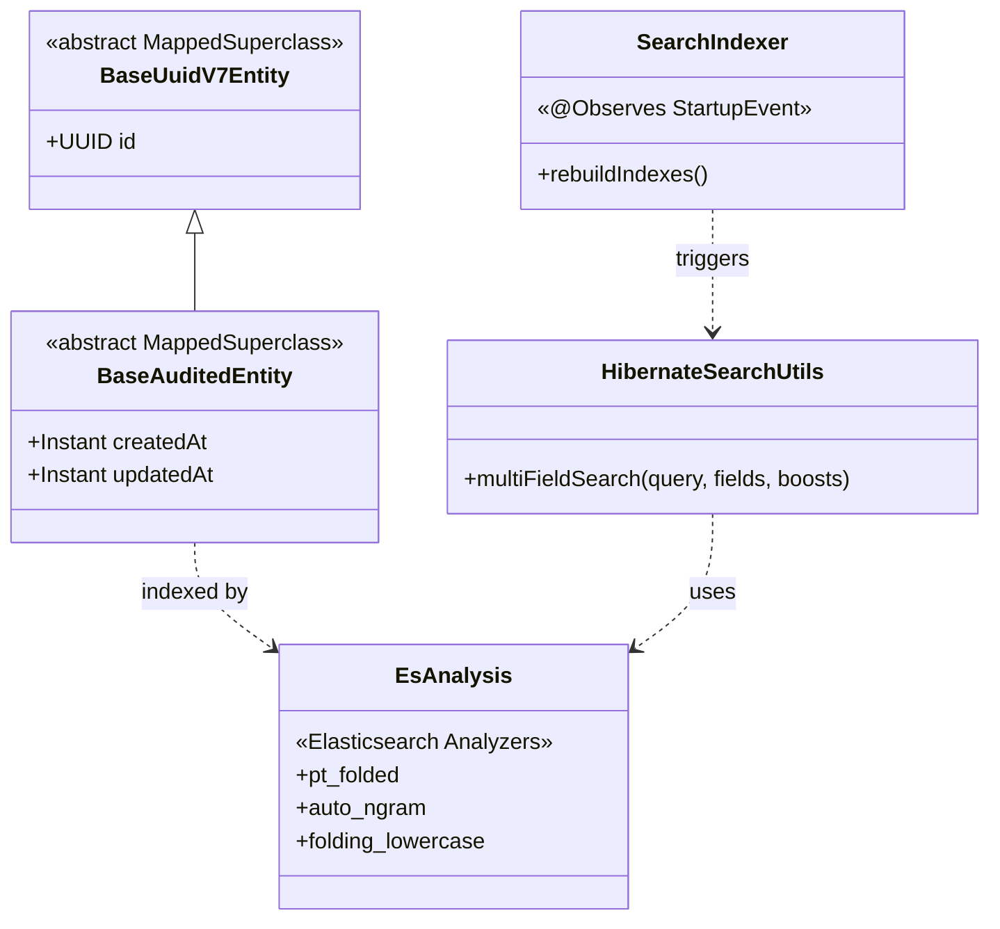
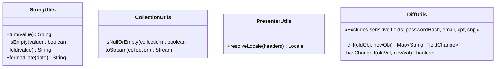
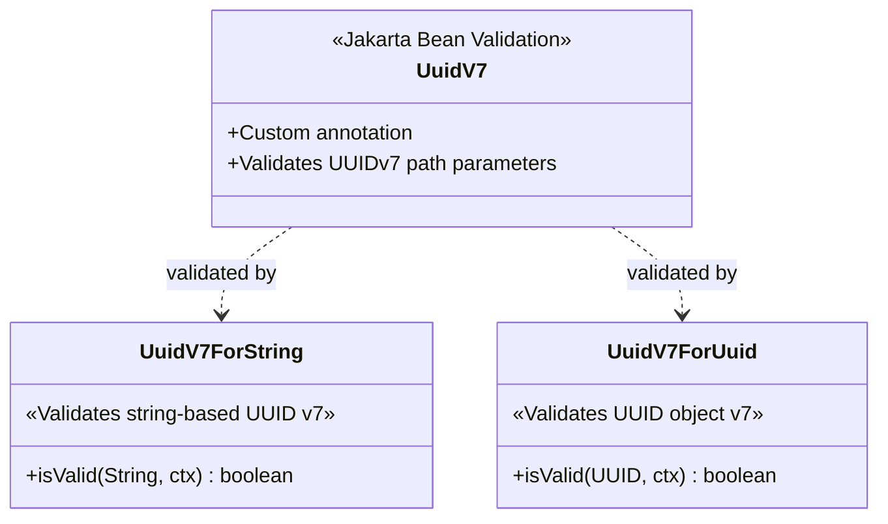

# 🧩 Shared Module

## Overview

The **Shared** module provides cross-cutting infrastructure, utilities, and base domain abstractions used by all other bounded contexts. It is **not** a standalone business module — instead, it defines the foundational building blocks of the platform's architecture, including the domain audit trail persisted to MongoDB.

## Components

### Domain Layer



### Exception Handling



Exception mappers translate these (and infrastructure-level exceptions) into standardized `ApiEnvelope` error responses:

| Mapper | Handles | HTTP Status |
|---|---|---|
| `AppValidationExceptionMapper` | `AppValidationException` | 400 |
| `ConstraintViolationExceptionMapper` | Jakarta Bean Validation | 400 |
| `NotAuthorizedExceptionMapper` | `NotAuthorizedException` | 401 |
| `ResourceNotFoundExceptionMapper` | `ResourceNotFoundException` | 404 |
| `DuplicateResourceExceptionMapper` | `DuplicateResourceException` | 409 |
| `PersistenceExceptionMapper` | JPA/Hibernate `PersistenceException` | 409 / 500 |
| `BusinessRuleExceptionMapper` | `BusinessRuleException` | 422 |
| `UncaughtExceptionMapper` | Any unhandled `Throwable` | 500 |

### REST API Infrastructure



### Internationalization (i18n)



### Audit Infrastructure (MongoDB)



### Presenter DTOs



### Infrastructure



### Utilities



### Validation



## Architecture Diagram

```
shared/
├── domain/
│   ├── DomainError              ← Self-validating base
│   ├── enums/
│   │   ├── AccountType, Campi   ← Shared domain enums
│   │   ├── GenericCodes         ← Base interface for all error/code enums
│   │   ├── GenericFieldErrorCodes ← Base interface for field-specific error codes
│   │   ├── SharedErrorCodes     ← System-wide error codes
│   │   └── SharedFieldErrorCodes ← Shared field validation codes
│   └── vos/AuditInfo            ← Shared value object
├── exceptions/                  ← Custom exception hierarchy
├── http/CorrelationFilter       ← Request tracing
├── i18n/I18n                    ← Internationalization
├── infra/
│   ├── audit/                   ← MongoDB-backed audit trail
│   │   ├── AuditLog             ← MongoDB document entity
│   │   ├── AuditListener        ← Async CDI event consumer
│   │   ├── AuditPublisher       ← Event-firing service
│   │   ├── DomainAuditEvent     ← CDI event payload record
│   │   └── FieldChange          ← Old/new value pair record
│   ├── persistence/             ← Base JPA entities
│   └── search/                  ← Elasticsearch config + utilities
├── presenter/
│   ├── dtos/
│   │   ├── AuditInfoResponse    ← Audit timestamps DTO
│   │   └── CampusResponse       ← Campus enum + localized label DTO
│   ├── mappers/                 ← SharedDataPresenter
│   └── rest/
│       ├── ApiEnvelope          ← Standardized response wrapper
│       ├── ApiError             ← Error payload structure
│       ├── Details              ← Polymorphic error details wrapper
│       ├── FieldErrorsResponse  ← Field-level error details
│       └── mappers/             ← Exception → HTTP response mappers
│           ├── AppValidationExceptionMapper
│           ├── BusinessRuleExceptionMapper
│           ├── ConstraintViolationExceptionMapper
│           ├── DuplicateResourceExceptionMapper
│           ├── NotAuthorizedExceptionMapper
│           ├── PersistenceExceptionMapper
│           ├── ResourceNotFoundExceptionMapper
│           └── UncaughtExceptionMapper
├── utils/
│   ├── CollectionUtils          ← Collection helpers
│   ├── DiffUtils                ← Reflection-based object differ for audit
│   ├── PresenterUtils           ← Locale resolution
│   └── StringUtils              ← String manipulation
└── validation/
    ├── UuidV7                   ← Custom annotation
    ├── UuidV7ForString          ← String-based validator
    └── UuidV7ForUuid            ← UUID-based validator
```
