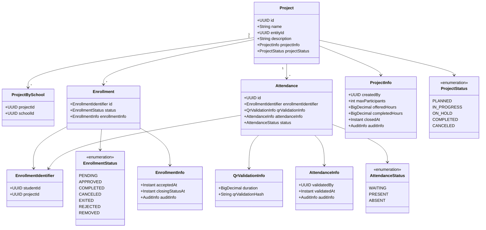
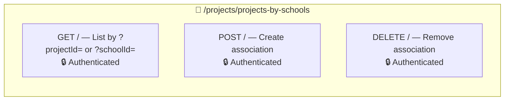
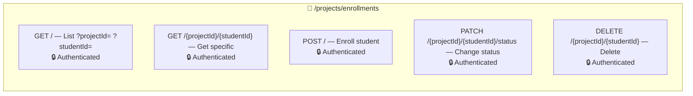
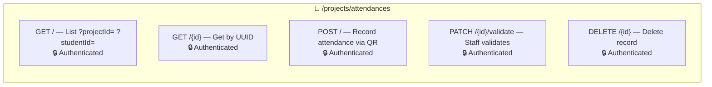
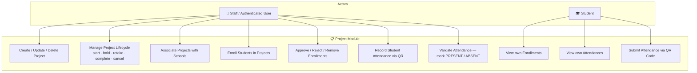
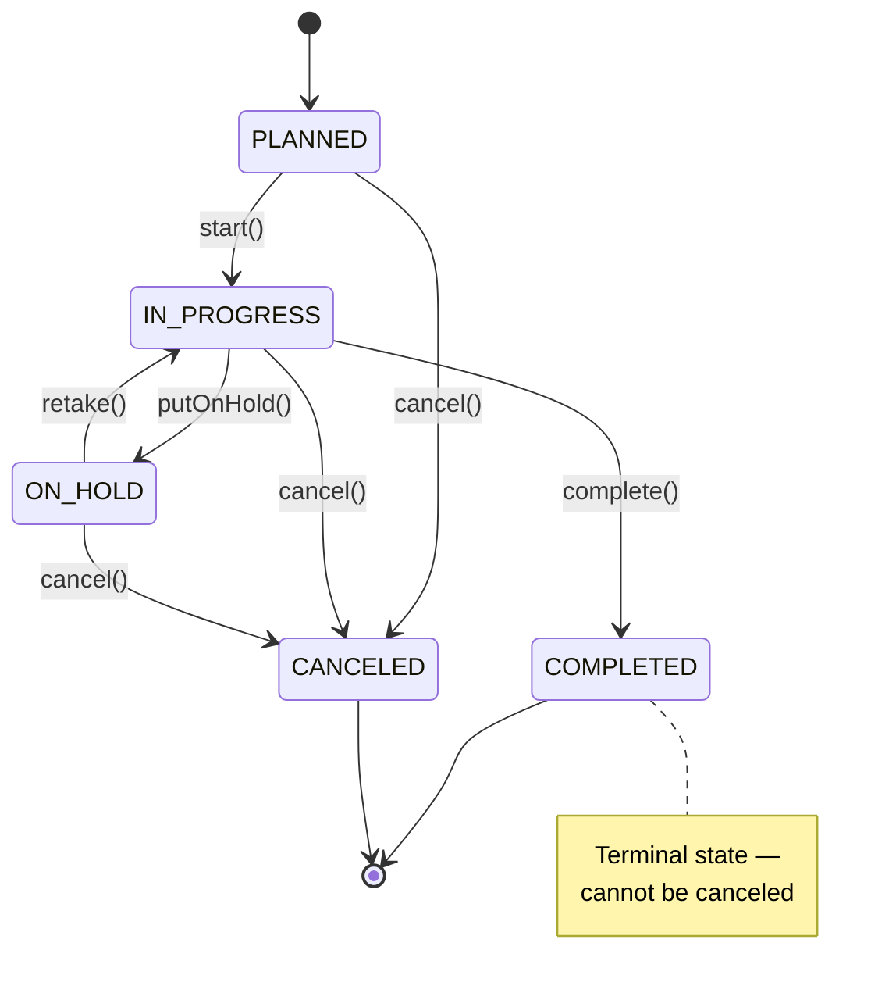
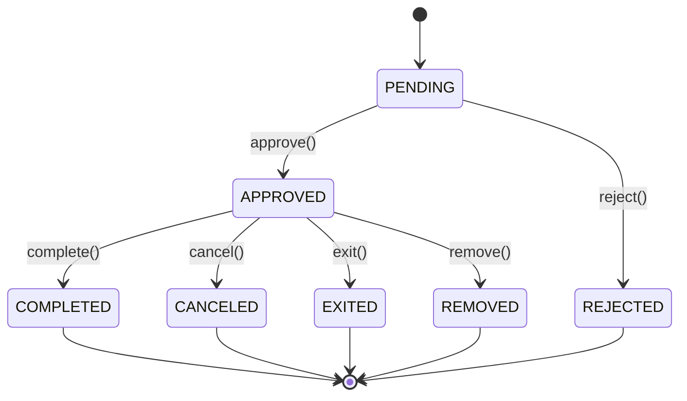
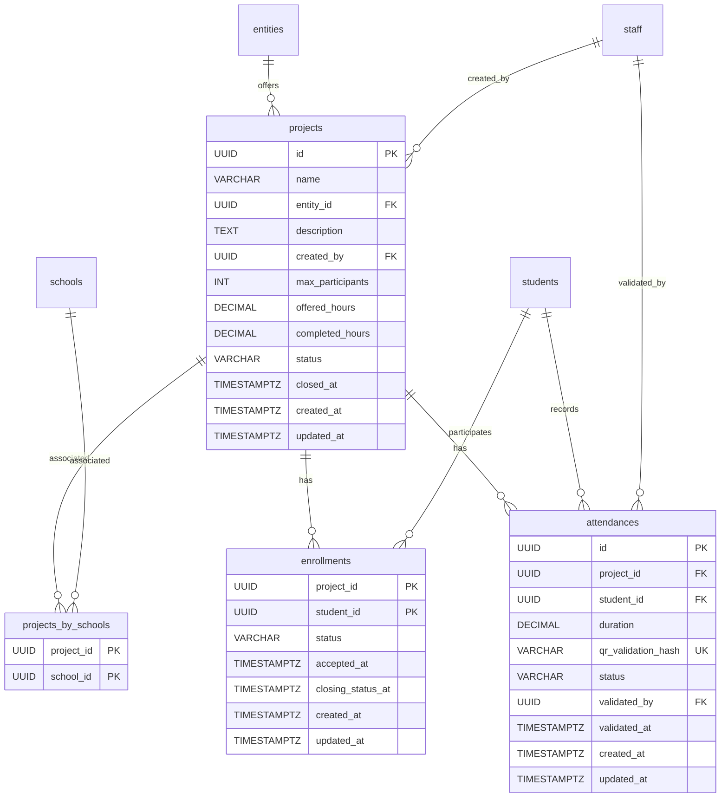

# 📋 Project Module

## Overview

The **Project** module is the operational core of the PUG platform. It manages community service **Projects** offered by partner entities, **Enrollments** of students into those projects, and **Attendance** tracking via QR code validation. Projects follow a rich lifecycle state machine (PLANNED → IN_PROGRESS → COMPLETED/CANCELED) and track counterpart hours.

## Domain Model



## Architecture

```
presenter/                        ← REST controllers
  ProjectResource                 ← CRUD + lifecycle for projects
  ProjectBySchoolResource         ← Project-School associations
  EnrollmentResource              ← CRUD + status transitions for enrollments
  AttendanceResource              ← CRUD + QR validation for attendances
  dtos/                           ← Request/Response DTOs
  mappers/                        ← Presenter layer transformers
domain/                           ← Pure domain model
  Project, Enrollment, Attendance ← Aggregate roots
  ProjectBySchool                 ← Association aggregate
  vos/                            ← Value Objects
  enums/                          ← Status enums
  *Repository                     ← Repository interfaces
service/                          ← Application services (CQRS)
  ProjectService                  ← Project commands + lifecycle
  EnrollmentService               ← Enrollment commands + transitions
  AttendanceService               ← Attendance commands + QR validation
  *ReadService                    ← Query-side services
infra/                            ← Infrastructure layer
  persistence/                    ← JPA entities (Hibernate Search indexed)
  read/                           ← CQRS query implementations
  *Mapper                         ← Domain ↔ JPA anti-corruption layers
```

## Endpoints

### Projects — `/projects/projects`

```mermaid
graph LR
    subgraph Projects["📋 /projects/projects"]
        direction TB
        GET_LIST["GET / — List/search ?q= ?entityId= ?createdBy=<br/>🔒 Authenticated"]
        GET_ID["GET /{id} — Get by UUID<br/>🔒 Authenticated"]
        POST["POST / — Create project<br/>🔒 Authenticated"]
        PUT["PUT /{id} — Update project<br/>🔒 Authenticated"]
        PATCH_START["PATCH /{id}/start — To IN_PROGRESS<br/>🔒 Authenticated"]
        PATCH_COMPLETE["PATCH /{id}/complete — To COMPLETED<br/>🔒 Authenticated"]
        PATCH_CANCEL["PATCH /{id}/cancel — To CANCELED<br/>🔒 Authenticated"]
        PATCH_HOLD["PATCH /{id}/hold — To ON_HOLD<br/>🔒 Authenticated"]
        PATCH_RETAKE["PATCH /{id}/retake — Resume from ON_HOLD<br/>🔒 Authenticated"]
        DELETE["DELETE /{id} — Delete project<br/>🔒 Authenticated"]
    end
```



### Project ↔ School Associations — `/projects/projects-by-schools`



### Enrollments — `/projects/enrollments`



### Attendances — `/projects/attendances`



## Use Case Diagram



## Project Lifecycle State Machine



## Enrollment Lifecycle



## ERM (Entity-Relationship Model)



## Business Rules

- Project names must be unique per partner entity.
- A project cannot be deleted if it has enrollments.
- Enrollment status transitions follow a strict state machine (e.g., cannot go from PENDING directly to COMPLETED).
- Attendance QR hashes must be globally unique to prevent duplicate submissions.
- When completed hours reach offered hours, the project auto-completes.
- Staff members validate attendances, creating an audit trail (who validated, when).
