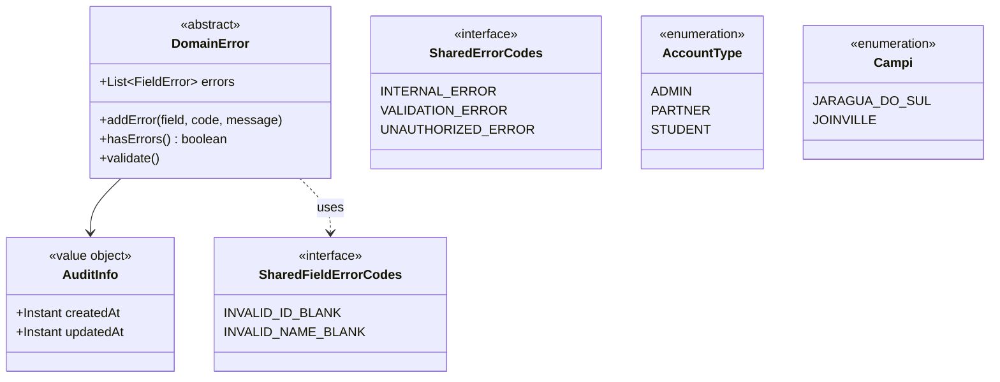
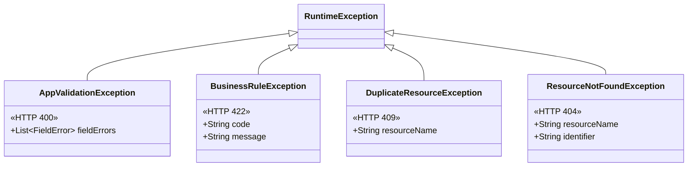
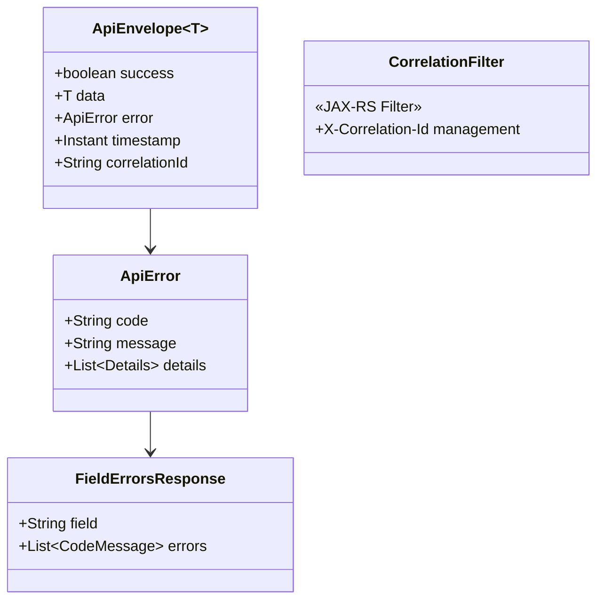
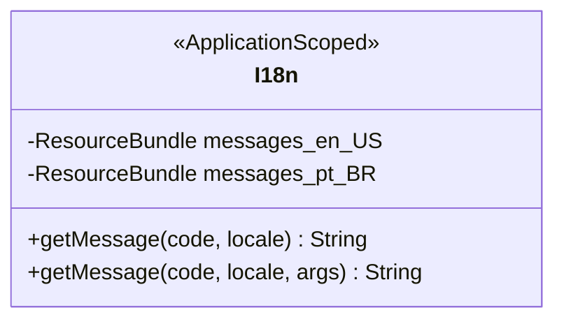
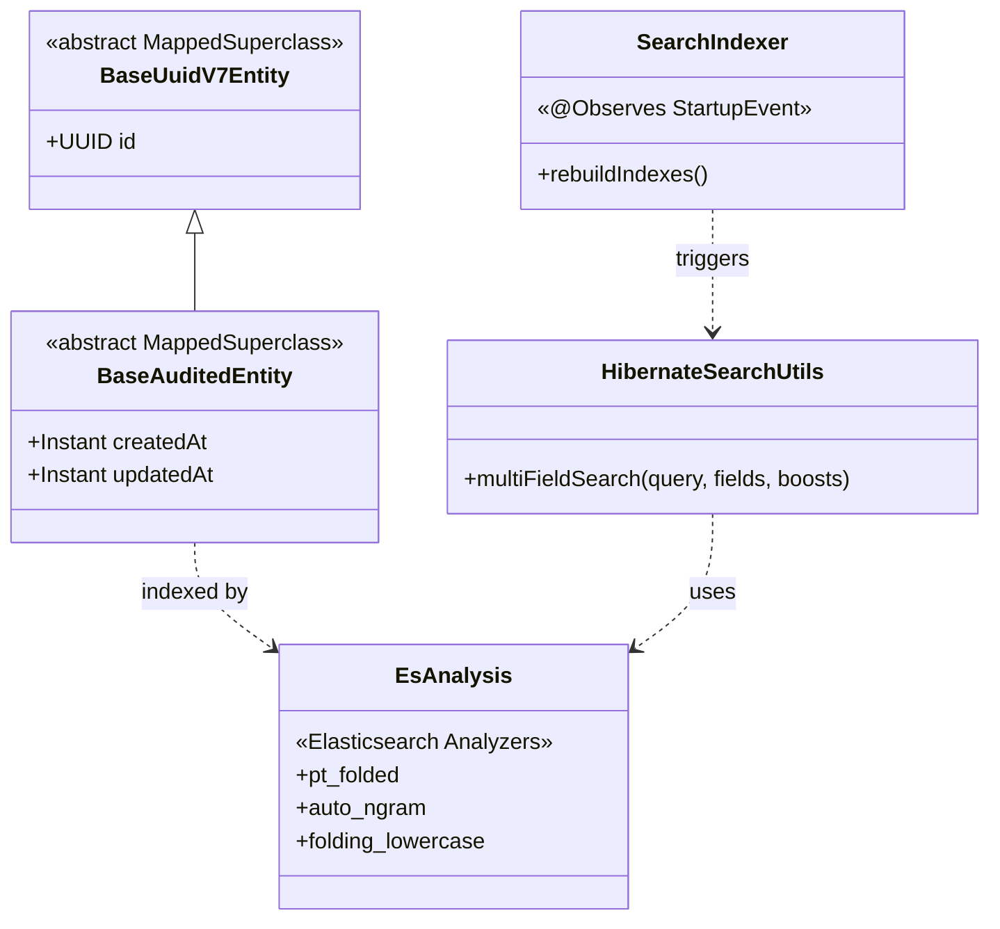
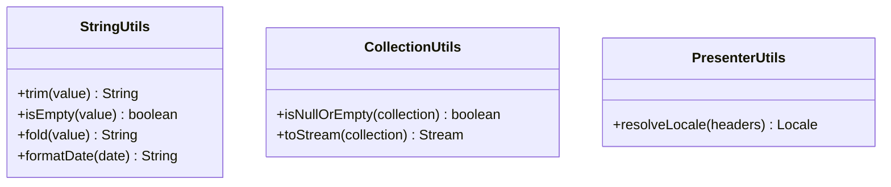
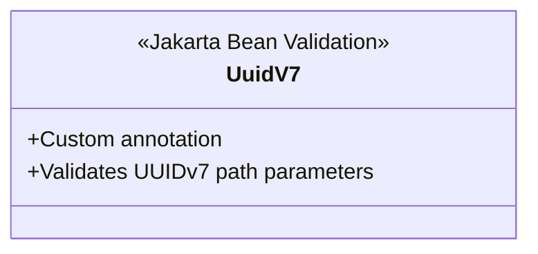

# 🧩 Shared Module

## Overview

The **Shared** module provides cross-cutting infrastructure, utilities, and base domain abstractions used by all other bounded contexts. It is **not** a standalone business module — instead, it defines the foundational building blocks of the platform's architecture.

## Components

### Domain Layer



### Exception Handling



### REST API Infrastructure



### Internationalization (i18n)



### Infrastructure



### Utilities



### Validation



## Architecture Diagram

```
shared/
├── domain/
│   ├── DomainError              ← Self-validating base
│   ├── enums/                   ← AccountType, Campi, error codes
│   └── vos/AuditInfo            ← Shared value object
├── exceptions/                  ← Custom exception hierarchy
├── http/CorrelationFilter       ← Request tracing
├── i18n/I18n                    ← Internationalization
├── infra/
│   ├── persistence/             ← Base JPA entities
│   └── search/                  ← Elasticsearch config + utilities
├── presenter/
│   ├── dtos/                    ← Shared response DTOs
│   ├── mappers/                 ← SharedDataPresenter
│   └── rest/                    ← ApiEnvelope, ApiError, exception mappers
├── utils/                       ← String, Collection, Presenter utilities
└── validation/                  ← Custom annotations
```
