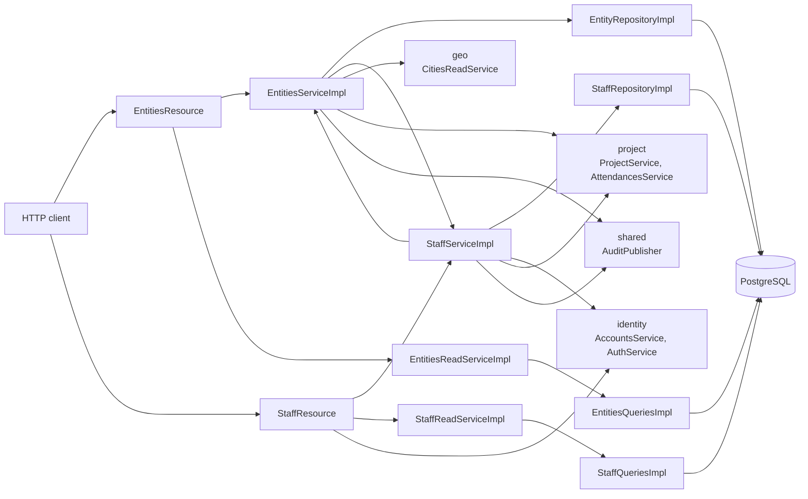
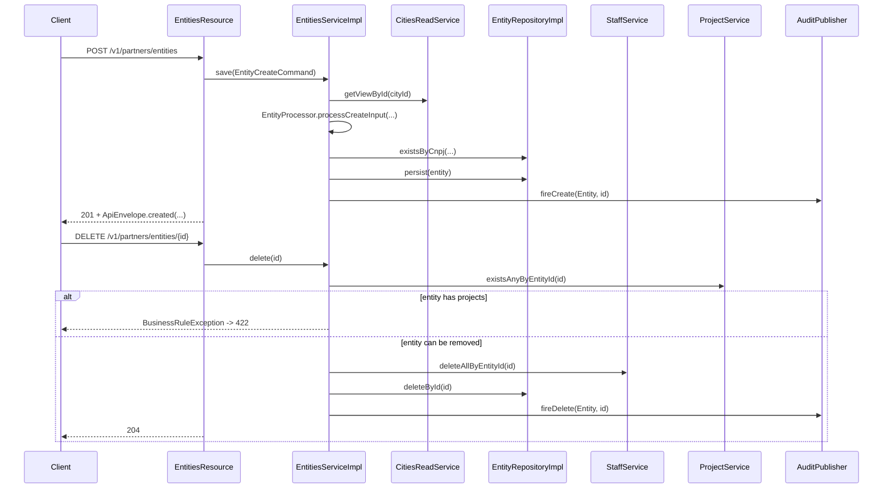
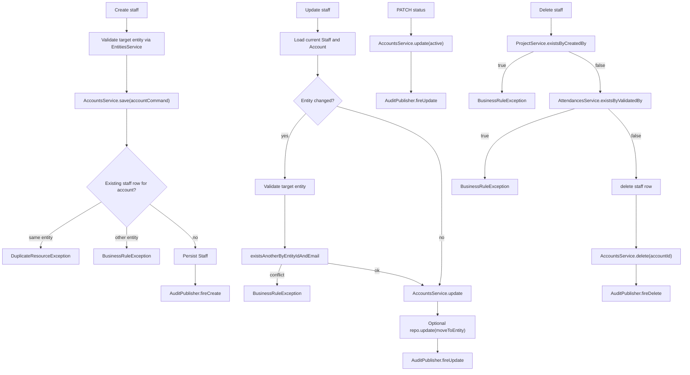

# Partner Module Architecture

[Back to module README](https://github.com/Plataforma-Universidade-Gratuita/pug-docs/blob/main/pug-service/partner/README.md)

## Overview

The `partner` package is a package-level module inside the Quarkus monolith. It owns two related concepts:

- partner organizations, modeled by [`Entity`](https://github.com/Plataforma-Universidade-Gratuita/pug-service/blob/main/src/main/java/br/org/catolicasc/pug/partner/domain/Entity.java)
- partner staff assignments, modeled by [`Staff`](https://github.com/Plataforma-Universidade-Gratuita/pug-service/blob/main/src/main/java/br/org/catolicasc/pug/partner/domain/Staff.java)

The module does **not** own person identity end to end. Names, CPF, email, account type, and active status remain in the `identity` module, while `partner` stores only the organizational link in the `staff` table.

## Internal structure

| Package | Role |
| --- | --- |
| `domain` | Immutable aggregates (`Entity`, `Staff`), the `Cnpj` value object, and partner-specific error codes. |
| `service` | Write orchestration (`EntitiesServiceImpl`, `StaffServiceImpl`), read facades (`EntitiesReadServiceImpl`, `StaffReadServiceImpl`), and command/query DTOs. |
| `service/utils` | Stateless mappers from raw command input into validated domain objects. |
| `infra/persistence` | JPA entities for `entities` and `staff`. |
| `infra/persistence/impl` | Panache-backed repositories for write-side persistence. |
| `infra/read` | CQRS-style read projections and custom JPA queries for lists and complex search. |
| `presenter` | JAX-RS resources, request/response DTOs, and presenter mappers that shape API output. |

## Data model and persistence

### Write-side tables

| Table | Owned by | Shape |
| --- | --- | --- |
| `entities` | `partner` | UUIDv7 `id`, unique `cnpj`, `name`, `city_id`, `address`, `created_at`, `updated_at` |
| `staff` | `partner` | `account_id` as both primary key and foreign key to `accounts.id`, plus `entity_id` foreign key to `entities.id` |

Concrete schema files:

- [`V005__create_entities_table.sql`](https://github.com/Plataforma-Universidade-Gratuita/pug-service/blob/main/src/main/resources/db/migration/V005__create_entities_table.sql)
- [`V006__create_staff_table.sql`](https://github.com/Plataforma-Universidade-Gratuita/pug-service/blob/main/src/main/resources/db/migration/V006__create_staff_table.sql)

`entities.city_id` is stored as a UUID foreign key to `cities.id`, but the domain aggregate keeps it as a plain identifier instead of a JPA object graph. The same pattern is used for `staff.account_id` and `staff.entity_id`.

### Domain aggregates

| Type | Fields | Notes |
| --- | --- | --- |
| `Entity` | `id`, `cnpj`, `name`, `cityId`, `address`, `auditInfo` | Immutable aggregate root with self-validation and update methods (`rename`, `moveToCity`, `moveToAddress`). |
| `Staff` | `accountId`, `entityId` | Minimal aggregate that expresses only the membership link between an identity account and a partner entity. |
| `Cnpj` | `value` | Sanitizes input to digits and validates with `CNPJValidator`. |

### Read-side projections

| Projection | Used by | Shape |
| --- | --- | --- |
| [`EntityView`](https://github.com/Plataforma-Universidade-Gratuita/pug-service/blob/main/src/main/java/br/org/catolicasc/pug/partner/infra/read/dtos/EntityView.java) | `GET /entities`, `GET /entities/{id}` | Entity data plus `cityId` only |
| [`EntityComplexSearchView`](https://github.com/Plataforma-Universidade-Gratuita/pug-service/blob/main/src/main/java/br/org/catolicasc/pug/partner/infra/read/dtos/EntityComplexSearchView.java) | `POST /entities/search` | Entity data plus `cityName` and `cityIbgeCode` |
| [`StaffView`](https://github.com/Plataforma-Universidade-Gratuita/pug-service/blob/main/src/main/java/br/org/catolicasc/pug/partner/infra/read/dtos/StaffView.java) | `GET /staff`, `GET /staff/{id}`, `GET /staff/me` | Nested `AccountView` plus `entityId` and `cityId` |
| [`StaffComplexSearchView`](https://github.com/Plataforma-Universidade-Gratuita/pug-service/blob/main/src/main/java/br/org/catolicasc/pug/partner/infra/read/dtos/StaffComplexSearchView.java) | `POST /staff/search` | Nested `AccountComplexSearchView` plus lightweight entity projection |

This split matters for API behavior: plain `GET` endpoints return lightweight views, while `/search` endpoints join more tables and return richer nested data.

## Main flows

### Entity create and delete flow

What the code actually enforces:

- city existence is validated before entity persistence in [`EntitiesServiceImpl`](https://github.com/Plataforma-Universidade-Gratuita/pug-service/blob/main/src/main/java/br/org/catolicasc/pug/partner/service/impl/EntitiesServiceImpl.java)
- CNPJ uniqueness is checked in both the service and database schema
- deleting an entity is idempotent for unknown IDs, but blocked when the project module reports linked projects
- successful entity deletion cascades into bulk staff/account deletion through `StaffService.deleteAllByEntityId(...)`

### Staff create, transfer, status update, and delete flow

Important details from [`StaffServiceImpl`](https://github.com/Plataforma-Universidade-Gratuita/pug-service/blob/main/src/main/java/br/org/catolicasc/pug/partner/service/impl/StaffServiceImpl.java):

- the module stores only the assignment row; the underlying `Account` lifecycle is delegated to `identity`
- a transfer to another entity checks whether another staff member in the target entity already uses the effective email
- `PATCH /status` changes the linked account's `active` flag, not a field in `staff`
- bulk delete by entity collects account IDs first, deletes `staff`, then calls `AccountsService.deleteAll(...)`

## Search and request/data flow

Both query implementations are hand-written JPA queries rather than repository-generated lookups.

```mermaid
flowchart LR
    req[HTTP search request] --> dto[Search request DTO]
    dto --> criteria[Service criteria record]
    criteria --> page[PageQuery]
    page --> queries[EntitiesQueriesImpl or StaffQueriesImpl]
    queries --> joins[Custom JPQL joins]
    joins --> result[PageResult projection]
    result --> presenter[EntityPresenter or StaffPresenter]
    presenter --> envelope[ApiEnvelope<PageResponse<...>>]
```

Concrete query behavior:

- [`EntitiesQueriesImpl`](https://github.com/Plataforma-Universidade-Gratuita/pug-service/blob/main/src/main/java/br/org/catolicasc/pug/partner/infra/read/impl/EntitiesQueriesImpl.java)
  - orders by entity name ascending
  - joins `CityEntity` only for complex search
  - supports substring filters for `name`, `cnpj`, and `address`, plus `cityIds` and audit timestamp windows
- [`StaffQueriesImpl`](https://github.com/Plataforma-Universidade-Gratuita/pug-service/blob/main/src/main/java/br/org/catolicasc/pug/partner/infra/read/impl/StaffQueriesImpl.java)
  - orders by user name ascending
  - joins `AccountEntity`, `UserEntity`, `EntityEntity`, and `CityEntity`
  - supports substring filters for `name`, `cpf`, and `email`, plus `entityIds`, timestamp windows, and `activeOnly`
- the shared `PageQuery` contract reserves `size = 1` as the fetch-all sentinel; partner search tests assert that behavior for entity search

## Presentation layer details

- [`EntityPresenter`](https://github.com/Plataforma-Universidade-Gratuita/pug-service/blob/main/src/main/java/br/org/catolicasc/pug/partner/presenter/mappers/EntityPresenter.java) returns both raw `cnpj` and formatted `cnpjFormatted` (`##.###.###/####-##`).
- [`StaffPresenter`](https://github.com/Plataforma-Universidade-Gratuita/pug-service/blob/main/src/main/java/br/org/catolicasc/pug/partner/presenter/mappers/StaffPresenter.java) composes partner responses with identity presenters, so account localization stays consistent with the identity module.
- [`StaffResource`](https://github.com/Plataforma-Universidade-Gratuita/pug-service/blob/main/src/main/java/br/org/catolicasc/pug/partner/presenter/StaffResource.java) resolves `/me` through `AuthService.getCurrentAccountId()`.
- All endpoints return shared `ApiEnvelope` wrappers except `DELETE` and `PATCH /status`, which return HTTP `204` with no body.

## Important design decisions

1. **CQRS-style read/write split is used inside a single module.**
   - Write-side services use repositories and domain aggregates.
   - Read-side services use dedicated query classes and projection DTOs.

2. **Cross-module references stay as IDs on the write side.**
   - `Entity` stores only `cityId`.
   - `Staff` stores only `accountId` and `entityId`.
   - Richer joins happen only in read queries.

3. **`Staff` is an account extension, not a standalone person model.**
   - `staff.account_id` is the primary key.
   - Identity data remains in `accounts` and `users`.

4. **Validation is layered.**
   - request DTOs apply Bean Validation
   - domain objects accumulate field errors
   - services throw `AppValidationException`, duplicate-resource exceptions, or business-rule exceptions

5. **Partner account provisioning intentionally defers password setup.**
   - `StaffPresenter.toCommand(...)` builds `AccountCreateCommand` with `AccountType.PARTNER` and `null` password.
   - The credential-wiring flow therefore belongs to `identity`, not `partner`.

6. **The default staff search view is active-only.**
   - omitted `activeOnly` becomes `true` in `StaffResource`
   - callers must explicitly send `false` to include inactive partner accounts

## Dependencies and boundaries

### Outbound dependencies

- `shared`
  - paging DTOs, envelope DTOs, locale helpers, UUIDv7 validation, audit publishing, and shared search helpers
- `geo`
  - `CitiesReadService` validation on entity create/update
  - read-side city joins for entity and staff search
- `identity`
  - `AccountsService` for create/update/delete/status
  - `AuthService` for `/v1/partners/staff/me`
  - nested account presenters and DTOs in partner responses
- `project`
  - `ProjectService` blocks entity and staff deletion in certain cases
  - `AttendancesService` blocks staff deletion when attendances were validated by that account

### Inbound dependencies

- The `project` module imports [`EntitiesService`](https://github.com/Plataforma-Universidade-Gratuita/pug-service/blob/main/src/main/java/br/org/catolicasc/pug/partner/service/EntitiesService.java) and partner presenter DTOs such as [`EntitySimpleComplexSearchResponse`](https://github.com/Plataforma-Universidade-Gratuita/pug-service/blob/main/src/main/java/br/org/catolicasc/pug/partner/presenter/dtos/entities/EntitySimpleComplexSearchResponse.java).

### Persistence and integration boundaries

- Primary persistence is PostgreSQL through JPA/Panache.
- The module publishes audit events but does not own the audit persistence target; that boundary is handled by `shared`.
- Seed data for local/test scenarios is present in [`V018__seed_test_data.sql`](https://github.com/Plataforma-Universidade-Gratuita/pug-service/blob/main/src/main/resources/db/migration/V018__seed_test_data.sql), including 3 partner entities and 5 staff assignments.
