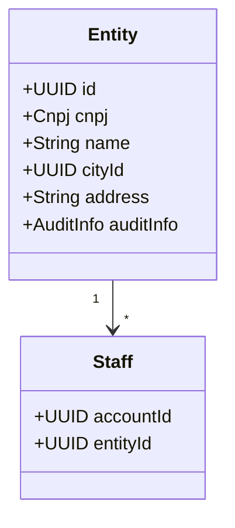
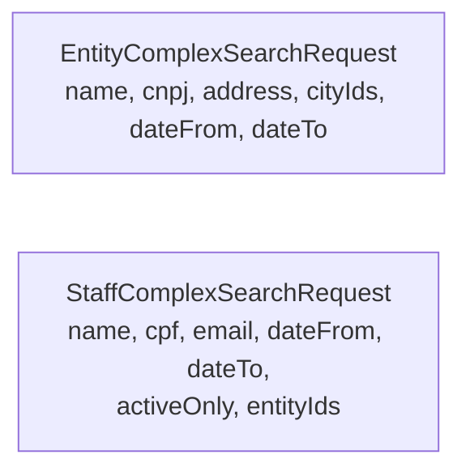
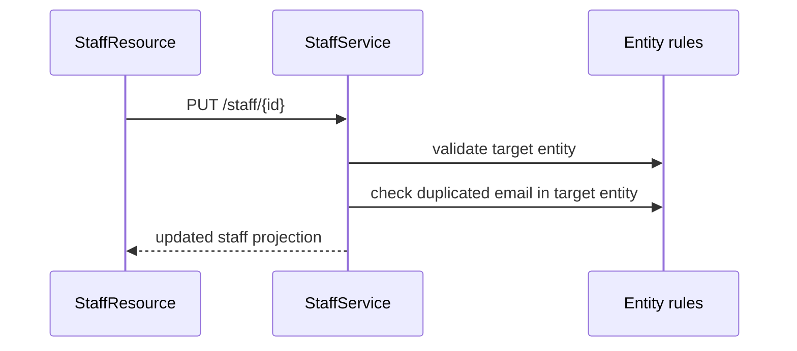

# 🏢 Partner Module

## 📌 Overview

The partner module manages external organizations and their staff accounts.

Responsibilities:

- maintain partner entities
- maintain staff assignments
- expose complex-search for both aggregates
- handle staff active status updates through a dedicated endpoint

## 🧠 Domain model



## 🌐 Public endpoints

### Entities

```text
GET    /v1/partners/entities/{id}
GET    /v1/partners/entities?ids=
POST   /v1/partners/entities/search
POST   /v1/partners/entities
PUT    /v1/partners/entities/{id}
DELETE /v1/partners/entities/{id}
```

### Staff

```text
GET    /v1/partners/staff/{id}
GET    /v1/partners/staff/me
GET    /v1/partners/staff?ids=
POST   /v1/partners/staff/search
POST   /v1/partners/staff
PUT    /v1/partners/staff/{id}
PATCH  /v1/partners/staff/{id}/status
DELETE /v1/partners/staff/{id}
```

## 🔍 Complex-search contracts



## 🔄 Staff update flow

Staff updates are no longer just account-field edits. They may also transfer the staff member to another entity.



## 🔗 Dependencies

- depends on `geo` for entity city references
- depends on `identity` for staff account/user provisioning and status updates
- feeds `project` through entity ownership and staff-created project flows

## ✅ Notes

- older public filters such as direct CPF/email route patterns are no longer the preferred contract
- entity city listing routes were removed from the public partner contract
