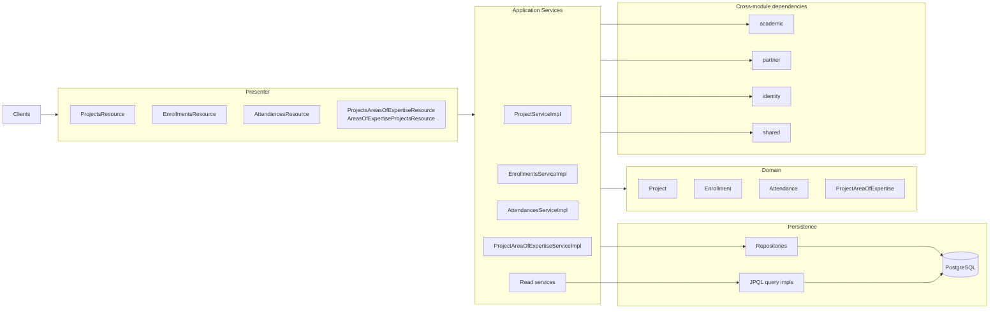
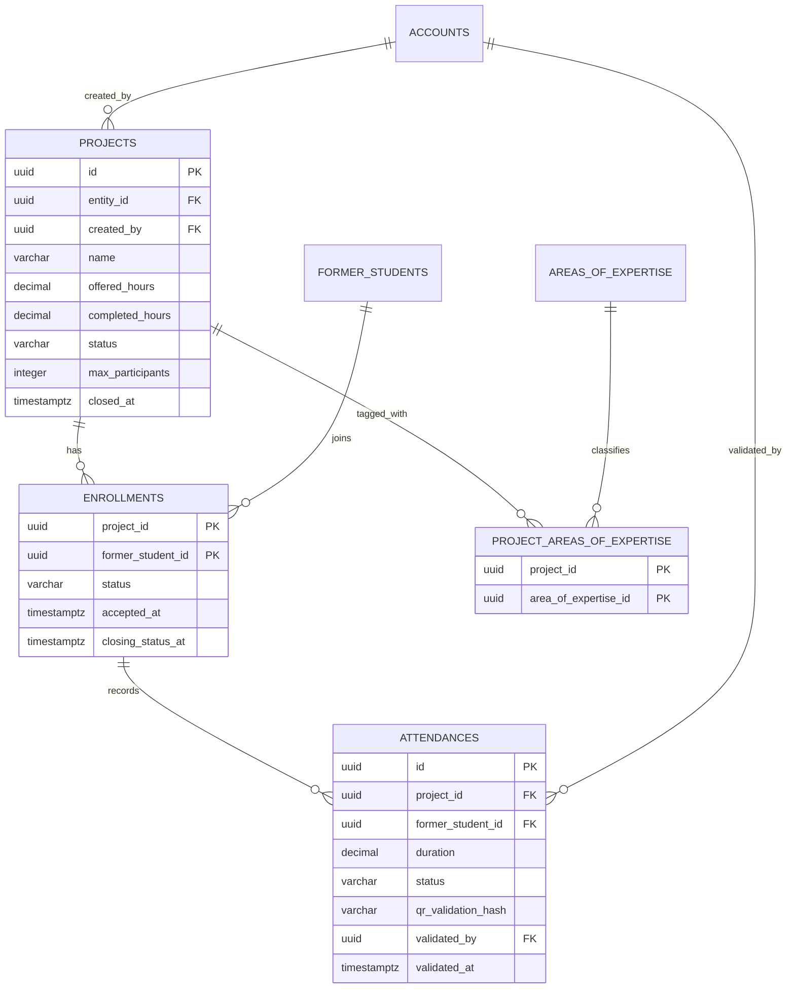
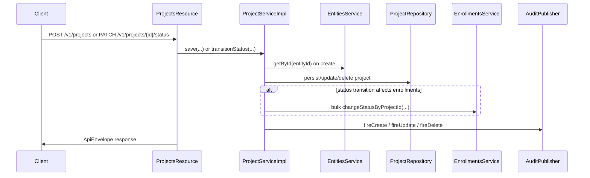
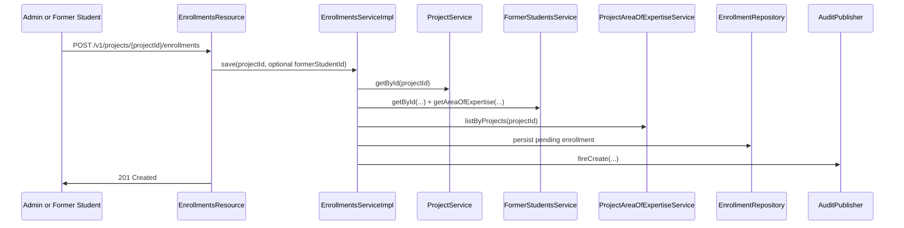
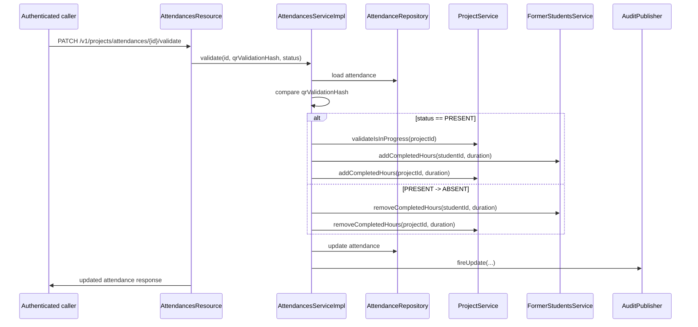
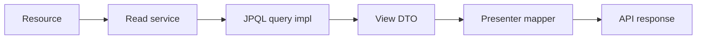

# Project Module Architecture

See the [project module README](./README.md) for the endpoint inventory, repository examples, and test entry points.

## Overview

The `project` package is one module with four tightly connected slices:

- `projects`
- `enrollments`
- `attendances`
- `project-area-of-expertise` associations

It follows the same package split used in the rest of `pug-service`: presenter layer for REST, application services for orchestration, domain aggregates for lifecycle rules, JPA repositories for writes, and JPQL projections for reads.

## Internal structure

| Package area | Role | Main files |
| --- | --- | --- |
| [`presenter`](../../../pug-service/src/main/java/br/org/catolicasc/pug/project/presenter) | REST resources, request DTOs, response DTOs, presenter mappers | `ProjectsResource`, `EnrollmentsResource`, `AttendancesResource`, `ProjectsAreasOfExpertiseResource`, `AreasOfExpertiseProjectsResource` |
| [`service/impl`](../../../pug-service/src/main/java/br/org/catolicasc/pug/project/service/impl) | Write-side orchestration plus read-service wrappers | `ProjectServiceImpl`, `EnrollmentsServiceImpl`, `AttendancesServiceImpl`, `ProjectAreaOfExpertiseServiceImpl` |
| [`service/utils`](../../../pug-service/src/main/java/br/org/catolicasc/pug/project/service/utils) | Aggregate construction helpers | `AttendanceProcessor`, `ProjectAreaOfExpertiseProcessor` |
| [`domain`](../../../pug-service/src/main/java/br/org/catolicasc/pug/project/domain) | Aggregates, repositories, enums, value objects | `Project`, `Enrollment`, `Attendance`, `ProjectAreaOfExpertise`, `EnrollmentIdentifier` |
| [`infra/persistence`](../../../pug-service/src/main/java/br/org/catolicasc/pug/project/infra/persistence) | JPA entities and repository implementations | `ProjectEntity`, `EnrollmentEntity`, `AttendanceEntity`, `ProjectAreaOfExpertiseEntity` |
| [`infra/read`](../../../pug-service/src/main/java/br/org/catolicasc/pug/project/infra/read) | Read-side contracts, projections, JPQL implementations | `ProjectQueries`, `EnrollmentsQueries`, `AttendancesQueries`, `ProjectView`, `EnrollmentView`, `AttendanceView` |

## Persistence model

The module persists four tables introduced by Flyway migrations [`V010`](../../../pug-service/src/main/resources/db/migration/V010__create_projects_table.sql) through [`V013`](../../../pug-service/src/main/resources/db/migration/V013__create_attendances_table.sql).

| Table | Key | What it stores | Important constraints |
| --- | --- | --- | --- |
| `projects` | `id` (`uuid`) | Core project row | unique `(entity_id, name)`, non-negative `offered_hours`, non-negative `completed_hours`, non-negative `max_participants` |
| `project_areas_of_expertise` | `(project_id, area_of_expertise_id)` | Project-to-area association | FK to `projects` and `areas_of_expertise` |
| `enrollments` | `(project_id, former_student_id)` | Former-student participation in a project | FK to `projects` and `former_students(account_id)` |
| `attendances` | `id` (`uuid`) | Attendance validation record | FK to enrollment composite key, unique `qr_validation_hash`, positive `duration` |

Concrete seeded examples for this model live in [`V018__seed_test_data.sql`](../../../pug-service/src/main/resources/db/migration/V018__seed_test_data.sql). The seed includes multiple project states, multiple enrollment states, and `WAITING`/`PRESENT`/`ABSENT` attendance examples.

## Main flows

### 1. Project writes and lifecycle propagation

What the write side actually does:

- Create resolves `createdBy` from the authenticated account and initializes the aggregate in `PLANNED` state.
- Update changes mutable fields without changing status.
- Status changes call explicit domain methods such as `start()`, `putOnHold()`, `retake()`, `complete()`, and `cancel()`.
- `addCompletedHours(...)` can auto-complete the project when accumulated hours reach offered hours.
- Delete is hard delete, but only after checking that no enrollments exist and after clearing project-area associations.

### 2. Enrollment creation and closure

Enrollment-specific design points:

- The target former student comes from the query parameter only for admin callers. Otherwise the authenticated former-student account is used.
- Area compatibility is enforced before persistence through the project-area association table.
- The aggregate key is modeled as [`EnrollmentIdentifier`](../../../pug-service/src/main/java/br/org/catolicasc/pug/project/domain/vos/EnrollmentIdentifier.java), not a surrogate UUID.
- Bulk project-driven transitions deliberately skip invalid lifecycle moves instead of failing the whole operation.
- Closing statuses (`CANCELED`, `COMPLETED`, `EXITED`, `REMOVED`) trigger deletion of waiting attendances for that enrollment.

### 3. Attendance validation and completed-hour propagation

Concrete implications from the code:

- New attendances are created from approved enrollments only and start as `WAITING`.
- The QR hash is part of the aggregate and is generated from enrollment data, current time, duration, and the configured `security.qr.pepper`.
- A `PRESENT` validation requires the project to be in progress.
- The reverse transition from `PRESENT` to `ABSENT` is meaningful because it removes previously granted completed hours.
- The resource layer is only `@Authenticated`; role-specific validation for `PRESENT` happens in the service layer.

### 4. Read and search model

The read side is intentionally separate from the write aggregates.

The query layer does more than simple table reads:

- [`ProjectQueriesImpl`](../../../pug-service/src/main/java/br/org/catolicasc/pug/project/infra/read/impl/ProjectQueriesImpl.java) joins partner entities and creator account/user data.
- [`EnrollmentsQueriesImpl`](../../../pug-service/src/main/java/br/org/catolicasc/pug/project/infra/read/impl/EnrollmentsQueriesImpl.java) joins project, former-student, account, and user data.
- [`AttendancesQueriesImpl`](../../../pug-service/src/main/java/br/org/catolicasc/pug/project/infra/read/impl/AttendancesQueriesImpl.java) joins project, former-student, and optional validator account/user data.
- Search filters are concrete and module-specific:
  - projects: name, entity IDs, description, creator IDs, timestamp range, statuses, offered-hour bounds
  - enrollments: project IDs, former-student IDs, statuses, lifecycle timestamp range, counterpart period range
  - attendances: project IDs, former-student IDs, statuses, validator IDs, duration range, timestamp range
- Default paging is `page=0`, `size=25`.
- Tests cover the shared fetch-all sentinel where `size=1` returns the full result set.

## Important design decisions

- **CQRS-style split for feature responses:** write services operate on aggregates and repositories, while read services delegate to JPQL projections already shaped for the presenter layer.
- **Composite identifiers where the domain is naturally relational:** enrollments are keyed by `(projectId, formerStudentId)` and project-area links are keyed by `(projectId, areaOfExpertiseId)`.
- **Attendance validation is the source of truth for completed hours:** neither project hours nor former-student completed hours are edited directly through REST endpoints in this module.
- **Academic eligibility is enforced inside project flows:** enrollment creation depends on the area-of-expertise mapping instead of trusting caller input.
- **Hard deletes plus shared audit trail:** delete operations remove rows and rely on [`AuditPublisher`](../../../pug-service/src/main/java/br/org/catolicasc/pug/shared/infra/audit/AuditPublisher.java) for traceability.
- **No internal background processing:** scheduled jobs and message consumers were not found in `src/main/java/br/org/catolicasc/pug/project` after checking for `@Scheduled`, `@Incoming`, `@Outgoing`, and `@ConsumeEvent`.

## Dependencies and boundaries

| Dependency or boundary | How the project module uses it |
| --- | --- |
| [`shared`](../../../pug-service/src/main/java/br/org/catolicasc/pug/shared) | API envelopes, pagination, UUIDv7 validation, locale formatting, audit publishing, common exceptions |
| [`partner`](../../../pug-service/src/main/java/br/org/catolicasc/pug/partner) | validate partner entity existence on project create; expose entity names in project read models |
| [`academic`](../../../pug-service/src/main/java/br/org/catolicasc/pug/academic) | resolve former-student records, area-of-expertise compatibility, completed-hour updates, academic-side project association reads |
| [`identity`](../../../pug-service/src/main/java/br/org/catolicasc/pug/identity) | determine the current account and expose creator/student/validator identity data in read models |
| PostgreSQL + Flyway | persist `projects`, `project_areas_of_expertise`, `enrollments`, and `attendances` |
| Shared audit pipeline | write operations publish audit events; persistence of audit logs happens in the `shared` module |

Additional boundary notes:

- Outbound HTTP clients were not found in the `project` package; the module integrates through in-process service calls and JPA.
- Inbound callers from other modules are real and important:
  - `academic` clears project-area links and uses enrollment services
  - `partner` uses project and attendance services for delete guards
  - `identity` uses project services for admin-delete guards

## Links

- [Back to project module README](./README.md)
