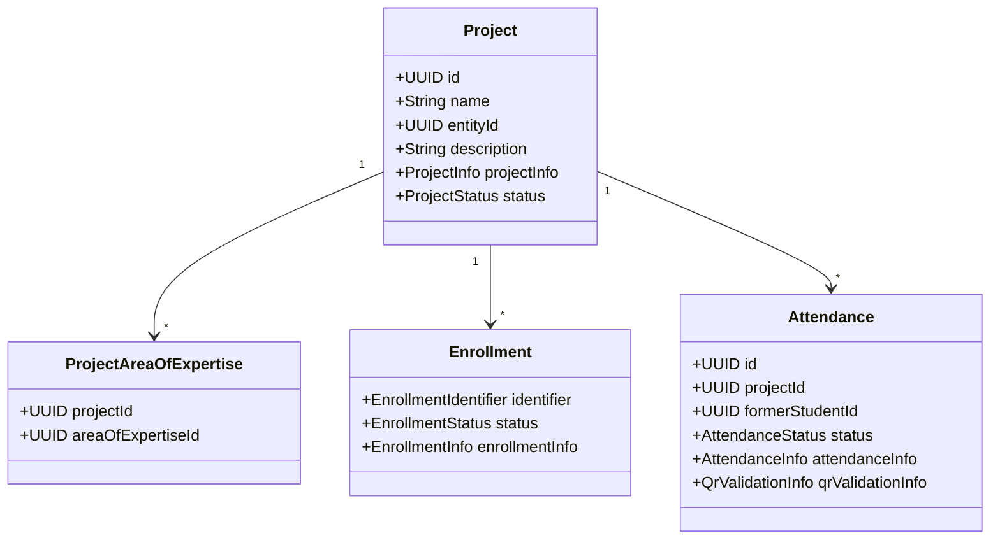
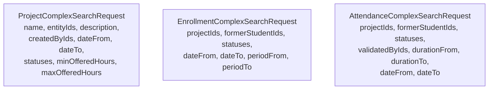
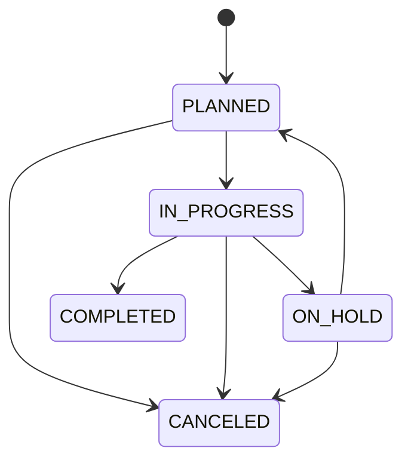
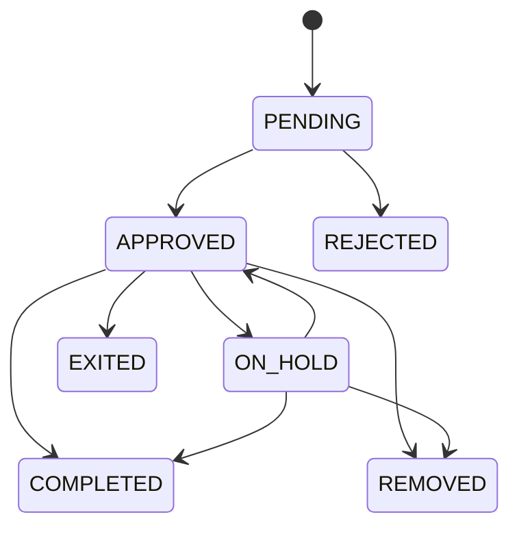
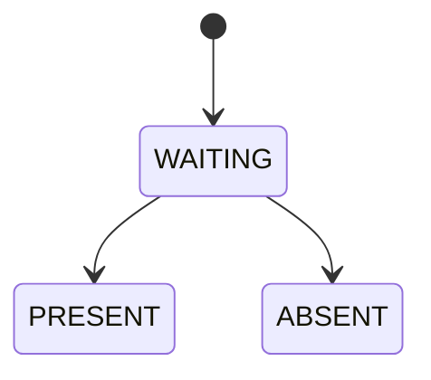
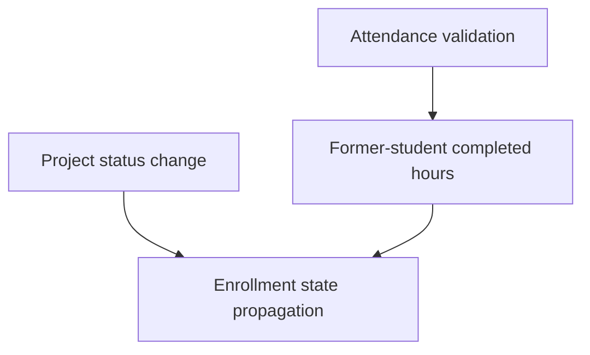

# 📋 Project Module

## 📌 Overview

The project module is the operational core of the platform.

Responsibilities:

- manage projects and lifecycle transitions
- associate projects with academic areas of expertise
- manage enrollments
- manage attendances and validation
- propagate status effects between projects, enrollments, and former-student progress

## 🧠 Domain model



## 🌐 Public endpoints

### Projects

```text
GET    /v1/projects/{id}
GET    /v1/projects?ids=
GET    /v1/projects/entities/{entityId}
GET    /v1/projects/creators/{createdById}
POST   /v1/projects/search
POST   /v1/projects
PUT    /v1/projects/{id}
PATCH  /v1/projects/{id}/status
DELETE /v1/projects/{id}
```

### Project <-> area-of-expertise association

```text
GET    /v1/projects/{projectId}/areas-of-expertise
POST   /v1/projects/{projectId}/areas-of-expertise
DELETE /v1/projects/{projectId}/areas-of-expertise/{areaOfExpertiseId}
DELETE /v1/projects/{projectId}/areas-of-expertise

GET    /v1/academic/areas-of-expertise/{areaOfExpertiseId}/projects
DELETE /v1/academic/areas-of-expertise/{areaOfExpertiseId}/projects
```

### Enrollments

```text
GET    /v1/projects/{projectId}/enrollments/{formerStudentId}
GET    /v1/projects/{projectId}/enrollments/me
GET    /v1/projects/enrollments
GET    /v1/projects/enrollments/me
POST   /v1/projects/{projectId}/enrollments
POST   /v1/projects/enrollments/search
PATCH  /v1/projects/{projectId}/enrollments/{formerStudentId}
PATCH  /v1/projects/{projectId}/enrollments/me
DELETE /v1/projects/{projectId}/enrollments/{formerStudentId}
```

### Attendances

```text
GET    /v1/projects/attendances/{id}
GET    /v1/projects/attendances?ids=
POST   /v1/projects/attendances/search
POST   /v1/projects/attendances
PATCH  /v1/projects/attendances/{id}/validate
DELETE /v1/projects/attendances/{id}
```

## 🔍 Complex-search contracts



## 🔄 Lifecycle rules

### Project status



### Enrollment status



### Attendance status



## 🔁 Propagation behavior

The project module contains the most cross-aggregate propagation.



Current business effects:

- project `CANCELED` -> project enrollments become `CANCELED`
- project `COMPLETED` -> project enrollments become `COMPLETED`
- project `ON_HOLD` -> approved enrollments become `ON_HOLD`
- project retake to `PLANNED` -> `ON_HOLD` enrollments go back to `APPROVED`
- attendance validation to `PRESENT` adds completed hours
- when a former student concludes required hours, approved enrollments may be completed

## 📦 Response composition

Project-side responses now use grouped DTOs:

- `ProjectResponse`
  - `projectInfo`
  - `status`
- `EnrollmentResponse`
  - `enrollmentInfo`
  - `status`
- `AttendanceResponse`
  - `attendanceInfo`
  - `status`
  - `qrValidationInfo`

## ✅ Notes

- public association terminology is `area-of-expertise`, not `school`
- status transitions should stay in dedicated endpoints and domain/service logic, not drift back into broad update payloads
