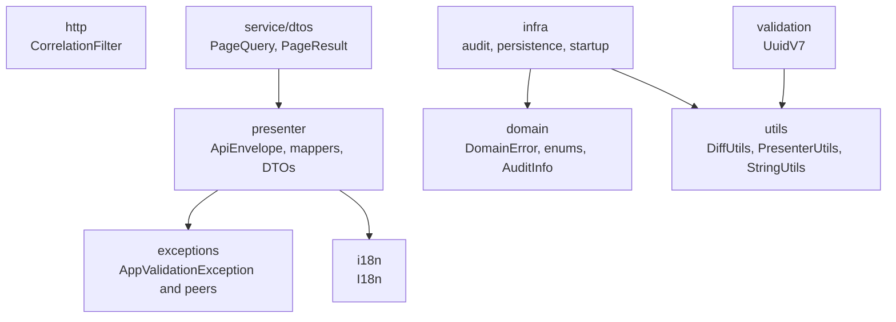
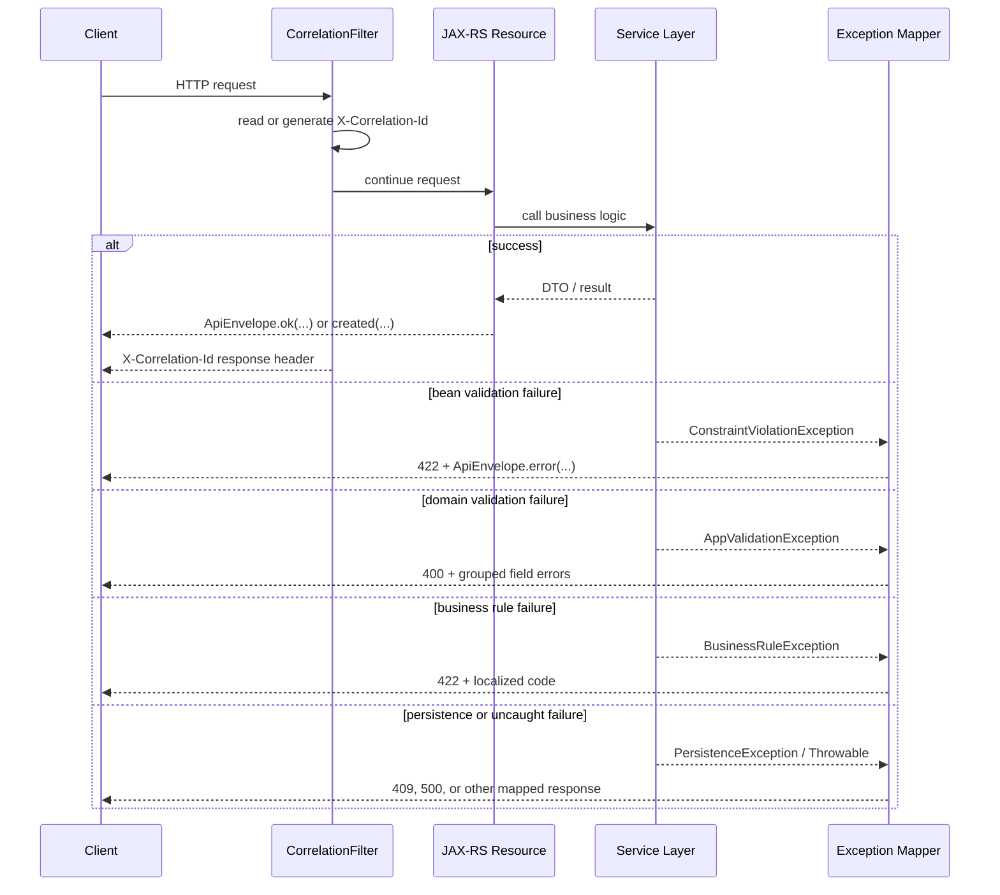
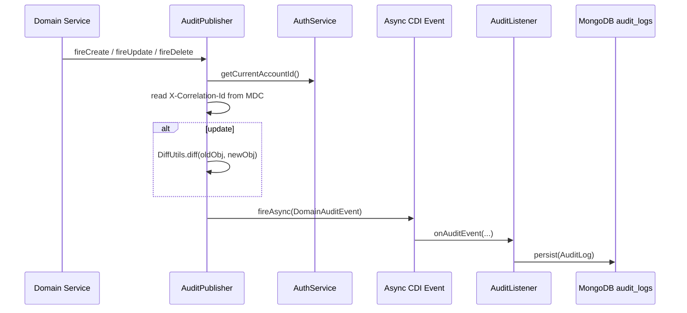

# Shared Module Architecture

[Back to module README](./README.md)

## Overview

The `shared` package provides the low-level contracts that keep the rest consistent. It is responsible for:

- request correlation and standardized API envelopes
- validation and exception translation
- locale-aware message resolution
- asynchronous audit capture and persistence
- shared persistence and pagination primitives
- a small amount of startup infrastructure tied to the identity module

It is package-oriented, not a separately deployable component.

## Internal structure

| Package | Role |
| --- | --- |
| `domain` | Base validation primitive (`DomainError`), shared enums, and value objects such as `AuditInfo`. |
| `exceptions` | Application-level exceptions consumed by global REST mappers. |
| `http` | Request/response cross-cutting filters, `CorrelationFilter`. |
| `i18n` | Resource-bundle based message resolution through `I18n`. |
| `infra` | Startup wiring plus audit persistence (`AdminPasswordSeeder`, `audit/*`, `persistence/*`). |
| `presenter` | Shared response DTOs, presenters, envelopes, and global exception mappers. |
| `service/dtos` | Pagination DTOs used by read services across modules. |
| `utils` | Stateless helpers for collections, diffs, locales, string folding, and date formatting. |
| `validation` | Custom Bean Validation annotation and validators for UUIDv7. |

## Main flow: request, validation, and error handling

Most shared runtime behavior sits on the boundary between HTTP and service code.

### What the code actually does

- [`CorrelationFilter`](https://github.com/Plataforma-Universidade-Gratuita/pug-service/blob/main/src/main/java/br/org/catolicasc/pug/shared/http/CorrelationFilter.java) stores `X-Correlation-Id` in MDC and mirrors it back to the response.
- [`ApiEnvelope`](https://github.com/Plataforma-Universidade-Gratuita/pug-service/blob/main/src/main/java/br/org/catolicasc/pug/shared/presenter/rest/ApiEnvelope.java) adds a UTC timestamp plus the correlation ID to both success and error responses.
- [`ConstraintViolationExceptionMapper`](https://github.com/Plataforma-Universidade-Gratuita/pug-service/blob/main/src/main/java/br/org/catolicasc/pug/shared/presenter/rest/mappers/ConstraintViolationExceptionMapper.java) maps Bean Validation failures to HTTP `422`.
- [`AppValidationExceptionMapper`](https://github.com/Plataforma-Universidade-Gratuita/pug-service/blob/main/src/main/java/br/org/catolicasc/pug/shared/presenter/rest/mappers/AppValidationExceptionMapper.java) groups `GenericFieldErrorCodes` by field and returns HTTP `400`.
- [`PersistenceExceptionMapper`](https://github.com/Plataforma-Universidade-Gratuita/pug-service/blob/main/src/main/java/br/org/catolicasc/pug/shared/presenter/rest/mappers/PersistenceExceptionMapper.java) interprets constraint names such as `uq_*` and `*_fkey` to avoid leaking raw database details.
- [`UncaughtExceptionMapper`](https://github.com/Plataforma-Universidade-Gratuita/pug-service/blob/main/src/main/java/br/org/catolicasc/pug/shared/presenter/rest/mappers/UncaughtExceptionMapper.java) logs the stack trace but returns only a generic localized `INTERNAL_ERROR` payload.

## Main flow: audit capture

The audit pipeline is intentionally asynchronous so write-path latency is not tied to MongoDB writes.

### Audit design details

- [`AuditPublisher`](https://github.com/Plataforma-Universidade-Gratuita/pug-service/blob/main/src/main/java/br/org/catolicasc/pug/shared/infra/audit/AuditPublisher.java) suppresses update events when `DiffUtils.diff(...)` finds no field changes.
- [`DiffUtils`](https://github.com/Plataforma-Universidade-Gratuita/pug-service/blob/main/src/main/java/br/org/catolicasc/pug/shared/utils/DiffUtils.java) ignores sensitive or noisy fields such as `passwordHash`, `qrValidationHash`, `email`, `cpf`, `cnpj`, `createdAt`, and `updatedAt`.
- [`AuditListener`](https://github.com/Plataforma-Universidade-Gratuita/pug-service/blob/main/src/main/java/br/org/catolicasc/pug/shared/infra/audit/AuditListener.java) catches persistence errors internally so async audit failures do not fail the original business operation.
- [`AuditLog`](https://github.com/Plataforma-Universidade-Gratuita/pug-service/blob/main/src/main/java/br/org/catolicasc/pug/shared/infra/audit/AuditLog.java) is stored in MongoDB collection `audit_logs`.
- The integration test [`AuditSystemTest`](https://github.com/Plataforma-Universidade-Gratuita/pug-service/blob/main/src/test/java/br/org/catolicasc/pug/shared/infra/audit/AuditSystemTest.java) uses Awaitility to verify async persistence.

## Main flow: localization and presentation helpers

- [`I18n`](https://github.com/Plataforma-Universidade-Gratuita/pug-service/blob/main/src/main/java/br/org/catolicasc/pug/shared/i18n/I18n.java) resolves keys from `messages_*.properties` and falls back to the raw key when it cannot resolve one.
- [`PresenterUtils`](https://github.com/Plataforma-Universidade-Gratuita/pug-service/blob/main/src/main/java/br/org/catolicasc/pug/shared/utils/PresenterUtils.java) defaults locale selection to `pt-BR` when headers are absent or invalid.
- [`SharedDataPresenter`](https://github.com/Plataforma-Universidade-Gratuita/pug-service/blob/main/src/main/java/br/org/catolicasc/pug/shared/presenter/mappers/SharedDataPresenter.java) formats audit timestamps and localized campus labels for API output.
- Includes message bundles for `pt-BR` and `en-US` under `src/main/resources`.

## Main flow: persistence, IDs, and search helpers

- [`BaseUuidV7Entity`](https://github.com/Plataforma-Universidade-Gratuita/pug-service/blob/main/src/main/java/br/org/catolicasc/pug/shared/infra/persistence/BaseUuidV7Entity.java) defines the standard `UUID` primary key shape used by JPA entities.
- [`UuidV7`](https://github.com/Plataforma-Universidade-Gratuita/pug-service/blob/main/src/main/java/br/org/catolicasc/pug/shared/validation/UuidV7.java) enforces UUID version 7 on request DTO fields before they reach domain code.
- [`BaseAuditedEntity`](https://github.com/Plataforma-Universidade-Gratuita/pug-service/blob/main/src/main/java/br/org/catolicasc/pug/shared/infra/persistence/BaseAuditedEntity.java) adds `createdAt` and `updatedAt` to persistent entities.
- [`PageQuery`](https://github.com/Plataforma-Universidade-Gratuita/pug-service/blob/main/src/main/java/br/org/catolicasc/pug/shared/service/dtos/PageQuery.java), [`PageExecution`](https://github.com/Plataforma-Universidade-Gratuita/pug-service/blob/main/src/main/java/br/org/catolicasc/pug/shared/service/dtos/PageExecution.java), and [`PageResult`](https://github.com/Plataforma-Universidade-Gratuita/pug-service/blob/main/src/main/java/br/org/catolicasc/pug/shared/service/dtos/PageResult.java) form the shared pagination contract.
- `PageQuery` reserves `size = 1` as the fetch-all sentinel. That convention is code-backed and should be preserved when adding new read services.
- [`JpaSearchUtils`](https://github.com/Plataforma-Universidade-Gratuita/pug-service/blob/main/src/main/java/br/org/catolicasc/pug/shared/infra/persistence/JpaSearchUtils.java) centralizes accent-insensitive PostgreSQL `translate(...)` search expressions so read-side queries behave the same across modules.

## Important design decisions

1. **Validation accumulates before it is thrown.**
   - `DomainError` lets domain objects collect multiple `GenericFieldErrorCodes`.
   - Services can then throw a single `AppValidationException` with the full set.

2. **The API contract is uniform.**
   - Both success and failure payloads are wrapped in `ApiEnvelope`.
   - Error mappers are the main boundary that converts exceptions into HTTP semantics.

3. **Audit persistence is out-of-band.**
   - Business transactions publish audit events asynchronously.
   - MongoDB audit failures are logged, not propagated back into the domain flow.

4. **UUIDv7 is a project-wide standard.**
   - Shared validation and base entity classes enforce time-ordered identifiers.
   - This choice matches the Flyway migration `V000__generate_uuid_v7_from_db.sql` and the rest of the persistence model.

5. **`shared` is mostly foundational, but not fully independent.**
   - `AuditPublisher` depends on the `identity` module's `AuthService`.
   - `AdminPasswordSeeder` depends on `PasswordService` and directly updates the `accounts` table with native SQL.
   - That coupling is visible in the code and should be kept in mind before moving shared infrastructure into a separate library.

## Data models and shared abstractions

| Type | Kind | Purpose |
| --- | --- | --- |
| `AuditInfo` | Value object | Immutable created/updated timestamps with self-validation. |
| `AuditLog` | Mongo document | Stores create/update/delete history in `audit_logs`. |
| `FieldChange` | Record | Normalized field-level audit diff entry. |
| `DomainAuditEvent` | Record | Async CDI event payload between publisher and listener. |
| `BaseUuidV7Entity` | JPA mapped superclass | Standard UUID primary key base. |
| `BaseAuditedEntity` | JPA mapped superclass | Standard created/updated timestamp base. |
| `PageQuery` / `PageExecution` / `PageResult` | Service DTOs | Shared pagination contract used by read-side services. |
| `ApiEnvelope` / `ApiError` / `Details` | REST DTOs | Shared response contract for all modules. |

## Dependencies and boundaries

### Inbound dependencies

- Every business module imports shared enums, exceptions, presenters, paging DTOs, base entities, utilities, or validation annotations.
- The `shared` package is therefore a stable inward dependency for the modular monolith.

### Outbound dependencies

- `identity` module interfaces:
  - [`AuthService`](https://github.com/Plataforma-Universidade-Gratuita/pug-service/blob/main/src/main/java/br/org/catolicasc/pug/identity/service/AuthService.java)
  - [`PasswordService`](https://github.com/Plataforma-Universidade-Gratuita/pug-service/blob/main/src/main/java/br/org/catolicasc/pug/identity/service/PasswordService.java)
- PostgreSQL/JPA:
  - base entity classes and `JpaSearchUtils`
- MongoDB:
  - `AuditLog` and `AuditListener`
- Quarkus and Jakarta runtime:
  - CDI events, JAX-RS filters, Bean Validation, persistence, and Mongo Panache
- Resource bundles:
  - `messages_pt_BR.properties`, `messages_en_US.properties`, `ValidationMessages_pt_BR.properties`, `ValidationMessages_en_US.properties`

### Persistence and integration boundaries

- `shared` does **not** expose repositories for business aggregates.
- The only persistent document owned directly by this package is `AuditLog` in MongoDB.
- `BaseUuidV7Entity` and `BaseAuditedEntity` define contracts that other modules persist through their own repositories.
- `AdminPasswordSeeder` crosses a boundary by issuing a native SQL update against the `accounts` table. This is intentional, but it means `shared` knows about an `identity`-owned table name.
