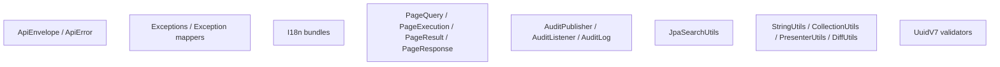
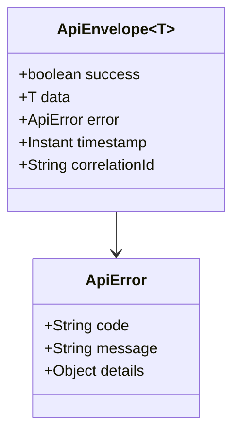
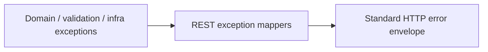
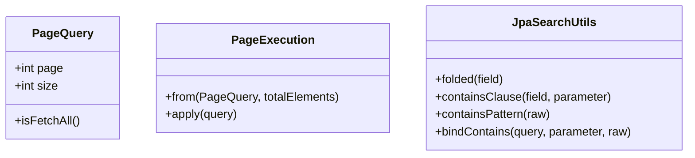
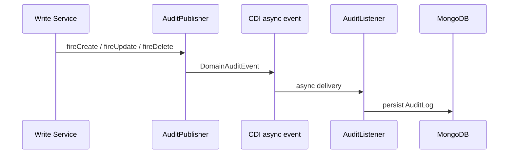

# 🧩 Shared Module

## 📌 Overview

The shared module contains the cross-cutting contracts and infrastructure used by every bounded context.

It is not a business module. It provides the platform rules that keep the other modules consistent.

Main responsibilities:

- standard API envelope and error payloads
- shared exceptions and exception mappers
- i18n
- UUID v7 validation
- pagination support
- JPQL search helpers
- audit event publication and MongoDB audit persistence
- small utility helpers used across modules

## 🧱 Main building blocks

## 🌐 API response model

Every content-returning endpoint uses `ApiEnvelope`.

Common response patterns:

- `ApiEnvelope.ok(data)`
- `ApiEnvelope.created(data)`
- `204 No Content` for void contracts

## ❗ Exception mapping

Important mapped families:

- validation errors
- business rule errors
- unauthorized errors
- duplicate resource errors
- not found errors
- persistence conflicts
- uncaught internal errors

## 🔍 Shared pagination and search

Important convention:

- `PageQuery.size == 1` is the shared fetch-all sentinel

## 🧾 Audit architecture

Notes:

- audit publication is asynchronous
- `DiffUtils` is used to compute field changes on updates
- the current account id and correlation id are attached to events

## 🌍 i18n

Shared i18n is the contract behind localized messages and enum formatting.

Current bundle layout includes:

- `messages_en_US.properties`
- `messages_pt_BR.properties`
- `ValidationMessages_en_US.properties`
- `ValidationMessages_pt_BR.properties`

## ✅ Notes

- search is JPQL-based with shared folded matching helpers, not Elasticsearch-based anymore
- this module is where cross-cutting behavior should be added before duplicating small infrastructure patterns across bounded contexts
