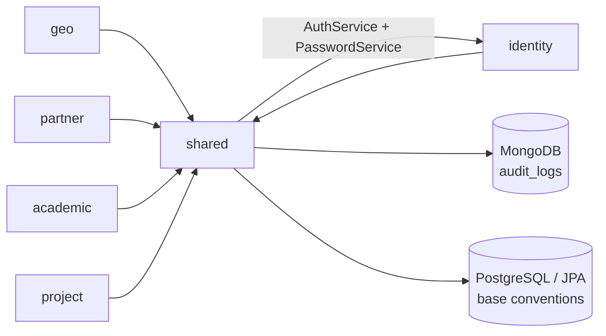

# Shared Module

The `shared` package is the cross-cutting foundation of `pug-service`. It centralizes response formatting, validation primitives, audit plumbing, locale handling, pagination helpers, and persistence base classes reused by the domain packages.

## Module purpose

- `shared` is a package-level module under `src/main/java/br/org/catolicasc/pug/shared`, not a standalone Maven submodule.
- It provides reusable infrastructure for `geo`, `identity`, `partner`, `academic`, and `project`.
- It owns the only MongoDB document persisted directly from this package: audit logs.

## Main responsibilities

- 🧾 Standardize API responses with `ApiEnvelope`, `ApiError`, `Details`, and `FieldErrorsResponse`.
- 🌐 Resolve localized messages through `I18n` plus `messages_*.properties` and `ValidationMessages_*.properties`.
- 🔎 Carry request correlation through `CorrelationFilter` and the `X-Correlation-Id` header.
- 🧠 Accumulate domain validation errors with `DomainError` and translate them through global exception mappers.
- 🗂 Provide shared paging and search helpers with `PageQuery`, `PageExecution`, `PageResult`, and `JpaSearchUtils`.
- 🧬 Standardize persistence base classes with UUIDv7 identifiers and audit timestamps.
- 🧾 Persist asynchronous audit trails to MongoDB through `AuditPublisher` and `AuditListener`.
- 🔐 Re-hash the seeded `admin@pug.com` account password on startup through `AdminPasswordSeeder`.

## Public API, services, and jobs

- Request correlation:
  - [`CorrelationFilter`](https://github.com/Plataforma-Universidade-Gratuita/pug-service/blob/main/src/main/java/br/org/catolicasc/pug/shared/http/CorrelationFilter.java) reuses or generates `X-Correlation-Id`, stores it in MDC, and writes it back to the response.
- REST error contract:
  - [`ApiEnvelope`](https://github.com/Plataforma-Universidade-Gratuita/pug-service/blob/main/src/main/java/br/org/catolicasc/pug/shared/presenter/rest/ApiEnvelope.java) and the mappers under [`presenter/rest/mappers`](https://github.com/Plataforma-Universidade-Gratuita/pug-service/tree/main/src/main/java/br/org/catolicasc/pug/shared/presenter/rest/mappers) define the API-wide success and error shape.
- Audit service:
  - [`AuditPublisher`](https://github.com/Plataforma-Universidade-Gratuita/pug-service/blob/main/src/main/java/br/org/catolicasc/pug/shared/infra/audit/AuditPublisher.java) is called by write services after create, update, and delete mutations.
  - [`AuditListener`](https://github.com/Plataforma-Universidade-Gratuita/pug-service/blob/main/src/main/java/br/org/catolicasc/pug/shared/infra/audit/AuditListener.java) consumes CDI async events and writes to MongoDB collection `audit_logs`.
- Startup job:
  - [`AdminPasswordSeeder`](https://github.com/Plataforma-Universidade-Gratuita/pug-service/blob/main/src/main/java/br/org/catolicasc/pug/shared/infra/AdminPasswordSeeder.java) runs on non-test startup and updates the seeded admin password hash with the active pepper.
- Validation contract:
  - [`UuidV7`](https://github.com/Plataforma-Universidade-Gratuita/pug-service/blob/main/src/main/java/br/org/catolicasc/pug/shared/validation/UuidV7.java) validates both `String` and `UUID` inputs against UUID version 7.

## Important classes and files

- Domain and error primitives:
  - [`DomainError`](https://github.com/Plataforma-Universidade-Gratuita/pug-service/blob/main/src/main/java/br/org/catolicasc/pug/shared/domain/DomainError.java)
  - [`SharedErrorCodes`](https://github.com/Plataforma-Universidade-Gratuita/pug-service/blob/main/src/main/java/br/org/catolicasc/pug/shared/domain/enums/SharedErrorCodes.java)
  - [`SharedFieldErrorCodes`](https://github.com/Plataforma-Universidade-Gratuita/pug-service/blob/main/src/main/java/br/org/catolicasc/pug/shared/domain/enums/SharedFieldErrorCodes.java)
  - [`AppValidationException`](https://github.com/Plataforma-Universidade-Gratuita/pug-service/blob/main/src/main/java/br/org/catolicasc/pug/shared/exceptions/AppValidationException.java)
- REST contract:
  - [`ApiEnvelope`](https://github.com/Plataforma-Universidade-Gratuita/pug-service/blob/main/src/main/java/br/org/catolicasc/pug/shared/presenter/rest/ApiEnvelope.java)
  - [`FieldErrorsResponse`](https://github.com/Plataforma-Universidade-Gratuita/pug-service/blob/main/src/main/java/br/org/catolicasc/pug/shared/presenter/rest/FieldErrorsResponse.java)
  - [`ConstraintViolationExceptionMapper`](https://github.com/Plataforma-Universidade-Gratuita/pug-service/blob/main/src/main/java/br/org/catolicasc/pug/shared/presenter/rest/mappers/ConstraintViolationExceptionMapper.java)
  - [`PersistenceExceptionMapper`](https://github.com/Plataforma-Universidade-Gratuita/pug-service/blob/main/src/main/java/br/org/catolicasc/pug/shared/presenter/rest/mappers/PersistenceExceptionMapper.java)
- Audit and infrastructure:
  - [`AuditPublisher`](https://github.com/Plataforma-Universidade-Gratuita/pug-service/blob/main/src/main/java/br/org/catolicasc/pug/shared/infra/audit/AuditPublisher.java)
  - [`AuditListener`](https://github.com/Plataforma-Universidade-Gratuita/pug-service/blob/main/src/main/java/br/org/catolicasc/pug/shared/infra/audit/AuditListener.java)
  - [`AuditLog`](https://github.com/Plataforma-Universidade-Gratuita/pug-service/blob/main/src/main/java/br/org/catolicasc/pug/shared/infra/audit/AuditLog.java)
  - [`AdminPasswordSeeder`](https://github.com/Plataforma-Universidade-Gratuita/pug-service/blob/main/src/main/java/br/org/catolicasc/pug/shared/infra/AdminPasswordSeeder.java)
- Persistence and search:
  - [`BaseUuidV7Entity`](https://github.com/Plataforma-Universidade-Gratuita/pug-service/blob/main/src/main/java/br/org/catolicasc/pug/shared/infra/persistence/BaseUuidV7Entity.java)
  - [`BaseAuditedEntity`](https://github.com/Plataforma-Universidade-Gratuita/pug-service/blob/main/src/main/java/br/org/catolicasc/pug/shared/infra/persistence/BaseAuditedEntity.java)
  - [`JpaSearchUtils`](https://github.com/Plataforma-Universidade-Gratuita/pug-service/blob/main/src/main/java/br/org/catolicasc/pug/shared/infra/persistence/JpaSearchUtils.java)
- Localization and presentation:
  - [`I18n`](https://github.com/Plataforma-Universidade-Gratuita/pug-service/blob/main/src/main/java/br/org/catolicasc/pug/shared/i18n/I18n.java)
  - [`SharedDataPresenter`](https://github.com/Plataforma-Universidade-Gratuita/pug-service/blob/main/src/main/java/br/org/catolicasc/pug/shared/presenter/mappers/SharedDataPresenter.java)
  - [`PresenterUtils`](https://github.com/Plataforma-Universidade-Gratuita/pug-service/blob/main/src/main/java/br/org/catolicasc/pug/shared/utils/PresenterUtils.java)
- Validation and utilities:
  - [`UuidV7`](https://github.com/Plataforma-Universidade-Gratuita/pug-service/blob/main/src/main/java/br/org/catolicasc/pug/shared/validation/UuidV7.java)
  - [`DiffUtils`](https://github.com/Plataforma-Universidade-Gratuita/pug-service/blob/main/src/main/java/br/org/catolicasc/pug/shared/utils/DiffUtils.java)
  - [`StringUtils`](https://github.com/Plataforma-Universidade-Gratuita/pug-service/blob/main/src/main/java/br/org/catolicasc/pug/shared/utils/StringUtils.java)

## Dependencies on other modules

- Inbound:
  - All feature modules depend on `shared` for response envelopes, exception types, pagination DTOs, base entities, utilities, and validation annotations.
- Outbound:
  - `shared` has a narrow dependency on [`AuthService`](https://github.com/Plataforma-Universidade-Gratuita/pug-service/blob/main/src/main/java/br/org/catolicasc/pug/identity/service/AuthService.java) inside `AuditPublisher` to resolve the acting account.
  - `shared` also depends on [`PasswordService`](https://github.com/Plataforma-Universidade-Gratuita/pug-service/blob/main/src/main/java/br/org/catolicasc/pug/identity/service/PasswordService.java) inside `AdminPasswordSeeder` to hash the seeded administrator password.
- Infrastructure boundaries:
  - `AuditListener` writes to MongoDB.
  - `BaseUuidV7Entity`, `BaseAuditedEntity`, and `JpaSearchUtils` support the PostgreSQL/JPA side used by the domain modules.

## Module relationships

## How to test the module

- Shared tests live under `src/test/java/br/org/catolicasc/pug/shared` and cover domain primitives, utilities, exception mappers, audit persistence, correlation IDs, i18n, and UUIDv7 validation.
- Useful examples from the repository:
  - [`AuditSystemTest`](https://github.com/Plataforma-Universidade-Gratuita/pug-service/blob/main/src/test/java/br/org/catolicasc/pug/shared/infra/audit/AuditSystemTest.java)
  - [`CorrelationFilterTest`](https://github.com/Plataforma-Universidade-Gratuita/pug-service/blob/main/src/test/java/br/org/catolicasc/pug/shared/http/CorrelationFilterTest.java)
  - [`I18nTest`](https://github.com/Plataforma-Universidade-Gratuita/pug-service/blob/main/src/test/java/br/org/catolicasc/pug/shared/i18n/I18nTest.java)
  - [`UuidV7Test`](https://github.com/Plataforma-Universidade-Gratuita/pug-service/blob/main/src/test/java/br/org/catolicasc/pug/shared/validation/UuidV7Test.java)
  - [`SystemExceptionMappersTest`](https://github.com/Plataforma-Universidade-Gratuita/pug-service/blob/main/src/test/java/br/org/catolicasc/pug/shared/presenter/rest/mappers/SystemExceptionMappersTest.java)
- Commands:
  - Full suite: `./mvnw test`
  - Focused examples: `./mvnw -Dtest=AuditSystemTest,CorrelationFilterTest,I18nTest,UuidV7Test test`

## Links

- [Shared architecture](./ARCHITECTURE.md)
- [Back to pug-service docs](../README.md)
