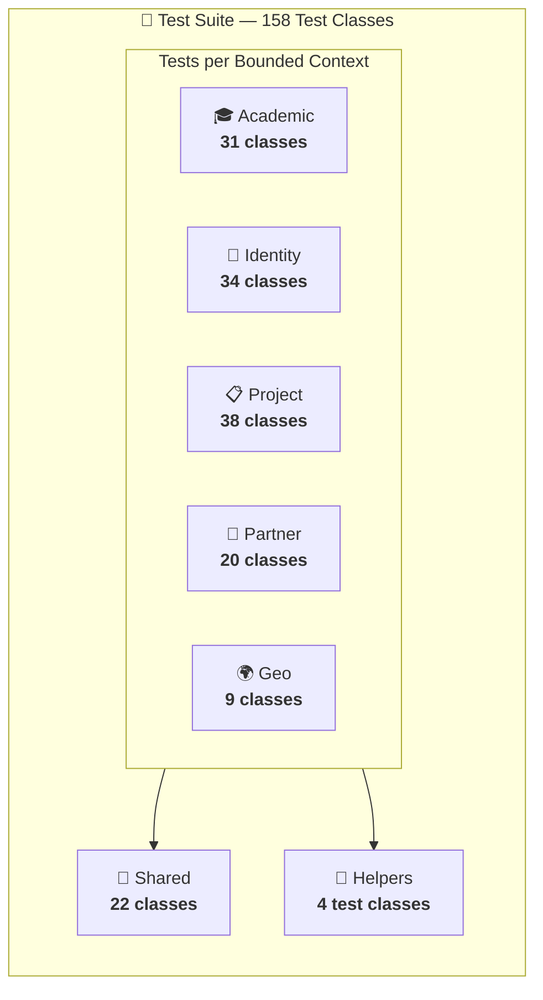
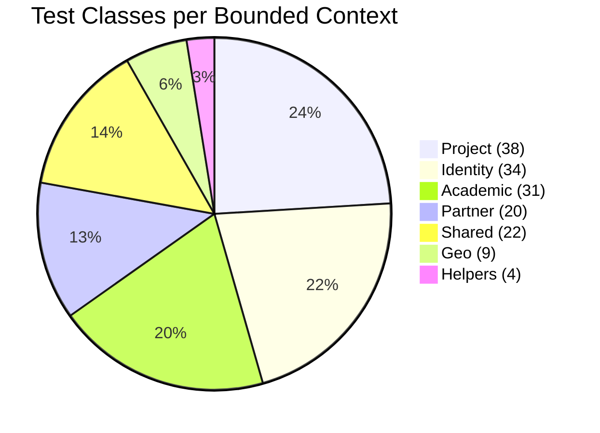
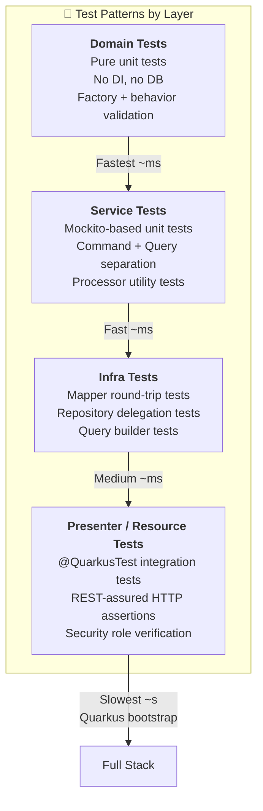
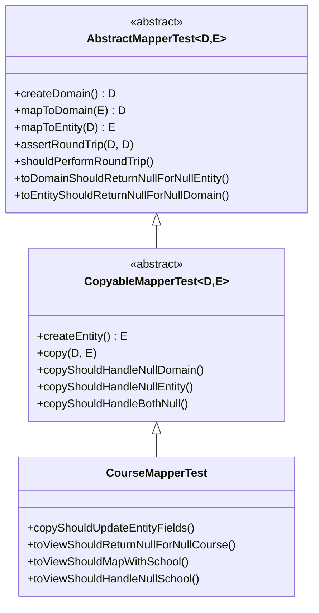
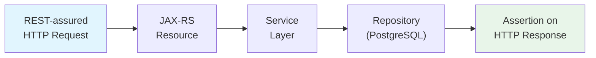
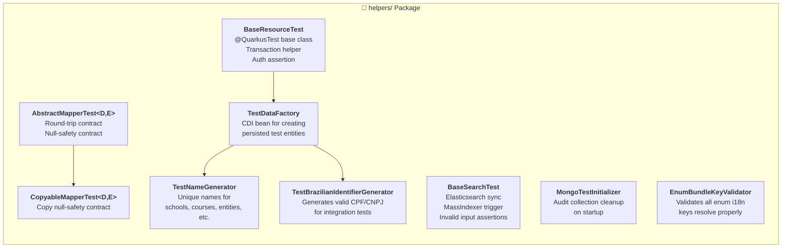
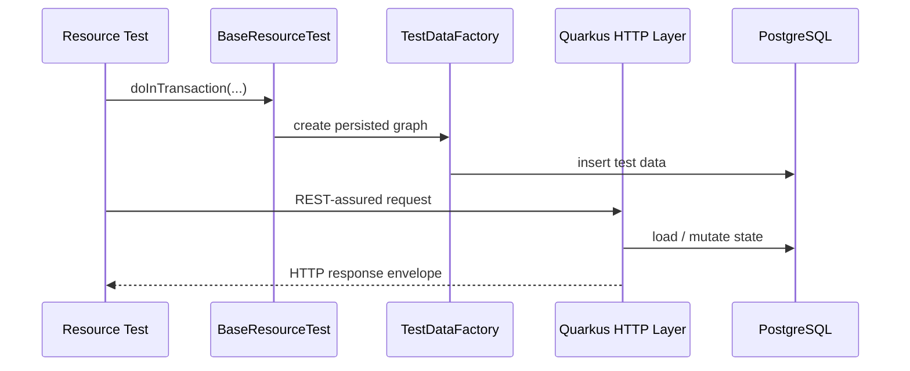

# 🧪 PUG Service — Test Suite

> Comprehensive test documentation for the PUG Service backend, covering **158 test classes** organized by bounded context and aligned with the same modular architecture used in production.

## 📊 Test Overview

| Metric                  | Value        |
|-------------------------|--------------|
| **Total Test Classes**  | 158          |
| **Avg. Execution Time** | ~20 seconds  |
| **Framework**           | JUnit 5      |
| **Assertion Library**   | AssertJ      |
| **REST Testing**        | REST-assured |
| **Mocking**             | Mockito      |
| **Coverage Tool**       | JaCoCo       |

## 🏗️ Test Architecture

The test suite mirrors the production module structure, ensuring each bounded context is verified across its own domain, service, infrastructure, and presenter layers.



## 📁 Test Distribution by Module



### Breakdown by Module and Layer

| Module       | Domain | Service | Infra | Presenter | Total |
|--------------|--------|---------|-------|-----------|-------|
| 🎓 Academic  | 7      | 9       | 9     | 6         | **31** |
| 🔐 Identity  | 6      | 11      | 10    | 7         | **34** |
| 📋 Project   | 10     | 12      | 9     | 7         | **38** |
| 🏢 Partner   | 4      | 6       | 4     | 4         | **20** |
| 🌍 Geo       | 3      | 1       | 3     | 2         | **9** |
| 🧩 Shared    | 2      | —       | 3     | 9         | **22** |
| 🔧 Helpers   | —      | —       | —     | —         | **4** |
| **Total**    | **32** | **39**  | **38**| **35**    | **154 + 4** |

> Some modules also include enum bundle key tests and value object tests counted under domain.

## 🧬 Test Patterns

The project follows a layered testing strategy with reusable base classes to minimize boilerplate and keep conventions consistent.



### 1. Domain Tests — Pure Unit Tests

Domain tests verify **entities, value objects, and business rules** with zero external dependencies.

**Pattern:**
- Factory method validation for valid and invalid inputs
- Business behavior methods such as transitions, mutations, and invariants
- `@Nested` classes for grouped scenarios (`BehaviorTests`, `FactoryTests`, `TransitionTests`)
- `@DisplayName` for readable output in the test report

```java
@DisplayName("Course Aggregate Tests")
class CourseTest {
    @Test void shouldCreateCourse() { ... }
    @Test void shouldCollectValidationErrors() { ... }

    @Nested class BehaviorTests {
        @Test void shouldRename() { ... }
        @Test void shouldMoveToSchool() { ... }
    }
}
```

### 2. Service Tests — Mockito Unit Tests

Service tests verify **application logic** with mocked repositories and infrastructure dependencies, following the CQRS split used in production.

**Pattern:**
- Separate tests for `*ServiceImplTest` (commands) and `*ReadServiceImplTest` (queries)
- `*ProcessorTest` classes for validation and exception-translation helpers
- Dependencies injected as mocks
- Auth-related tests covering login, refresh, logout, and logout-all

### 3. Infrastructure Tests — Mapper & Repository Tests

Infrastructure tests verify the **data mapping and persistence integration layer**.

**Pattern — Mapper Tests (inheritance-based):**



Every mapper test inherits **5–6 contract tests** automatically (round-trip, null-safety, copy null-safety) and adds module-specific assertions on top.

Repository tests usually sit closer to real persistence, often under `@QuarkusTest`, when the behavior depends on JPA mapping, transactions, or startup wiring.

### 4. Presenter / Resource Tests — Integration Tests

Resource tests are full **`@QuarkusTest` integration tests** verifying HTTP endpoints end-to-end.

**Pattern:**
- Extend `BaseResourceTest` (provides `TestDataFactory`, `EntityManager`, `UserTransaction`)
- Use `@TestSecurity` for role-based access scenarios
- Use `doInTransaction(...)` for setup
- Verify status codes, response envelope structure, and RBAC (`401` / `403`)



### 5. Search Tests — Indexed Read Behavior

Search-related tests verify Hibernate Search + Elasticsearch integration.

Typical pattern:
- persist setup data transactionally
- commit it
- call `syncIndex(...)` from `BaseSearchTest`
- assert fuzzy / normalized / empty-input search behavior

## 🔧 Test Infrastructure & Helpers



### Key Helper Roles

| Helper Class                       | Purpose |
|------------------------------------|---------|
| `BaseResourceTest`                 | Shared base for REST integration tests (DI, transactions, setup helper) |
| `BaseSearchTest`                   | Shared base for Elasticsearch / Hibernate Search tests |
| `AbstractMapperTest<D,E>`          | Contract tests: round-trip mapping + null-safety |
| `CopyableMapperTest<D,E>`          | Extends mapper tests with `copy()` null-safety contracts |
| `TestDataFactory`                  | CDI-managed factory for creating fully persisted test entities |
| `TestNameGenerator`                | Generates unique random names (schools, courses, entities, people) |
| `TestBrazilianIdentifierGenerator` | Generates valid CPF and CNPJ numbers for tests |
| `MongoTestInitializer`             | Clears audit data on startup in the test profile |
| `EnumBundleKeyValidator`           | Ensures all enum i18n bundle keys resolve in both locales |

### Typical Resource Test Workflow



This is the standard shape for endpoint tests in the suite.

## 🧰 Test Runtime Environment

The `%test` profile uses **real local infrastructure**, not Quarkus DevServices.

### Required Local Services

| Service | Port | Purpose |
|---------|------|---------|
| PostgreSQL | `5434` | Main relational persistence + Flyway |
| MongoDB | `27019` | Audit log storage |
| Elasticsearch | `9202` | Hibernate Search backend |

### Test Profile Characteristics

From `src/test/resources/application.properties`:

- DevServices are disabled for PostgreSQL, MongoDB, and Elasticsearch
- Flyway runs with `migrate-at-start=true`
- Flyway also runs with `clean-at-start=true`
- Hibernate Search points directly to local Elasticsearch
- JWT issuer and signing config are isolated for the `%test` profile
- SQL and framework logging are reduced to keep output readable

This means `./mvnw test` assumes the local test stack is already available.

## 🧭 Running the Tests

### Run All Tests

```bash
./mvnw test
```

### Run a Specific Module's Tests

```bash
./mvnw test -Dtest="br.org.catolicasc.pug.academic.**"
```

### Run Only Unit Tests (Domain + Service)

```bash
./mvnw test -Dtest="**/domain/**,**/service/**"
```

### Run Only Integration Tests (Presenter)

```bash
./mvnw test -Dtest="**/presenter/**"
```

### Run a Focused Set While Refactoring

```bash
./mvnw test -Dtest="EnrollmentResourceTest,ProjectSchoolResourceTest"
```

### Compile Tests Without Running Them

```bash
./mvnw -DskipTests test-compile
```

### Generate Coverage Report

```bash
./mvnw verify
# Report at: target/jacoco-report/index.html
```

## 🚨 Failure Diagnosis

### Quarkus Startup Failures

Some tests fail before the first assertion because Quarkus cannot start under the `%test` profile.

Typical example:

```text
Failed to start quarkus
Unable to obtain connection from database: Connection to localhost:5434 refused
```

When that happens, the failure is usually environmental rather than a regression in the test logic itself.

### Common Causes

| Symptom | Most Likely Cause |
|---------|-------------------|
| `Connection to localhost:5434 refused` | PostgreSQL test instance is down |
| Flyway startup error | DB unavailable or schema clean/migration failed |
| Search test returns empty result unexpectedly | Elasticsearch unavailable or index not synchronized |
| Audit-related integration failure | MongoDB unavailable |
| Unexpected `401` / `403` in resource test | wrong `@TestSecurity` role or endpoint policy mismatch |
| Unexpected `404` in resource test | test still points to an old route contract |

### Search-Specific Note

If a test depends on indexed visibility, setup data alone is not enough. It should call `syncIndex(...)` from `BaseSearchTest` before asserting search results.

## 📏 Coverage and Build Gates

JaCoCo coverage is enforced during `verify` at **package level**. That means even a narrow change can fail the build if it introduces untested instructions in a package whose covered ratio drops below the configured minimum.

Typical cases that need follow-up tests:

- new public resource routes
- new `PATCH` branches or status transitions
- new domain behavior methods
- new presenter or service mapping paths

In practice, the right fix is usually a focused test in the same package that changed rather than broad unrelated coverage.

## ⏱️ Performance Profile


| Test Category         | Classes | Approx. Time | Notes |
|-----------------------|---------|--------------|-------|
| Quarkus Bootstrap     | —       | ~8s          | CDI container, Flyway, local DB / ES / Mongo wiring |
| Domain (Unit)         | 32      | ~2s          | Pure Java, no DI — fastest |
| Service (Unit)        | 39      | ~2s          | Mockito mocks, no I/O |
| Infra (Unit/Integ.)   | 38      | ~2s          | Mapper + repository tests |
| Presenter (Integ.)    | 35      | ~6s          | Full HTTP round-trips with REST-assured |
| **Total**             | **158** | **~20s**     | Single `./mvnw test` run |

> The majority of wall-clock time is spent on Quarkus bootstrap and external service readiness. Actual test execution is still dominated by fast unit tests.

## 📐 Testing Conventions

1. **Naming**: `{ClassName}Test.java` — always matches the production class under test
2. **Display Names**: Every test class and method uses `@DisplayName` for readable output
3. **Nested Classes**: `@Nested` groups related scenarios (`BehaviorTests`, `FactoryTests`, `TransitionTests`)
4. **Assertions**: AssertJ fluent API (`assertThat(...)`) for assertions
5. **No Test Data Leakage**: `TestDataFactory` generates unique names via `TestNameGenerator` + UUID suffixes
6. **CQRS Split**: Separate test classes for read services (`*ReadServiceImplTest`) and write services (`*ServiceImplTest`)
7. **Security Testing**: Resource tests should cover `401 Unauthorized` and `403 Forbidden` scenarios where relevant
8. **Inheritance for Contracts**: Mapper tests inherit standard verifications from `AbstractMapperTest` / `CopyableMapperTest`
9. **i18n Validation**: Enum bundle key tests ensure all error codes resolve in both `pt_BR` and `en_US`
10. **Contract Synchronization**: When an endpoint changes, the resource tests, Bruno requests, and module READMEs should move together

## 📂 Test Folder Structure

```text
src/test/
├── java/br/org/catolicasc/pug/
│   ├── academic/
│   │   ├── domain/            ← Entity + VO + enum tests
│   │   ├── service/impl/      ← Service command + query tests
│   │   ├── service/utils/     ← Processor tests
│   │   ├── infra/             ← Mapper tests
│   │   ├── infra/persistence/ ← Repository tests
│   │   ├── infra/read/        ← Query implementation tests
│   │   └── presenter/         ← Resource + presenter mapper tests
│   ├── geo/                   ← same layer structure
│   ├── identity/              ← same layer structure
│   ├── partner/               ← same layer structure
│   ├── project/               ← same layer structure
│   ├── shared/                ← cross-cutting concern tests
│   └── helpers/               ← shared test infrastructure
└── resources/
    ├── application.properties    ← test-specific Quarkus config
    ├── messages_en_US.properties ← English test messages
    └── messages_pt_BR.properties ← Portuguese test messages
```

## ✅ Summary

The suite is designed to catch:

- domain rule regressions
- DTO and route drift
- security mistakes
- persistence mapping problems
- search indexing/query issues
- startup/configuration breakage

It is intentionally structured so that failures usually point to a specific bounded context and layer rather than becoming one undifferentiated integration suite.
