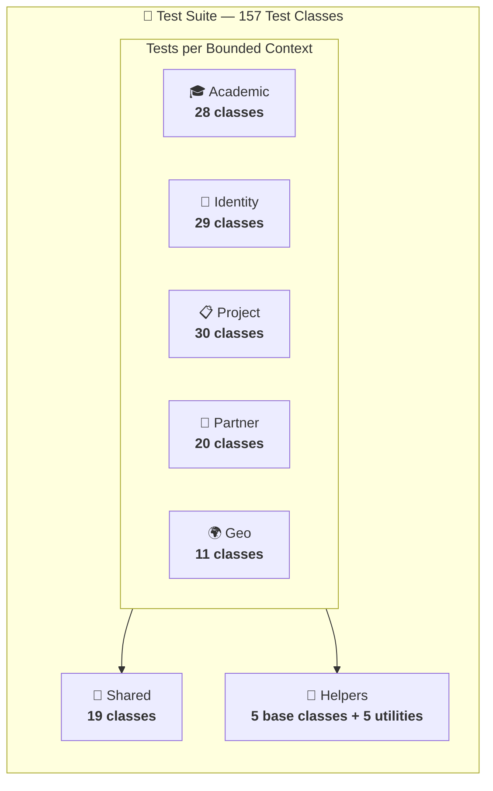
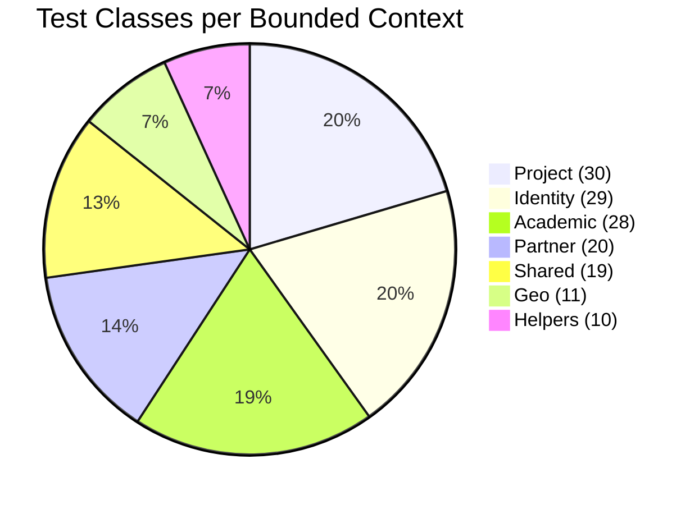
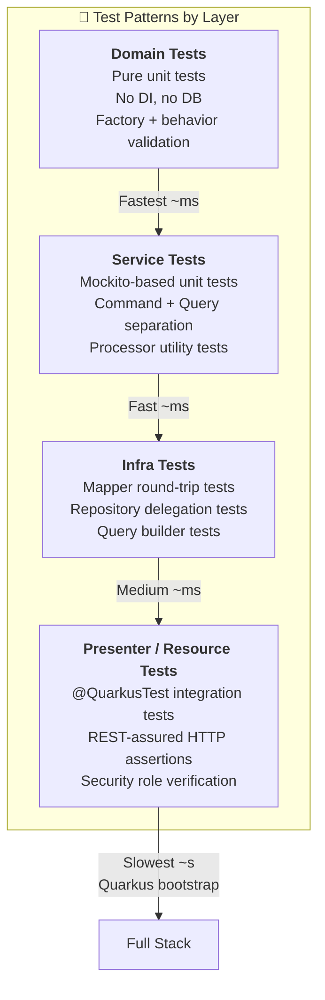
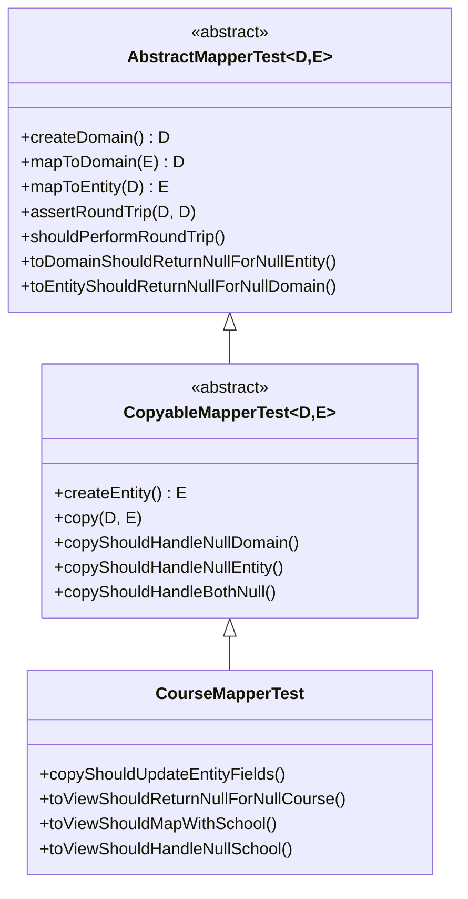
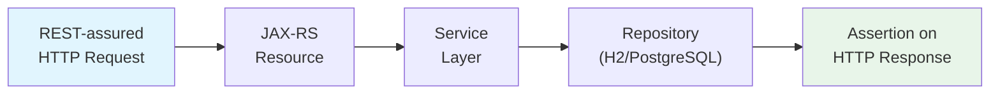
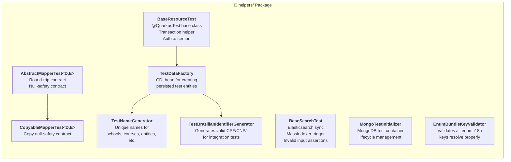

# 🧪 PUG Service — Test Suite

> Comprehensive test documentation for the PUG Service backend, covering **157 test classes** organized by bounded context, following the same modular architecture as the production code.

## 📊 Test Overview

| Metric                  | Value        |
|-------------------------|--------------|
| **Total Test Classes**  | 157          |
| **Avg. Execution Time** | ~20 seconds  |
| **Framework**           | JUnit 5      |
| **Assertion Library**   | AssertJ      |
| **REST Testing**        | REST-assured |
| **Mocking**             | Mockito      |
| **Coverage Tool**       | JaCoCo       |

## 🏗️ Test Architecture

The test suite mirrors the production module structure, ensuring each bounded context is independently verified across all architectural layers.



## 📁 Test Distribution by Module



### Breakdown by Module and Layer

| Module       | Domain | Service | Infra | Presenter | Total |
|--------------|--------|---------|-------|-----------|-------|
| 🎓 Academic  | 7      | 9       | 6     | 6         | **28**|
| 🔐 Identity  | 6      | 9       | 7     | 7         | **29**|
| 📋 Project   | 10     | 12      | 6     | 8         | **30**|*
| 🏢 Partner   | 4      | 6       | 4     | 4         | **20**|*
| 🌍 Geo       | 3      | 1       | 3     | 2         | **11**|*
| 🧩 Shared    | 2      | —       | 2     | 9         | **19**|*
| 🔧 Helpers   | —      | —       | —     | —         | **10**|
| **Total**    | **32** | **37**  | **28**| **36**    |**147+10**|

> \* Some modules include enum bundle key tests and value object tests counted under domain.

## 🧬 Test Patterns

The project follows a layered testing strategy with reusable base classes to minimize boilerplate and enforce consistency.



### 1. Domain Tests — Pure Unit Tests

Domain tests verify **entities, value objects, and business rules** with zero external dependencies.

**Pattern:**
- Factory method validation (valid + invalid inputs)
- Business behavior methods (state transitions, mutations)
- `@Nested` classes for grouped behavior scenarios (`BehaviorTests`, `FactoryTests`, `TransitionTests`)
- `@DisplayName` for readable test output

```java
// Example: CourseTest.java
@DisplayName("Course Aggregate Tests")
class CourseTest {
    @Test void shouldCreateCourse() { ... }
    @Test void shouldCollectValidationErrors() { ... }

    @Nested class BehaviorTests {
        @Test void shouldRename() { ... }
        @Test void shouldMoveToSchool() { ... }
    }
}
```

### 2. Service Tests — Mockito Unit Tests

Service tests verify **application logic** with mocked repository and infrastructure dependencies, following the CQRS split.

**Pattern:**
- Separate test classes for `*ServiceImplTest` (commands) and `*ReadServiceImplTest` (queries)
- `*ProcessorTest` for validation/exception translation utilities
- All dependencies are `@Mock`-injected
- `AuthServiceImplTest` covers login, token refresh, logout, and logout-all flows

### 3. Infrastructure Tests — Mapper & Repository Tests

Infrastructure tests verify the **data mapping layer** using reusable abstract base classes.

**Pattern — Mapper Tests (inheritance-based):**



Every mapper test inherits **5–6 contract tests** automatically (round-trip, null-safety, copy null-safety), and adds module-specific assertions on top.

### 4. Presenter / Resource Tests — Integration Tests

Resource tests are full **@QuarkusTest** integration tests verifying HTTP endpoints end-to-end.

**Pattern:**
- Extends `BaseResourceTest` (provides `TestDataFactory`, `EntityManager`, `UserTransaction`)
- `@TestSecurity` for role-based access scenarios
- `doInTransaction(...)` helper for test data setup
- Verifies status codes, response envelope structure, and RBAC (401/403)



## 🔧 Test Infrastructure & Helpers



### Key Helper Roles

| Helper Class                      | Purpose                                                            |
|-----------------------------------|--------------------------------------------------------------------|
| `BaseResourceTest`                | Shared base for all REST integration tests (DI, transactions)      |
| `BaseSearchTest`                  | Shared base for Elasticsearch/Hibernate Search tests               |
| `AbstractMapperTest<D,E>`         | Contract tests: round-trip mapping + null-safety                   |
| `CopyableMapperTest<D,E>`        | Extends mapper tests with `copy()` null-safety contracts           |
| `TestDataFactory`                 | CDI-managed factory for creating fully persisted test entities      |
| `TestNameGenerator`               | Generates unique random names (schools, courses, entities, people) |
| `TestBrazilianIdentifierGenerator`| Generates valid CPF and CNPJ numbers for tests                     |
| `MongoTestInitializer`            | Manages MongoDB test container lifecycle                           |
| `EnumBundleKeyValidator`          | Ensures all enum i18n bundle keys resolve in both locales          |

## 🏃 Running the Tests

### Run All Tests

```bash
./mvnw test
```

### Run a Specific Module's Tests

```bash
./mvnw test -Dtest="br.org.catolicasc.pug.academic.**"
```

### Run Only Unit Tests (Domain + Service)

```bash
./mvnw test -Dtest="**/domain/**,**/service/**"
```

### Run Only Integration Tests (Presenter)

```bash
./mvnw test -Dtest="**/presenter/**"
```

### Generate Coverage Report

```bash
./mvnw verify
# Report at: target/jacoco-report/index.html
```

## ⏱️ Performance Profile

```mermaid
gantt
    title Test Execution Timeline (~20s total)
    dateFormat ss
    axisFormat %Ss

    section Bootstrap
    Quarkus CDI + DevServices     :a1, 00, 8s

    section Unit Tests
    Domain tests (~32 classes)    :a2, after a1, 2s
    Service tests (~37 classes)   :a3, after a2, 2s

    section Infra Tests
    Mapper tests (~28 classes)    :a4, after a3, 2s

    section Integration Tests
    Resource tests (~36 classes)  :a5, after a4, 6s
```



| Test Category         | Classes | Approx. Time | Notes                                         |
|-----------------------|---------|---------------|-----------------------------------------------|
| Quarkus Bootstrap     | —       | ~8s           | CDI container, DevServices (DB, ES, Mongo)    |
| Domain (Unit)         | 32      | ~2s           | Pure Java, no DI — fastest                    |
| Service (Unit)        | 37      | ~2s           | Mockito mocks, no I/O                         |
| Infra (Unit/Integ.)   | 28      | ~2s           | Mapper + repository tests                     |
| Presenter (Integ.)    | 36      | ~6s           | Full HTTP round-trips with REST-assured       |
| **Total**             | **157** | **~20s**      | Single `./mvnw test` run                      |

> ⚡ The majority of wall-clock time is spent on Quarkus bootstrap (Dev Services). The actual test execution is highly optimized thanks to pure unit tests dominating the count.

## 📐 Testing Conventions

1. **Naming**: `{ClassName}Test.java` — always matches the production class under test
2. **Display Names**: Every test class and method uses `@DisplayName` for readable output
3. **Nested Classes**: `@Nested` groups related scenarios (e.g., `BehaviorTests`, `FactoryTests`, `TransitionTests`)
4. **Assertions**: AssertJ fluent API (`assertThat(...)`) for all assertions
5. **No Test Data Leakage**: `TestDataFactory` generates unique names via `TestNameGenerator` + UUID suffixes
6. **CQRS Split**: Separate test classes for read services (`*ReadServiceImplTest`) and write services (`*ServiceImplTest`)
7. **Security Testing**: Every resource test includes `401 Unauthorized` and `403 Forbidden` scenarios
8. **Inheritance for Contracts**: Mapper tests inherit standard contract verifications from `AbstractMapperTest` / `CopyableMapperTest`
9. **i18n Validation**: Enum bundle key tests ensure all error codes resolve in both `pt_BR` and `en_US` locales

## 📂 Test Folder Structure

```
src/test/
├── java/br/org/catolicasc/pug/
│   ├── academic/
│   │   ├── domain/           ← Entity + VO + enum tests
│   │   ├── service/impl/     ← Service command + query tests
│   │   ├── service/utils/    ← Processor tests
│   │   ├── infra/            ← Mapper tests
│   │   ├── infra/persistence/← Repository tests
│   │   ├── infra/read/       ← Query implementation tests
│   │   └── presenter/        ← Resource + presenter mapper tests
│   ├── geo/                  ← (same layer structure)
│   ├── identity/             ← (same layer structure)
│   │   ├── domain/           ← Entity + VO + enum tests
│   │   ├── service/impl/     ← Auth (login, refresh, logout), account, admin, user tests
│   │   ├── infra/            ← Mapper tests
│   │   ├── infra/persistence/← Repository tests (incl. RefreshTokenRepositoryImplTest)
│   │   ├── infra/read/       ← Query implementation tests
│   │   └── presenter/        ← Resource + presenter mapper tests
│   ├── partner/              ← (same layer structure)
│   ├── project/              ← (same layer structure)
│   ├── shared/               ← Cross-cutting concern tests
│   │   ├── domain/           ← DomainError, AuditInfo tests
│   │   ├── exceptions/       ← Custom exception tests
│   │   ├── http/             ← Correlation filter tests
│   │   ├── i18n/             ← Internationalization tests
│   │   ├── infra/            ← Audit system, Hibernate Search tests
│   │   ├── presenter/        ← Exception mapper tests
│   │   ├── utils/            ← Utility class tests
│   │   └── validation/       ← UUIDv7 validation tests
│   └── helpers/              ← Test infrastructure
│       ├── builders/         ← Test data builders
│       ├── AbstractMapperTest.java
│       ├── BaseResourceTest.java
│       ├── BaseSearchTest.java
│       ├── CopyableMapperTest.java
│       ├── EnumBundleKeyValidator.java
│       ├── MongoTestInitializer.java
│       ├── TestBrazilianIdentifierGenerator.java
│       ├── TestDataFactory.java
│       └── TestNameGenerator.java
└── resources/
    ├── application.properties    ← Test-specific Quarkus config
    ├── messages_en_US.properties ← English test messages
    └── messages_pt_BR.properties ← Portuguese test messages
```

