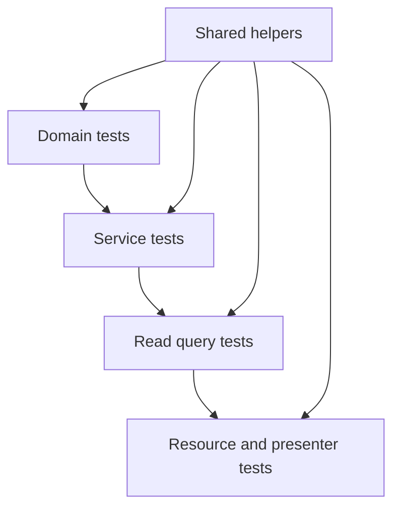
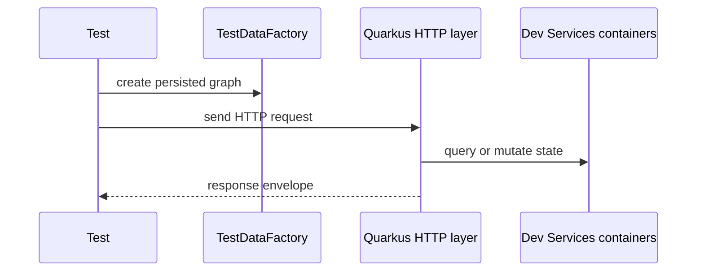

# 🧪 PUG Service Tests

## 📌 Overview

The test suite mirrors the production bounded contexts and follows the same layered structure as the application.

The important current facts are:

- tests compile and run against the renamed public domains
- `%test` now relies on Quarkus Dev Services
- PostgreSQL and MongoDB are provisioned automatically for test runs
- contract tests are concentrated in resource, service, query, mapper, and domain layers

## 🏗️ Test shape



## 🔧 Shared helpers

Common testing infrastructure includes:

- `BaseResourceTest`
- `BaseSearchTest`
- `AbstractMapperTest`
- `CopyableMapperTest`
- `TestDataFactory`
- enum bundle key validators
- Brazilian identifier generators

## 🌐 Resource tests

Resource tests are integration-style and usually:

- use `@QuarkusTest`
- extend `BaseResourceTest`
- seed data through `doInTransaction(...)`
- use `@TestSecurity`
- assert real HTTP contracts



## 🔍 Query tests

Read query tests are database-backed and validate:

- optional filter handling
- list `IN` filters
- date range branches
- paging
- fetch-all behavior

They are the main protection for the complex-search contracts introduced across modules.

## 🧠 Service tests

Service tests are usually orchestration-focused:

- mocks for repositories and external collaborators
- assertions on transitions, validation, and emitted side effects
- no HTTP concerns

## 🐳 Runtime requirements

Tests now run with Quarkus Dev Services.

That means:

- Docker must be available
- PostgreSQL is provisioned automatically
- MongoDB is provisioned automatically
- the suite no longer depends on manually preconfigured local containers on fixed test ports

## ▶️ Common commands

```bash
./mvnw test
./mvnw verify
./mvnw -DskipTests test-compile
```

## ✅ What the suite is protecting

- presenter contract drift
- domain lifecycle regressions
- search and paging regressions
- security-role mismatches
- persistence mapping issues
- i18n bundle consistency
