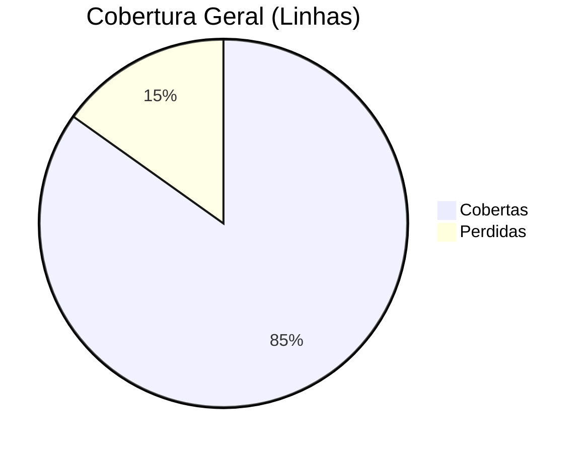

# Relatório de Cobertura de Testes - pug-service

| Métrica | Cobertas | Perdidas | Total | % Cobertura |
| :--- | :---: | :---: | :---: | :---: |
| Instruction | 16694 | 2632 | 19326 | 86.38% |
| Line | 3953 | 706 | 4659 | 84.85% |
| Complexity | 1261 | 618 | 1879 | 67.11% |
| Method | 970 | 62 | 1032 | 93.99% |
| Class | 255 | 3 | 258 | 98.84% |

## Visualização Mermaid

