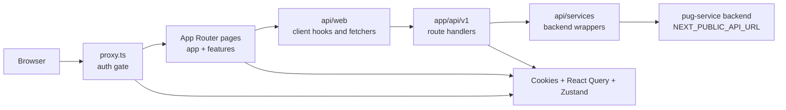
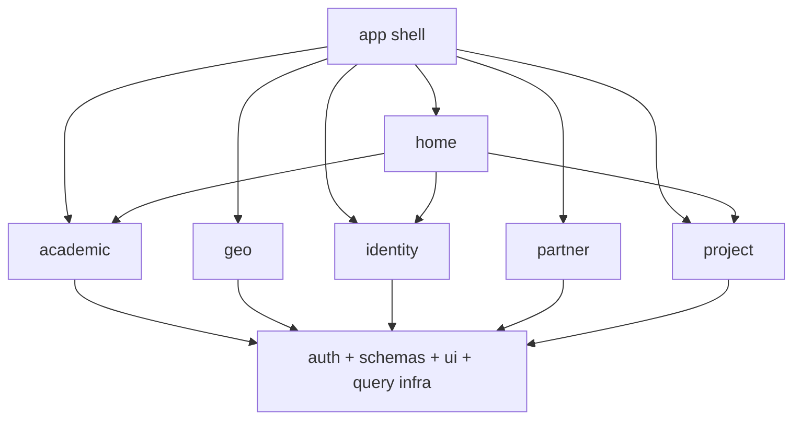
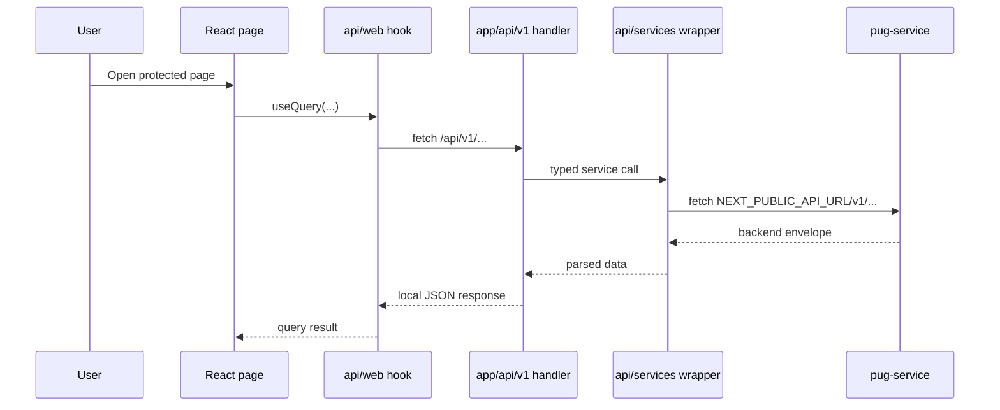
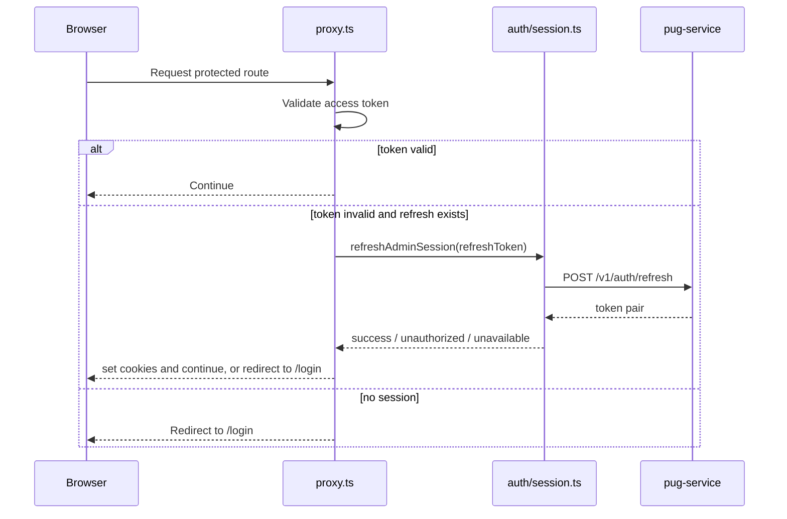

# PUG Web Admin Architecture

Back to [README.md](https://github.com/Plataforma-Universidade-Gratuita/pug-docs/blob/main/pug-web-admin/README.md).

## 🧭 Overall architecture

`pug-web-admin` is a layered Next.js App Router application. It is not just a UI shell on top of raw backend calls. The browser talks to local Next route handlers under `/api/v1/*`, and those handlers talk to the backend service configured by `NEXT_PUBLIC_API_URL`.

Page access is also guarded before rendering by [proxy.ts](https://github.com/Plataforma-Universidade-Gratuita/pug-web-admin/blob/main/proxy.ts), which validates the access token and attempts refresh using the refresh token cookie.

Core files:

- [app/layout.tsx](https://github.com/Plataforma-Universidade-Gratuita/pug-web-admin/blob/main/app/layout.tsx)
- [app/providers.tsx](https://github.com/Plataforma-Universidade-Gratuita/pug-web-admin/blob/main/app/providers.tsx)
- [proxy.ts](https://github.com/Plataforma-Universidade-Gratuita/pug-web-admin/blob/main/proxy.ts)
- [app/api/utils.ts](https://github.com/Plataforma-Universidade-Gratuita/pug-web-admin/blob/main/app/api/utils.ts)
- [api/services/utils.ts](https://github.com/Plataforma-Universidade-Gratuita/pug-web-admin/blob/main/api/services/utils.ts)
- [api/web/utils.ts](https://github.com/Plataforma-Universidade-Gratuita/pug-web-admin/blob/main/api/web/utils.ts)

## 🧱 Main layers and components

### 1. Route protection and session boundary

- [proxy.ts](https://github.com/Plataforma-Universidade-Gratuita/pug-web-admin/blob/main/proxy.ts) allows `/login` as the only public route
- protected routes require a valid access token or a successful refresh
- [auth/session.ts](https://github.com/Plataforma-Universidade-Gratuita/pug-web-admin/blob/main/auth/session.ts) calls the backend refresh endpoint and re-validates the returned token
- [auth/cookies.ts](https://github.com/Plataforma-Universidade-Gratuita/pug-web-admin/blob/main/auth/cookies.ts) applies and clears `accessToken`, `refreshToken`, and `passwordWired`

### 2. Root layout and global providers

- [app/layout.tsx](https://github.com/Plataforma-Universidade-Gratuita/pug-web-admin/blob/main/app/layout.tsx) reads theme and locale cookies on the server
- [app/providers.tsx](https://github.com/Plataforma-Universidade-Gratuita/pug-web-admin/blob/main/app/providers.tsx) composes i18n, theme, locale, React Query, toast, and React Query Devtools in development
- [app/constants.ts](https://github.com/Plataforma-Universidade-Gratuita/pug-web-admin/blob/main/app/constants.ts) defines the shared React Query defaults

### 3. Protected application shell

- the protected app layout in `app/(app)/layout.tsx` wraps routes with `Navbar`
- the same layout checks `PASSWORD_WIRED_COOKIE`
- if `passwordWired === false`, the shell renders but the children are suppressed until credentials are wired

### 4. Feature and page layer

- feature pages live under [features/](https://github.com/Plataforma-Universidade-Gratuita/pug-web-admin/tree/main/features)
- route wrappers under [app/](https://github.com/Plataforma-Universidade-Gratuita/pug-web-admin/tree/main/app) stay thin and usually delegate immediately to feature pages
- navigation structure is centralized in [features/app-shell/constants.ts](https://github.com/Plataforma-Universidade-Gratuita/pug-web-admin/blob/main/features/app-shell/constants.ts)
- the home dashboard composes data from multiple modules in [features/home/HomeCommandCenterPage.tsx](https://github.com/Plataforma-Universidade-Gratuita/pug-web-admin/blob/main/features/home/HomeCommandCenterPage.tsx)

### 5. Browser-facing API layer

- Next route handlers live under [app/api/v1/](https://github.com/Plataforma-Universidade-Gratuita/pug-web-admin/tree/main/app/api/v1)
- these handlers parse request bodies, proxy to backend wrappers, and normalize retry/error behavior
- [app/api/utils.ts](https://github.com/Plataforma-Universidade-Gratuita/pug-web-admin/blob/main/app/api/utils.ts) provides `routeWithAuthRetry`, `routeVoidWithAuthRetry`, `routeData`, and `routeError`

### 6. Backend service layer

- [api/services/](https://github.com/Plataforma-Universidade-Gratuita/pug-web-admin/tree/main/api/services) wraps the actual PUG backend
- [api/services/constants.ts](https://github.com/Plataforma-Universidade-Gratuita/pug-web-admin/blob/main/api/services/constants.ts) maps the backend `v1` route bases
- [api/services/utils.ts](https://github.com/Plataforma-Universidade-Gratuita/pug-web-admin/blob/main/api/services/utils.ts) adds auth and locale headers and parses backend error envelopes

### 7. Client data layer

- [api/web/](https://github.com/Plataforma-Universidade-Gratuita/pug-web-admin/tree/main/api/web) provides client fetchers and React Query hooks
- [api/web/constants.ts](https://github.com/Plataforma-Universidade-Gratuita/pug-web-admin/blob/main/api/web/constants.ts) maps the local `/api/v1/*` route bases
- [api/web/utils.ts](https://github.com/Plataforma-Universidade-Gratuita/pug-web-admin/blob/main/api/web/utils.ts) always sends browser credentials and handles expired-session redirects

### 8. Validation and type boundary

- [schemas/api/](https://github.com/Plataforma-Universidade-Gratuita/pug-web-admin/tree/main/schemas/api) contains Zod schemas for backend and local API payloads
- [schemas/client/](https://github.com/Plataforma-Universidade-Gratuita/pug-web-admin/tree/main/schemas/client) contains client-specific schemas
- [types/api/](https://github.com/Plataforma-Universidade-Gratuita/pug-web-admin/tree/main/types/api) and [types/client/](https://github.com/Plataforma-Universidade-Gratuita/pug-web-admin/tree/main/types/client) mirror the same domain split

## 🔗 Module relationships

The frontend mirrors the same core business areas exposed by `pug-service`.

Concrete examples from code:

- the home command center imports hooks from `academic`, `identity`, and `project`
- the sidebar groups expose academic, partner, project, identity, and geo navigation
- the project client layer also includes project-area-of-expertise support under [api/services/project/project-areas-of-expertise/](https://github.com/Plataforma-Universidade-Gratuita/pug-web-admin/tree/main/api/services/project/project-areas-of-expertise)

## 🔄 Request and data flow

### Read flow

### Session recovery flow

### Route-handler retry flow

If a backend call made by a local route handler returns `401`, [app/api/utils.ts](https://github.com/Plataforma-Universidade-Gratuita/pug-web-admin/blob/main/app/api/utils.ts) retries once after refresh and applies the new cookies to the response when refresh succeeds.

## 🌐 External dependencies

- **PUG backend API** through `NEXT_PUBLIC_API_URL`
- **Browser cookies** for auth, theme, and locale state
- **Translation bundles** in [public/locales/](https://github.com/Plataforma-Universidade-Gratuita/pug-web-admin/tree/main/public/locales)
- **GitHub Actions** for CI
- **GHCR** for image publishing

The repository does not include direct integrations with a database, queue, or message broker.

## 💾 Persistence and integration boundaries

This repo does **not** own business persistence.

What it does store or manage:

- `accessToken`, `refreshToken`, and `passwordWired` cookies
- theme and language cookies
- React Query in-memory cache
- persisted app-shell collapsed state in [stores/app-shell.ts](https://github.com/Plataforma-Universidade-Gratuita/pug-web-admin/blob/main/stores/app-shell.ts)

What stays outside this repo:

- academic, geo, identity, partner, and project data persistence
- auth token issuance and revocation rules
- backend authorization rules
- deployment environment orchestration

## 📌 Architectural decisions visible in code

### Local API indirection is intentional

The application does not rely on the browser directly calling the backend service. The local `/api/v1/*` layer exists so the app can:

- reuse cookie-based auth
- retry on `401` centrally
- validate payloads on the server edge
- hide raw backend route usage from client components

### Validation is part of the architecture

Zod is used across the stack, not just at the form boundary. Data is parsed:

- entering local route handlers
- returning from backend service wrappers
- returning from local browser-facing fetchers

### Module pages and detail pages are split

Overview pages often act as module landing pages, while operational tables and detail views live deeper in the tree. For example, [features/project/ProjectOverviewPage.tsx](https://github.com/Plataforma-Universidade-Gratuita/pug-web-admin/blob/main/features/project/ProjectOverviewPage.tsx) points users toward `projects`, `enrollments`, and `attendances`.

## 🧪 Observed boundaries and gaps

- A `project-school-associations` API directory exists under `app/api/v1`, but no route handler file is present under `app/api/v1/project-school-associations/[[...slug]]`.
- A route-group directory `app/(app)/docs` exists, but no route files are present under that tree.
- Direct database access is not part of this repository.
