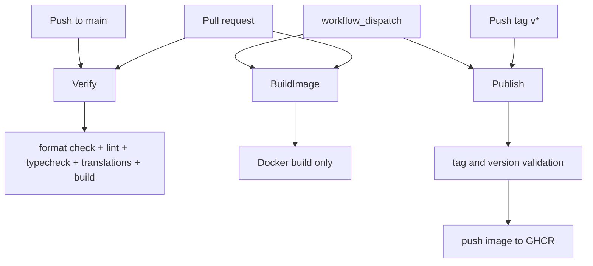

# PUG Web Admin CI/CD

Back to [README.md](./README.md).

## 🚦 Pipeline overview

The repository currently has three GitHub Actions workflows:

| Workflow | File | Trigger | Purpose |
| --- | --- | --- | --- |
| Verify | [verify.yml](../../pug-web-admin/.github/workflows/verify.yml) | `pull_request`, push to `main` | Run the repository quality gate |
| Build Image | [build-image.yml](../../pug-web-admin/.github/workflows/build-image.yml) | `pull_request`, `workflow_dispatch` | Validate that the Docker image builds |
| Publish Image | [publish-image.yml](../../pug-web-admin/.github/workflows/publish-image.yml) | tag push `v*`, `workflow_dispatch` | Build and publish the container image to GHCR |



## 🔔 Workflow triggers

### Verify

- runs on every pull request
- runs on pushes to `main`
- uses concurrency group `verify-${{ github.ref }}`
- cancels in-progress runs for the same ref

### Build Image

- runs on every pull request
- can also be triggered manually
- uses concurrency group `build-image-${{ github.ref }}`
- does not push an image

### Publish Image

- runs on pushed tags matching `v*`
- can also be triggered manually
- uses concurrency group `publish-image-${{ github.ref }}`

## 🛠️ Build and verification steps

### Verify workflow

The verify job:

1. checks out the repository
2. sets up Node `22`
3. restores npm cache through `actions/setup-node`
4. runs `npm ci`
5. runs `npm run verify`

`npm run verify` expands to:

```bash
npm run format:check && tsc --noEmit && npm run trans && npm run build
```

That means the current CI gate covers:

- Prettier formatting
- ESLint
- TypeScript strict type-checking
- translation consistency and translation usage checks
- production build success

Relevant files:

- [package.json](../../pug-web-admin/package.json)
- [scripts/reorderTranslations.js](../../pug-web-admin/scripts/reorderTranslations.js)
- [scripts/checkMissingTranslations.js](../../pug-web-admin/scripts/checkMissingTranslations.js)
- [scripts/checkUnusedTranslations.js](../../pug-web-admin/scripts/checkUnusedTranslations.js)

### Build Image workflow

The image-build workflow:

1. checks out the repository
2. sets up Docker Buildx
3. builds the image from [Dockerfile](../../pug-web-admin/Dockerfile)
4. keeps `push: false`

This workflow validates container buildability, but it does **not** run `npm run verify`.

## 📦 Publishing behavior

The publish workflow does more than a raw `docker build`.

It:

1. checks out with `fetch-depth: 0`
2. ensures the tagged commit belongs to `main`
3. sets up Node `22`
4. reads `name` and `version` from [package.json](../../pug-web-admin/package.json)
5. fails if the pushed tag is not exactly `v${package.json.version}`
6. sets up Docker Buildx
7. logs in to `ghcr.io`
8. computes image metadata
9. builds and pushes the image

Published image name source:

- `package.json.name`, normalized by the workflow before publishing

Observed Docker tags in the workflow:

- version tag: `${image_name}-${version}` on tag runs
- `latest` when the workflow runs on `main`
- `sha-*` when the workflow runs on `main`

Important nuance:

- the automatic trigger is tag-based
- `latest` and `sha-*` are therefore mainly relevant for manual runs on `main`, because pushes to `main` do not trigger `publish-image.yml`

## 🔐 Secrets and environment variables

### GitHub secrets

Discovered in workflow files:

- `GITHUB_TOKEN` for GHCR login in [publish-image.yml](../../pug-web-admin/.github/workflows/publish-image.yml)

No additional custom secrets were found in the current workflow files.

### CI environment variables

Workflow-level environment values found:

- `NEXT_TELEMETRY_DISABLED=1` in `verify.yml`
- `NEXT_TELEMETRY_DISABLED=1` in `publish-image.yml`

### Runtime environment values relevant to build/publish

Defined or consumed in the repo:

- `NEXT_PUBLIC_API_URL` in [constants/api.ts](../../pug-web-admin/constants/api.ts)
- `NEXT_PUBLIC_APP_URL` in [app/layout.tsx](../../pug-web-admin/app/layout.tsx)
- `NODE_ENV=production` in [Dockerfile](../../pug-web-admin/Dockerfile)
- `PORT=3000` in [Dockerfile](../../pug-web-admin/Dockerfile)
- `HOSTNAME=0.0.0.0` in [Dockerfile](../../pug-web-admin/Dockerfile)

## 🧪 Tests, lint, and coverage status

What the pipeline enforces today:

- formatting
- linting
- type-checking
- translation checks
- production build success

What was **not found in the current codebase**:

- a dedicated automated test script in [package.json](../../pug-web-admin/package.json)
- coverage reporting
- a coverage threshold gate

This repository currently treats `verify` as its quality gate instead of a dedicated test suite.

## 🚚 Deployment boundary

Present in the codebase:

- CI verification
- container image build validation
- container image publishing to GHCR

Not found in the current codebase:

- a deployment workflow to an environment
- preview environment provisioning
- post-deploy smoke tests
- infrastructure manifests tied directly to CI/CD

So the current pipeline clearly covers **verify, build, and publish**, but not downstream deployment orchestration.
