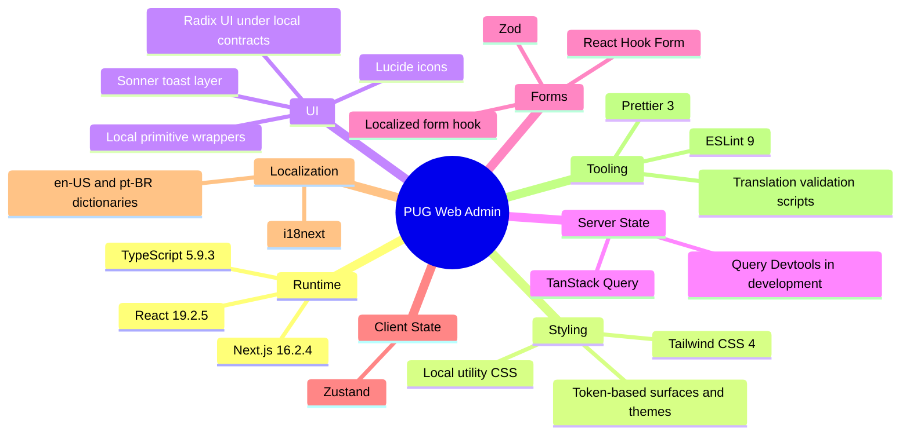
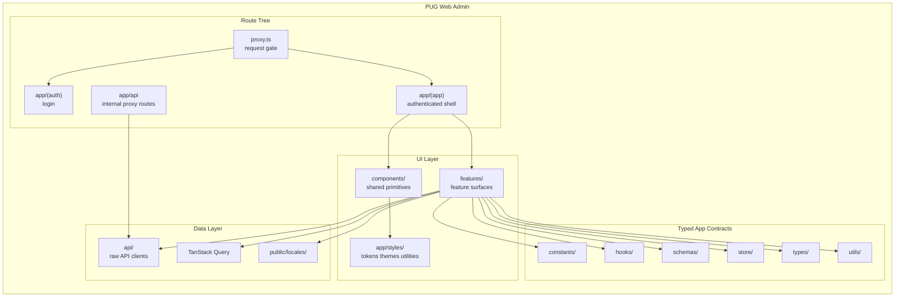
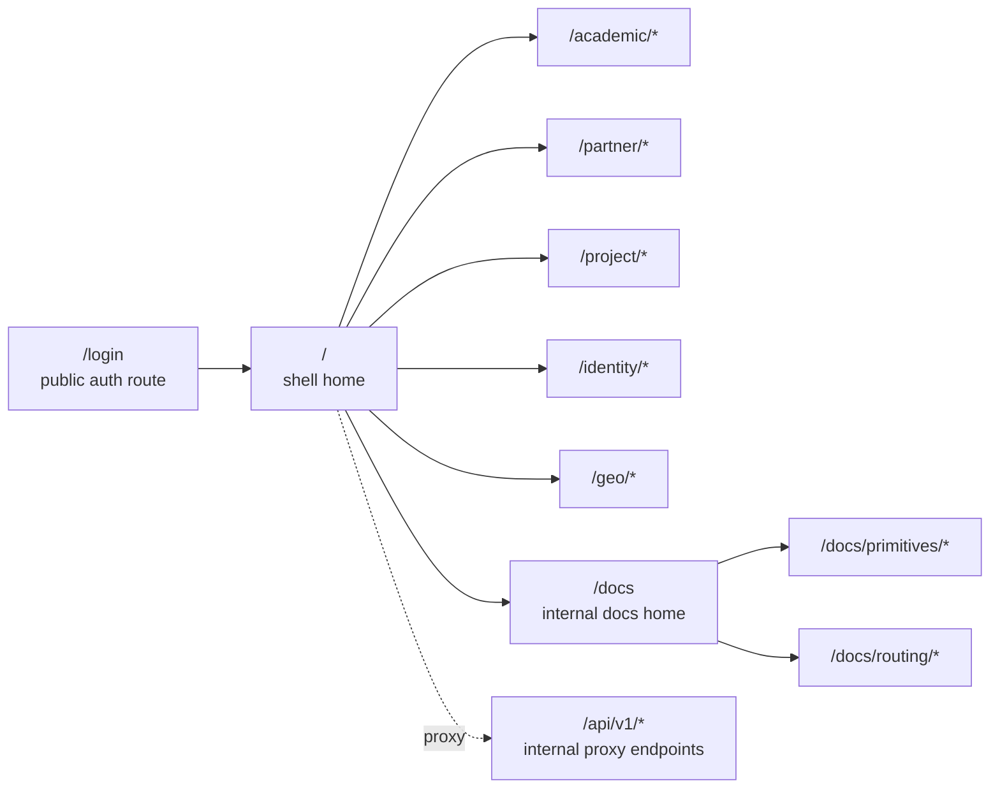
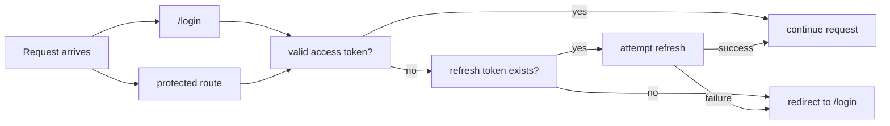
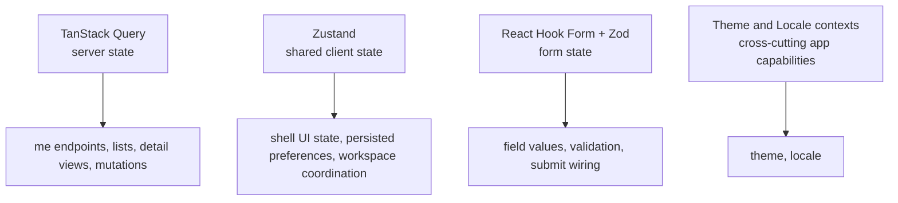
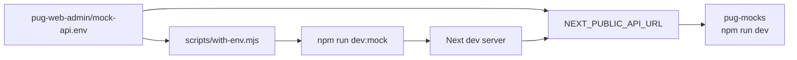

# PUG Web Admin

> PUG Web Admin is the authenticated Next.js back-office for the PUG platform. It is the operational web surface used to manage academic data, partner entities, projects, identity records, geo references, and the internal UI documentation area.

## Project Overview

`pug-web-admin` is a Next.js 16 App Router application built around a shared local design system, a query-driven server-state model, and a strict feature/config/schema split.

The current product surface covers:

- `academic`
- `partner`
- `project`
- `identity`
- `geo`
- `docs`

The application is organized around:

- an authenticated shell under `app/(app)`
- a public auth route under `app/(auth)`
- internal proxy endpoints under `app/api`
- request gating in `proxy.ts`

## Tech Stack



## Application Architecture

The application uses a clear split between route tree, shared primitives, feature surfaces, and typed API/schema layers.



## Route Model



## Auth and Session Flow

Auth is cookie-based. The login screen is the only public route. Protected navigation is mediated by `proxy.ts`.



## State Model

The project uses separate state layers with clear responsibilities.



## Shared UI System

The application ships with a local component system under `components/`. The primitives are grouped into:

- `actions`
- `display`
- `forms`
- `navigation`
- `overlays`
- `structure`

Important implementation rules:

- use local primitives before raw third-party components
- keep user-facing copy in locale files
- keep repeated visual contracts in utility CSS
- keep page composition section-first and use cards only for bounded inner units

## High-Level Folder Layout

```text
pug-web-admin/
|-- app/                 route tree, layouts, providers, proxy routes, styles
|-- api/                 raw API clients and API helpers
|-- components/          shared primitives
|-- constants/           static config and route maps
|-- contexts/            theme and locale providers
|-- features/            feature surfaces and internal docs pages
|-- hooks/               shared hooks
|-- public/locales/      i18n dictionaries
|-- schemas/             Zod schemas
|-- scripts/             translation and mock environment scripts
|-- store/               Zustand stores
|-- types/               API and client type contracts
|-- utils/               cross-cutting helpers
`-- proxy.ts             auth request gate
```

## Internal Docs Surface

The app includes an internal documentation area for current shared contracts:

- `/docs`
- `/docs/primitives`
- `/docs/routing`

Those pages exist to document:

- primitive usage contracts
- states and escalation boundaries
- route boundary previews for `not-found`, `error`, and `global-error`

## Local Development

### Prerequisites

- Node.js compatible with the current Next.js toolchain
- `npm`
- local access to the backend or the mock API workflow

### Install dependencies

```bash
npm install
```

### Start the application

```bash
npm run dev
```

Optional dev variants:

```bash
npm run dev:turbo
npm run dev:mock
npm run dev:mock:turbo
```

## Mock API Workflow

The project supports a shared local mock backend through `pug-mocks`.

From the `pug-web-admin` side, mock mode only means:

- `mock-api.env`
- `scripts/with-env.mjs`
- `npm run dev:mock`



Start the shared mock backend in `pug-mocks`:

```bash
cd ../pug-mocks
npm run dev
```

Then start the web app in `pug-web-admin`:

```bash
npm run dev:mock
```

Important behavior:

- `pug-web-admin` does not start the mock backend
- the web app remains ignorant to whether it is hitting the real backend or the mock backend
- switching between real and mock happens through `NEXT_PUBLIC_API_URL` and external process wiring only
- the environment loader is explicit and does not rely on `node --env-file`

Current shared mock coverage relevant to the web app includes:

- full `identity` contract coverage used by the current web clients
- `geo/cities` endpoints with a seeded Santa Catarina dataset

## Scripts

| Script | Purpose |
|---|---|
| `npm run dev` | Start Next dev server |
| `npm run dev:mock` | Start Next dev server with mock environment |
| `npm run dev:turbo` | Start Next dev server with Turbopack |
| `npm run dev:mock:turbo` | Start mock-target environment + Turbopack |
| `npm run build` | Build the application |
| `npm run start` | Start the production server |
| `npm run lint` | Run ESLint |
| `npm run lint:fix` | Run ESLint autofix |
| `npm run trans` | Reorder and validate locale files |
| `npm run format` | Default validation command |
| `npm run format:check` | Check formatting and lint status |

## Validation

Use the default project validation command:

```bash
npm run format
```

It runs:

- Prettier
- ESLint autofix
- TypeScript typecheck (`tsc --noEmit`)
- translation ordering and validation

Use narrower commands only when there is a specific reason.

## Current Working Conventions

- internal imports use `@/`
- user-facing copy lives in `public/locales/en-US/common.json` and `public/locales/pt-BR/common.json`
- shared server state is query-driven
- feature-local query logic lives in feature-local `queries.ts`
- form validation uses React Hook Form + Zod
- shared client state uses Zustand only when it is not server state or form state
- shared primitive contracts are documented in the internal docs area
- mock mode keeps the same runtime API contract; only the backend target changes

## Related Documentation

Centralized docs for this application live here:

- `pug-docs/pug-web-admin`

Repo-specific implementation conventions remain in the source repository:

- `pug-web-admin/codex-context.md`
